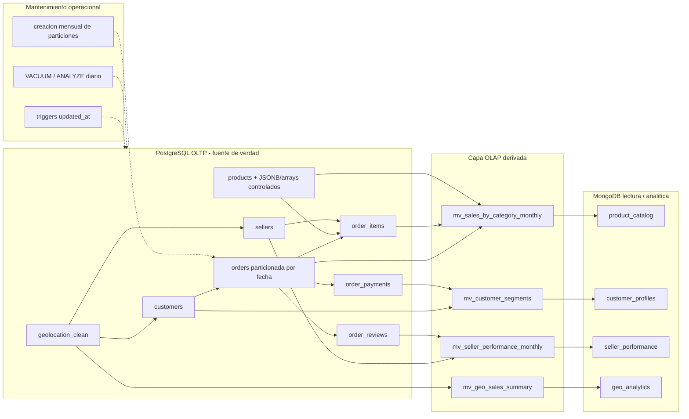
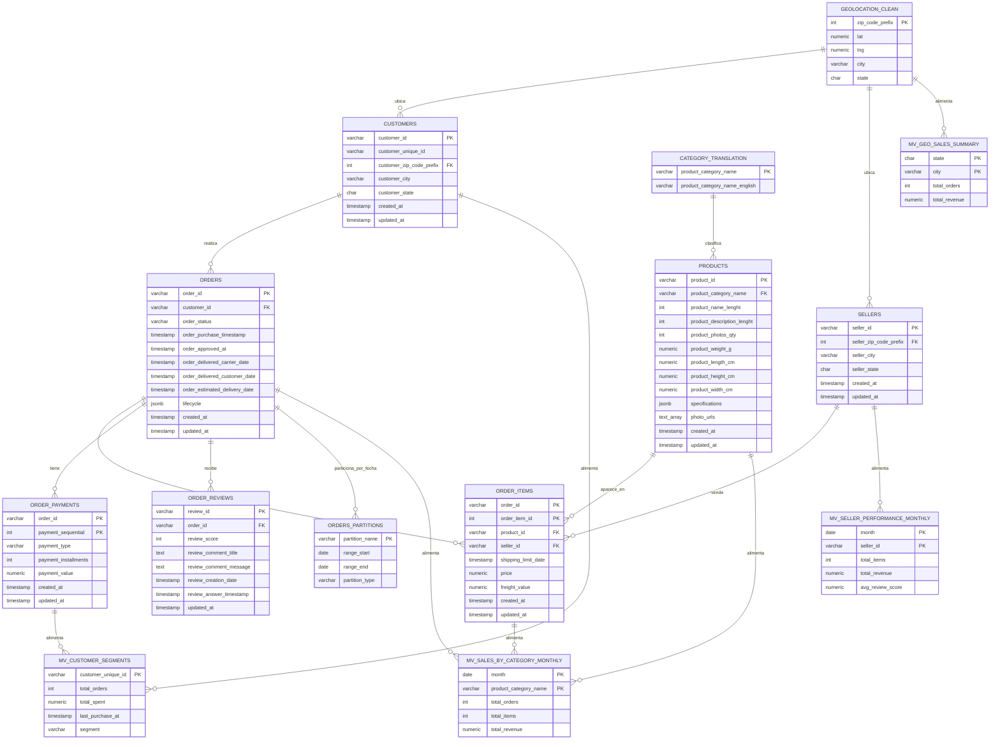

# Ecommify Database Design

## Estructura esperada del repositorio

```text
Ecommify_Database_Design/
|-- README.md
|-- docs/
|   |-- Documento_Tecnico_Diseno.pdf
|   `-- Presentacion_Ejecutiva.pdf
|-- postgresql/
|   |-- schema/ (scripts DDL)
|   |-- seed_data/
|   `-- queries/
|-- mongodb/
|   `-- schema/
`-- notebooks/
    `-- Data_Exploration_Analysis.ipynb
```

## Indice

- [Estructura esperada del repositorio](#estructura-esperada-del-repositorio)
- [Etapa 1 - Investigacion: posibles cambios por resolver](#etapa-1---investigacion-posibles-cambios-por-resolver)
  - [Analisis de tipos avanzados en PostgreSQL](#1-analisis-de-tipos-avanzados-en-postgresql)
  - [Comparacion inicial: JSONB vs columnas normalizadas](#2-comparacion-inicial-jsonb-vs-columnas-normalizadas)
  - [Cambios posibles derivados de este analisis](#3-cambios-posibles-derivados-de-este-analisis)
  - [Preguntas para refinar en conjunto](#4-preguntas-para-refinar-en-conjunto)
  - [Modelado hibrido OLTP/OLAP](#5-modelado-hibrido-oltp--olap)
    - [Requisitos OLTP vs OLAP de Ecommify](#51-requisitos-oltp-vs-olap-de-ecommify)
    - [Particionamiento de orders por fecha](#52-particionamiento-de-orders-por-fecha)
    - [Vistas materializadas para dashboards](#53-vistas-materializadas-para-dashboards)
    - [Triggers para updated_at](#54-triggers-para-updated_at)
    - [Estrategia de mantenimiento](#55-estrategia-de-mantenimiento)
  - [Metricas de monitoreo OLTP y OLAP](#56-metricas-de-monitoreo-oltp-y-olap)
  - [Estrategia de escalamiento](#57-estrategia-de-escalamiento)
  - [Referencias de trabajo](#6-referencias-de-trabajo)
- [Requisitos y restricciones de negocio adoptadas](#requisitos-y-restricciones-de-negocio-adoptadas)
- [Hallazgos del EDA inicial](#1-hallazgos-del-eda-inicial---dataset-olist--ecommify)
- [Estructura general del dataset](#1-estructura-general-del-dataset)
- [Volumen de datos](#2-volumen-de-datos)
- [Revision de claves y cardinalidad](#3-revision-de-claves-y-cardinalidad)
- [Relaciones principales identificadas](#4-relaciones-principales-identificadas)
- [Calidad de datos y valores nulos](#5-calidad-de-datos-y-valores-nulos)
- [Duplicados](#6-duplicados)
- [Distribucion temporal](#7-distribucion-temporal)
- [Distribucion geografica](#8-distribucion-geografica)
- [Vista integrada orders_full](#9-vista-integrada-orders_full)
- [Implicaciones para el diseño de base de datos](#10-implicaciones-para-el-diseno-de-base-de-datos)
- [Decision arquitectonica preliminar](#11-decision-arquitectonica-preliminar)
- [Matriz de decision PostgreSQL vs MongoDB](#12-matriz-de-decision-postgresql-vs-mongodb)
  - [Ajustes aplicados desde la Etapa 1](#ajustes-aplicados-desde-la-etapa-1)
- [Recomendaciones para la siguiente etapa](#13-recomendaciones-para-la-siguiente-etapa)
- [Conclusion inicial](#14-conclusion-inicial)
- [Primera Forma Normal - 1FN](#primera-forma-normal---1fn)
- [Segunda Forma Normal - 2FN](#segunda-forma-normal---2fn)
- [Tercera Forma Normal - 3FN](#tercera-forma-normal---3fn)
- [Esquema normalizado final](#5-esquema-normalizado-final)
- [Identificacion de claves primarias y foraneas](#6-identificacion-de-claves-primarias-y-foraneas)
- [Analisis de trade-offs de alta normalizacion](#7-analisis-de-trade-offs-de-alta-normalizacion)
- [Tablas a normalizar y desnormalizacion estrategica](#8-que-tablas-normalizar-hasta-3fn-y-donde-considerar-desnormalizacion)

---

## Etapa 1 - Investigacion: posibles cambios por resolver

Esta seccion se agrega como espacio de trabajo para refinar decisiones antes de convertirlas en el documento tecnico final. No reemplaza el analisis consolidado del EDA ni el modelo normalizado; funciona como marco de discusion para decidir que ajustes se deben incorporar en PostgreSQL y que informacion conviene dejar para MongoDB o vistas analiticas.

### 1. Analisis de tipos avanzados en PostgreSQL

El analisis inicial nos indica evaluar `JSONB`, arrays, `hstore`, composite types y ranges para identificar ventajas, casos de uso y diferencias frente a columnas normalizadas. A partir del README consolidado, el criterio inicial es conservar el nucleo transaccional en tablas normalizadas y usar tipos avanzados solo cuando aporten flexibilidad real sin romper integridad.

| Tipo avanzado | Ventajas | Posible uso en Ecommify | Riesgo / limite | Decision preliminar |
|---|---|---|---|---|
| `JSONB` | Permite guardar estructuras flexibles, consultar claves internas e indexar con GIN. Es mas eficiente para consulta que `json`. | Atributos variables de producto, eventos de ciclo de vida de una orden, metadatos analiticos derivados. | Puede esconder atributos que deberian estar normalizados y dificultar constraints. | Usarlo solo para datos variables o secundarios, no para claves, precios, pagos, estados principales ni relaciones. |
| Arrays | Permiten almacenar listas simples de valores del mismo tipo. | Lista de URLs de fotos de producto, etiquetas internas de catalogo, flags simples de segmentacion. | No son ideales si cada elemento necesita atributos propios o relaciones. | Usarlos para listas atomicas simples; si el dato necesita detalle, crear tabla relacionada. |
| `hstore` | Modelo clave-valor simple para texto; util cuando todos los valores son cadenas. | Alternativa ligera para atributos simples heredados o metadata textual. | Menos expresivo que `JSONB`; se solapa con casos que `JSONB` resuelve mejor. | No priorizarlo; preferir `JSONB` salvo que se necesite clave-valor textual muy simple. |
| Composite types | Agrupan varios campos bajo un tipo reutilizable. | Direccion logica, dimensiones de producto o coordenadas si se quisiera encapsular estructura. | Pueden reducir claridad si se abusa; las consultas y constraints pueden ser mas incomodas que columnas normales. | Evaluarlo solo para estructuras muy estables y repetidas; inicialmente mantener columnas normalizadas. |
| Ranges | Modelan intervalos con operadores nativos para solapamiento, inclusion y busqueda por rango. | Periodos de promocion, ventanas de entrega, vigencia de campañas o estados temporales. | No aplica a todos los campos de fecha; requiere consultas orientadas a intervalos. | Incorporarlo si se agregan promociones o ventanas de entrega como entidad del proyecto. |

### 2. Comparacion inicial: `JSONB` vs columnas normalizadas

| Criterio | Columnas normalizadas | `JSONB` |
|---|---|---|
| Integridad referencial | Alta: permite PK, FK, `NOT NULL`, `CHECK` y tipos especificos. | Limitada: se puede validar parcialmente, pero no reemplaza relaciones. |
| Consultas transaccionales | Mejor para ordenes, pagos, clientes, productos base y vendedores. | Mejor para atributos flexibles o documentos derivados. |
| Evolucion del esquema | Requiere migraciones al agregar columnas. | Permite agregar claves sin alterar la tabla. |
| Rendimiento | Predecible con indices tradicionales. | Bueno con indices GIN, pero depende del patron de consulta. |
| Uso recomendado en Ecommify | Datos maestros y transaccionales. | Especificaciones variables, metadata y estructuras analiticas complementarias. |

Decision de trabajo: en el modelo de Ecommify, las columnas normalizadas deben seguir siendo la base para `customers`, `orders`, `order_items`, `order_payments`, `products`, `sellers` y `category_translation`. `JSONB` se propone como extension controlada para atributos variables del catalogo o eventos de negocio que no definan la integridad central.

### 3. Cambios posibles derivados de este analisis

| Cambio posible | Tabla / modulo afectado | Motivo | Cambio requerido en EDA | Cambio requerido en normalizacion | Impacto en estructura del documento | Impacto PostgreSQL | Impacto MongoDB | Estado | Aprobacion |
|---|---|---|---|---|---|---|---|---|---|
| Agregar `products.specifications JSONB` | PostgreSQL / `products` | Guardar atributos variables por categoria sin alterar el esquema por cada nuevo atributo. | Identificar atributos variables de producto que no estan bien representados por columnas fijas; proponer ejemplos de productos tecnologicos. | Mantener atributos base en `products` y justificar que `specifications` no reemplaza columnas normalizadas. | Agregar en el documento una subseccion de tipos avanzados con ejemplo JSONB para productos. | Agregar columna `specifications JSONB` en `products`; evaluar indice GIN si se consulta por claves internas. | Incluir `specifications` como subdocumento dentro de `product_catalog`. | Por validar | aprobado |
| Agregar `products.photo_urls TEXT[]` | PostgreSQL / `products` | Representar una lista simple de imagenes si el proyecto decide modelar URLs reales. | Confirmar que Olist solo trae `product_photos_qty` y documentar que las URLs son una extension del caso Ecommify. | Si las fotos son solo strings, puede usarse array; si tienen metadata, crear tabla `product_images`. | Documentar el supuesto: cantidad de fotos original vs lista real de URLs propuesta. | Agregar `photo_urls TEXT[]` si se acepta el supuesto de URLs simples. | Incluir arreglo `photos` en `product_catalog`. | Por validar | aprobado |
| Mantener dimensiones como columnas (`weight`, `length`, `height`, `width`) | PostgreSQL / `products` | Son atributos medibles y consultables; conviene conservarlos normalizados. | Revisar nulos y posibles outliers en peso y dimensiones. | Confirmar que peso y dimensiones dependen directamente de `product_id`. | Agregar decision explicita: dimensiones no van a `JSONB` ni composite type inicialmente. | Mantener columnas numericas en `products`; considerar checks de valores positivos. | Replicar dimensiones como subdocumento de lectura, sin cambiar la fuente de verdad. | Recomendado | aprobado |
| No mover pagos a `JSONB` | PostgreSQL / `order_payments` | Los pagos requieren consistencia, montos, secuencia y relacion con orden. | Mantener analisis de multiples pagos por orden y validar `payment_sequential`. | Reforzar la clave compuesta (`order_id`, `payment_sequential`) y la dependencia completa en 2FN. | Explicar que pagos son datos transaccionales y no documentos flexibles. | Mantener `order_payments` como tabla relacional con FK a `orders`. | Usar pagos solo como resumen derivado en dashboards o perfiles. | Recomendado | aprobado - no se hace ningun cambio a lo estructurado |
| Evaluar `orders.lifecycle JSONB` | PostgreSQL / `orders` | Podria guardar eventos de auditoria sin reemplazar fechas principales. | Analizar `order_status` y las fechas de orden para definir eventos del ciclo de vida. | Mantener fechas principales como columnas; `lifecycle` seria historico complementario. | Agregar ejemplo de eventos de orden en JSONB y aclarar que no reemplaza columnas de fecha. | Agregar `lifecycle JSONB` o, si se requiere auditoria fuerte, proponer tabla `order_events`. | Incluir timeline de orden en documentos analiticos si aporta valor. | Por validar | aprobado |
| Evaluar `promotions.valid_period TSTZRANGE` | Nuevo modulo de promociones | Aplica si el alcance incluye promociones o campañas. | Verificar que Olist no trae promociones; tratarlo solo como extension posible. | No modifica la normalizacion del dataset actual porque es un modulo fuera del alcance base. | Marcar promociones como fuera de alcance inicial. | No crear tabla `promotions` en el diseño inicial. | No agregar promociones al catalogo documental inicial. | Pendiente de alcance | rechazado |
| Descartar `hstore` inicialmente | PostgreSQL | `JSONB` cubre mejor los casos flexibles previstos. | No requiere analisis adicional; basta registrar que no hay necesidad de clave-valor textual simple. | No modifica 1FN, 2FN ni 3FN. | Incluir decision de descarte para evidenciar que se evaluo el tipo avanzado. | No habilitar ni usar extension `hstore` en el DDL inicial. | Sin impacto en colecciones MongoDB. | Recomendado | ok |
| Evaluar composite type para dimensiones | PostgreSQL / `products` | Podria agrupar dimensiones, pero puede restar simplicidad al modelo. | Revisar si las dimensiones se consultan o validan individualmente. | Mantener columnas separadas porque son simples, medibles y dependientes de `product_id`. | Documentar que se descarta composite type para preservar claridad del modelo. | No crear composite type para dimensiones; conservar columnas simples. | En MongoDB si pueden agruparse como subdocumento `dimensions`. | No prioritario | rechazado |

### 4. Preguntas para refinar en conjunto

- Que atributos variables reales tendria un producto tecnologico en Ecommify: marca, modelo, garantia, color, memoria, compatibilidad, condicion?
- Las fotos del producto deben ser solo una cantidad (`product_photos_qty`) como en Olist o una lista real de URLs?
- El ciclo de vida de una orden debe quedarse solo con fechas principales o conviene guardar eventos historicos adicionales?
- El proyecto incluira promociones, campañas o ventanas de entrega que justifiquen usar ranges?
- Se requiere que algun atributo flexible sea consultado frecuentemente? Si la respuesta es si, se debe definir indice o columna normalizada.


### 5. Modelado hibrido OLTP / OLAP

El analisis de cargas nos indica la necesidad de estudiar tecnicas de modelado hibrido, es decir, un diseño que soporte transacciones operacionales y consultas analiticas sin mezclar responsabilidades. Para Ecommify, la decision preliminar es mantener PostgreSQL como fuente de verdad transaccional y construir estructuras analiticas derivadas mediante vistas materializadas, particiones, jobs programados y documentos MongoDB orientados a lectura.

#### Diagrama de arquitectura hibrida OLTP / OLAP



#### 5.1 Requisitos OLTP vs OLAP de Ecommify

| Tipo de carga | Necesidad en Ecommify | Tablas / estructuras involucradas | Criterio de diseño |
|---|---|---|---|
| OLTP | Registrar ordenes, items, pagos, clientes, productos y vendedores con consistencia. | `orders`, `order_items`, `order_payments`, `customers`, `products`, `sellers`. | Modelo relacional normalizado, PK/FK, constraints e indices sobre claves de busqueda. |
| OLTP | Consultar estado de una orden y sus pagos. | `orders`, `order_payments`, `order_items`. | Acceso por `order_id`, consistencia fuerte y pagos fuera de `JSONB`. |
| OLTP | Mantener datos maestros de productos y vendedores. | `products`, `sellers`, `category_translation`. | 3FN con extensiones controladas: `products.specifications JSONB` y `products.photo_urls TEXT[]`. |
| OLAP | Analizar ventas por categoria, mes, estado, vendedor y producto. | Vistas materializadas sobre `orders`, `order_items`, `products`, `sellers`, `customers`, `order_payments`. | Precalcular agregados para dashboards y evitar joins costosos en cada consulta. |
| OLAP | Segmentar clientes por comportamiento de compra. | `customers`, `orders`, `order_payments`, `order_reviews`. | Vista materializada o coleccion MongoDB derivada para perfiles analiticos. |
| OLAP | Analisis geografico y logistico. | `customers`, `sellers`, `geolocation_clean`, `orders`. | Limpiar geolocalizacion, agregar por region y considerar PostGIS en fase posterior. |

Decision de trabajo: el modelo OLTP no debe sacrificarse para facilitar dashboards. Las consultas analiticas deben apoyarse en vistas materializadas, particiones, indices, jobs de mantenimiento y, cuando tenga sentido, documentos MongoDB derivados.

#### 5.2 Particionamiento de `orders` por fecha

La tabla `orders` es candidata a particionamiento por fecha porque concentra el evento transaccional principal (`order_purchase_timestamp`) y es la base de reportes mensuales, tendencias y consultas historicas.

| Elemento | Decision preliminar |
|---|---|
| Tabla particionada | `orders` |
| Columna de particion | `order_purchase_timestamp` |
| Tipo de particion | Rango mensual |
| Particiones hot | Mes actual y meses recientes, usadas para consultas frecuentes y operaciones activas. |
| Particiones cold | Meses historicos, usadas principalmente para analitica y auditoria. |
| Beneficio esperado | Reducir escaneo de datos historicos, facilitar mantenimiento y mejorar consultas por periodo. |

Ejemplo conceptual de particiones:

```sql
orders_2017_10
orders_2017_11
orders_2017_12
orders_2018_01
...
```

Impacto en el diseño:

- El EDA debe conservar el analisis temporal por `order_purchase_timestamp`.
- La normalizacion no cambia: `orders` sigue siendo entidad central en 3FN.
- El documento tecnico debe justificar el particionamiento por volumen, consultas por fecha y separacion hot/cold.
- PostgreSQL debe incluir DDL de particionamiento en `postgresql/schema`.
- MongoDB no reemplaza el particionamiento; puede consumir datos agregados derivados.

#### 5.3 Vistas materializadas para dashboards

Las vistas materializadas permiten resolver necesidades OLAP sin convertir `orders_full` en tabla transaccional. Se proponen como estructuras derivadas para dashboards y consultas recurrentes.

| Vista materializada | Fuente principal | Uso analitico | Frecuencia sugerida |
|---|---|---|---|
| `mv_sales_by_category_monthly` | `orders`, `order_items`, `products`, `category_translation`, `order_payments` | Ventas mensuales por categoria, ingresos, cantidad de ordenes e items. | Refresh semanal o diario si el dashboard lo requiere. |
| `mv_customer_segments` | `customers`, `orders`, `order_payments`, `order_reviews` | Segmentacion de clientes por frecuencia, gasto, recencia y satisfaccion. | Refresh semanal. |
| `mv_seller_performance_monthly` | `sellers`, `order_items`, `orders`, `order_reviews` | Desempeño de vendedores por ventas, entregas y calificacion. | Refresh semanal. |
| `mv_geo_sales_summary` | `customers`, `sellers`, `orders`, `geolocation_clean` | Analisis por estado, ciudad o prefijo postal. | Refresh semanal o mensual. |

Decision de trabajo: `orders_full` se mantiene como vista exploratoria o base conceptual, pero los dashboards deben apoyarse en vistas materializadas especificas y documentadas.

#### 5.4 Triggers para `updated_at`

Para mantener trazabilidad operacional, las tablas transaccionales y maestras deberian incluir `created_at` y `updated_at`. El campo `updated_at` se puede mantener mediante trigger.

| Tabla | Requiere `created_at` / `updated_at` | Motivo |
|---|---|---|
| `customers` | Si | Cambios en datos maestros del cliente. |
| `orders` | Si | Cambios de estado, fechas o lifecycle. |
| `order_items` | Si | Ajustes de detalle de orden si el proceso lo permite. |
| `order_payments` | Si | Trazabilidad de pagos, sin moverlos a `JSONB`. |
| `products` | Si | Cambios en catalogo, especificaciones o fotos. |
| `sellers` | Si | Cambios en datos maestros de vendedor. |
| `order_reviews` | Opcional | Puede ser util si se actualizan respuestas o correcciones. |

Ejemplo conceptual:

```sql
CREATE OR REPLACE FUNCTION set_updated_at()
RETURNS trigger AS $$
BEGIN
  NEW.updated_at = now();
  RETURN NEW;
END;
$$ LANGUAGE plpgsql;
```

Impacto en el documento: agregar en el diseño logico una subseccion de auditoria operacional y triggers. En PostgreSQL, esto se convertira en script DDL. En MongoDB, `updated_at` puede existir en documentos derivados, pero no debe ser la fuente de verdad.

#### 5.5 Estrategia de mantenimiento

| Job programado | Frecuencia propuesta | Objetivo | Impacto |
|---|---|---|---|
| `VACUUM` / `ANALYZE` | Diario | Mantener estadisticas e higiene de tablas transaccionales. | Mejora planes de consulta y reduce degradacion. |
| Refresh de vistas materializadas | Semanal inicialmente | Actualizar dashboards sin sobrecargar consultas OLTP. | Mantiene datos analiticos suficientemente frescos. |
| Creacion de particiones | Mensual | Preparar la siguiente particion de `orders`. | Evita fallos de insercion y mantiene estrategia hot/cold. |
| Revision de indices | Mensual | Detectar indices no usados o faltantes. | Optimiza rendimiento OLTP/OLAP. |
| Limpieza/consolidacion de `geolocation` | Inicial y luego bajo demanda | Reducir duplicados y preparar referencia geografica. | Mejora analisis logistico y geografico. |

Decision de trabajo: documentar estos jobs como parte del plan de mantenimiento, aunque la implementacion exacta dependa de Supabase, cron externo o jobs administrados.

#### 5.6 Metricas de monitoreo OLTP y OLAP

| Categoria | Metrica | Uso |
|---|---|---|
| OLTP | Latencia de insercion de ordenes | Validar que el particionamiento e indices no afecten operaciones criticas. |
| OLTP | Tiempo de consulta por `order_id` | Medir experiencia de soporte/consulta operacional. |
| OLTP | Errores de FK o constraints | Detectar problemas de integridad. |
| OLTP | Crecimiento mensual de `orders` y `order_items` | Planificar particiones y almacenamiento. |
| OLAP | Tiempo de refresh de vistas materializadas | Ajustar frecuencia de mantenimiento. |
| OLAP | Tiempo de consulta de dashboards | Validar si las vistas materializadas son suficientes. |
| OLAP | Desfase entre datos transaccionales y analiticos | Medir frescura de informacion para reportes. |
| OLAP | Tamaño de vistas materializadas y documentos MongoDB | Planificar almacenamiento y escalamiento. |

#### 5.7 Estrategia de escalamiento

| Escenario | Señal de alerta | Accion propuesta |
|---|---|---|
| Free tier o instancia inicial se queda corta | Consultas lentas, refresh muy largo, almacenamiento alto. | Optimizar indices, reducir frecuencia de refresh o subir plan. |
| `orders` crece rapidamente | Escaneos por fecha tardan demasiado. | Activar particionamiento mensual y revisar pruning de particiones. |
| Dashboards afectan OLTP | Carga alta durante consultas analiticas. | Usar vistas materializadas, replicas de lectura o MongoDB derivado. |
| Geolocalizacion pesa demasiado | Consultas geograficas lentas o duplicados altos. | Consolidar `geolocation_clean`, agregar indices y evaluar PostGIS. |
| Catalogo requiere atributos muy variables | Muchas migraciones para nuevas columnas. | Usar `products.specifications JSONB` con gobernanza de claves permitidas. |

Decision de trabajo: el escalamiento debe empezar por diseño fisico, indices, particiones y vistas materializadas antes de desnormalizar el nucleo transaccional.

### 6. Referencias de trabajo

- PostgreSQL 16 Documentation - JSON Types: https://www.postgresql.org/docs/16/datatype-json.html
- PostgreSQL 16 Documentation - Arrays: https://www.postgresql.org/docs/16/arrays.html
- PostgreSQL 16 Documentation - hstore: https://www.postgresql.org/docs/16/hstore.html
- PostgreSQL 16 Documentation - Composite Types: https://www.postgresql.org/docs/16/rowtypes.html
- PostgreSQL 16 Documentation - Range Types: https://www.postgresql.org/docs/16/rangetypes.html

---

## Requisitos y restricciones de negocio adoptadas

Esta seccion incorpora decisiones utiles del documento de trabajo de la unidad 2 y las alinea con el marco definido en este README. No cambia la arquitectura acordada: PostgreSQL conserva el nucleo transaccional y MongoDB queda como capa documental/analitica derivada.

### Requisitos funcionales adoptados

| Requisito funcional | Como aparece en el documento | Como queda alineado en este README | Impacto en el modelo |
|---|---|---|---|
| Gestion de catalogo | Administracion de productos, dimensiones, pesos y categorias jerarquicas. | Se conserva `products` como tabla base en PostgreSQL y se permite catalogo enriquecido en MongoDB. | `products` mantiene columnas normalizadas para dimensiones y agrega `specifications JSONB` y `photo_urls TEXT[]` como flexibilidad controlada. |
| Gestion transaccional | Procesamiento atomico de pedidos, pagos y seguimiento logistico. | PostgreSQL es la fuente de verdad para `orders`, `order_items` y `order_payments`. | Se mantienen PK/FK, pagos fuera de `JSONB`, constraints y claves compuestas donde aplica. |
| Gestion analitica y feedback | Registro de reseñas y analisis geografico basado en prefijos postales. | Reseñas y geografia se mantienen relacionadas con el nucleo, pero pueden alimentar documentos y vistas analiticas. | `order_reviews` puede existir en PostgreSQL y MongoDB derivado; `geolocation` debe limpiarse como `geolocation_clean`. |
| Trazabilidad logistica | Gestion de fechas de compra, aprobacion, despacho, entrega estimada y entrega real. | Las fechas principales permanecen como columnas de `orders`; `orders.lifecycle JSONB` solo complementa eventos. | `order_purchase_timestamp` es clave para consultas temporales y particionamiento de `orders`. |

### Requisitos no funcionales adoptados

| Requisito no funcional | Como aparece en el documento | Como queda alineado en este README | Impacto en el modelo |
|---|---|---|---|
| Consistencia | Garantizar integridad referencial en transacciones ACID. | PostgreSQL prioriza consistencia para ordenes, items, pagos, clientes, productos y vendedores. | Uso de PK, FK, `NOT NULL`, `CHECK` e indices transaccionales. |
| Flexibilidad | Manejar datos dispersos o variables en catalogo y reseñas. | La flexibilidad no reemplaza el modelo relacional; se usa en `JSONB`, arrays y MongoDB derivado. | `products.specifications JSONB`, `products.photo_urls TEXT[]` y documentos `product_catalog`. |
| Escalabilidad | Soportar crecimiento de `orders` y `order_items` sin degradar rendimiento. | Se adopta modelado hibrido OLTP/OLAP con particiones, vistas materializadas y documentos derivados. | `orders` particionada por fecha, MVs para dashboards y jobs de mantenimiento. |
| Rendimiento | Optimizar busquedas geograficas y por texto. | Se mantiene como decision tecnica para indices y extensiones. | Posible uso de `pg_trgm`, indices por fecha/clave y futura evaluacion de PostGIS para geografia. |

### Restricciones de negocio adoptadas

Estas restricciones se incorporan porque fortalecen la consistencia del modelo y conectan directamente con los hallazgos del EDA.

| Restriccion | Tabla / campo | Regla adoptada | Justificacion |
|---|---|---|---|
| Precio no negativo | `order_items.price` | `CHECK (price >= 0)` | Un item de orden no debe registrar precios negativos por errores de captura o carga. |
| Flete no negativo | `order_items.freight_value` | `CHECK (freight_value >= 0)` | El valor de envio debe ser cero o positivo. |
| Pago no negativo | `order_payments.payment_value` | `CHECK (payment_value >= 0)` | Los pagos son financieros y requieren validacion estricta. |
| Pagos secuenciales por orden | `order_payments` | PK compuesta (`order_id`, `payment_sequential`) | Una orden puede tener varios pagos; la combinacion identifica cada pago de forma auditable. |
| Fecha de compra obligatoria | `orders.order_purchase_timestamp` | `NOT NULL` | Toda orden debe tener fecha de compra; ademas soporta analisis temporal y particionamiento. |
| Estado de orden obligatorio | `orders.order_status` | `NOT NULL` recomendado | Permite seguimiento operacional y segmentacion de ordenes por estado. |
| Categoria de producto controlada | `products.product_category_name` | FK hacia `category_translation` cuando exista la categoria limpia | Evita inconsistencias de catalogo y permite analisis por categoria. |
| Reseñas con score valido | `order_reviews.review_score` | `CHECK (review_score BETWEEN 1 AND 5)` | La escala de reseñas debe mantenerse dentro del rango valido. |

### Implicaciones para SQL preliminar

Estas reglas deben reflejarse posteriormente en los scripts DDL dentro de `postgresql/schema`:

```sql
price DECIMAL(10,2) CHECK (price >= 0)
freight_value DECIMAL(10,2) CHECK (freight_value >= 0)
payment_value DECIMAL(10,2) CHECK (payment_value >= 0)
PRIMARY KEY (order_id, payment_sequential)
order_purchase_timestamp TIMESTAMP NOT NULL
review_score INTEGER CHECK (review_score BETWEEN 1 AND 5)
```

### Implicaciones para MongoDB

MongoDB debe recibir datos derivados, no reemplazar las restricciones transaccionales de PostgreSQL. Por tanto:

- `payment_summary` en documentos analiticos se deriva desde `order_payments`, pero no reemplaza esa tabla.
- `product_catalog` puede incluir `specifications`, `photos` y `dimensions`, pero la fuente base del producto sigue en PostgreSQL.
- `reviews` puede almacenar texto libre y campos opcionales, pero `review_score` debe conservar la escala valida.
- Los documentos deben usar tipos propios de MongoDB (`object`, `array`, `string`, `number`, `date`) y no declarar `JSONB` como tipo documental.

---

## 1. Hallazgos del EDA inicial - Dataset Olist / Ecommify

## Introduccion

Para esta actividad nuestro caso se basará en Ecommify es una plataforma de e-commerce multivendedor enfocada en productos tecnológicos. Como parte de la actividad que trabajaremos a lo largo del ciclo nos enfocaremos en diseñar la base de su arquitectura de datos, para la actividad estamos trabajando con el dataset real "Brazilian E-commerce (Olist)" extraído de Kaggle. El objetivo de este informe es trazar nuestra hoja de ruta técnica y definir cómo vamos a estructurar el sistema para que soporte tanto las ventas como la parte analítica del negocio.

## 1. Estructura general del dataset

El dataset analizado corresponde al conjunto de datos Brazilian E-commerce Public Dataset by Olist, utilizado como base para el caso académico Ecommify.

El conjunto de datos está compuesto por 9 archivos CSV relacionados con clientes, órdenes, productos, vendedores, pagos, reseñas, geolocalización y categorías de producto:

| Tabla | Descripción general |
|---|---|
| `customers` | Información de clientes, ciudad, estado y código postal. |
| `geolocation` | Información geográfica por prefijo de código postal. |
| `order_items` | Detalle de productos incluidos en cada orden. |
| `order_payments` | Información de pagos asociados a las órdenes. |
| `order_reviews` | Reseñas y calificaciones realizadas por los clientes. |
| `orders` | Información principal de las órdenes y sus estados. |
| `products` | Información base de productos, dimensiones y categorías. |
| `sellers` | Información de vendedores. |
| `category_translation` | Traducción de categorías de producto. |

El dataset presenta una estructura principalmente relacional, ya que existen identificadores comunes entre tablas, como `order_id`, `customer_id`, `product_id`, `seller_id` y `product_category_name`.

---

## 2. Volumen de datos

Al subir los archivos a Colab y hacer las relaciones entre las llaves y estructura de cada uno de los archivos, consolidamos un dataset maestro con 119,143 registros y 36 columnas. Esto nos permitió entender el contexto general de cómo se conectan los clientes, los pedidos, los pagos y los productos.

Durante el EDA se identificó el volumen de registros y columnas por cada tabla:

| Tabla | Filas | Columnas |
|---|---:|---:|
| `geolocation` | 1.000.163 | 5 |
| `order_items` | 112.650 | 7 |
| `order_payments` | 103.886 | 5 |
| `customers` | 99.441 | 5 |
| `orders` | 99.441 | 8 |
| `order_reviews` | 99.224 | 7 |
| `products` | 32.951 | 9 |
| `sellers` | 3.095 | 4 |
| `category_translation` | 71 | 2 |

La tabla con mayor volumen es `geolocation`, con más de un millón de registros. Le siguen `order_items`, `order_payments`, `customers`, `orders` y `order_reviews`, que concentran la mayor parte de la información transaccional del e-commerce.

Este volumen permite identificar dos necesidades principales:

1. Un modelo transaccional estructurado para órdenes, clientes, pagos, productos y vendedores.
2. Un modelo analítico o agregado para información geográfica, reseñas y análisis de comportamiento.

---

## 3. Revisión de claves y cardinalidad

Se revisaron las columnas principales de cada tabla para identificar posibles claves primarias y relaciones entre entidades.

| Tabla | Columna evaluada | Filas | Valores únicos | Duplicados en la clave |
|---|---|---:|---:|---:|
| `customers` | `customer_id` | 99.441 | 99.441 | 0 |
| `orders` | `order_id` | 99.441 | 99.441 | 0 |
| `order_items` | `order_id` | 112.650 | 98.666 | 13.984 |
| `order_payments` | `order_id` | 103.886 | 99.440 | 4.446 |
| `order_reviews` | `order_id` | 99.224 | 98.673 | 551 |
| `products` | `product_id` | 32.951 | 32.951 | 0 |
| `sellers` | `seller_id` | 3.095 | 3.095 | 0 |
| `geolocation` | `geolocation_zip_code_prefix` | 1.000.163 | 19.015 | 981.148 |
| `category_translation` | `product_category_name` | 71 | 71 | 0 |

Se identificó que `customers.customer_id`, `orders.order_id`, `products.product_id`, `sellers.seller_id` y `category_translation.product_category_name` tienen comportamiento adecuado como claves únicas.

En cambio, `order_items.order_id`, `order_payments.order_id` y `order_reviews.order_id` presentan valores repetidos. Esto no necesariamente representa un error, ya que una orden puede tener varios ítems, varios pagos o más de una relación asociada. En estos casos, se requiere analizar claves compuestas o relaciones 1:N.

La tabla `geolocation` presenta una alta cantidad de valores repetidos en `geolocation_zip_code_prefix`, lo cual indica que esta tabla requiere limpieza, agregación o consolidación antes de ser utilizada en el modelo final.

---

## 4. Relaciones principales identificadas

Se validaron las relaciones principales entre tablas mediante comparación de valores entre columnas origen y destino.

| Tabla origen | Columna origen | Tabla destino | Columna destino | Valores sin relación |
|---|---|---|---|---:|
| `orders` | `customer_id` | `customers` | `customer_id` | 0 |
| `order_items` | `order_id` | `orders` | `order_id` | 0 |
| `order_payments` | `order_id` | `orders` | `order_id` | 0 |
| `order_reviews` | `order_id` | `orders` | `order_id` | 0 |
| `order_items` | `product_id` | `products` | `product_id` | 0 |
| `order_items` | `seller_id` | `sellers` | `seller_id` | 0 |
| `products` | `product_category_name` | `category_translation` | `product_category_name` | 2 |

Las relaciones principales entre órdenes, clientes, pagos, productos y vendedores no presentan valores huérfanos, lo cual evidencia una estructura consistente para un modelo relacional.

La única relación con diferencias se encuentra entre `products.product_category_name` y `category_translation.product_category_name`, donde se identificaron 2 valores sin relación. Esto debe revisarse en la fase de limpieza o transformación de datos.

---

## 5. Calidad de datos y valores nulos

Se identificaron valores nulos en columnas específicas del dataset:

| Tabla | Columna | Nulos | Porcentaje |
|---|---|---:|---:|
| `order_reviews` | `review_comment_title` | 87.656 | 88,34% |
| `order_reviews` | `review_comment_message` | 58.247 | 58,70% |
| `orders` | `order_delivered_customer_date` | 2.965 | 2,98% |
| `products` | `product_name_lenght` | 610 | 1,85% |
| `products` | `product_category_name` | 610 | 1,85% |
| `products` | `product_description_lenght` | 610 | 1,85% |
| `products` | `product_photos_qty` | 610 | 1,85% |
| `orders` | `order_delivered_carrier_date` | 1.783 | 1,79% |
| `orders` | `order_approved_at` | 160 | 0,16% |
| `products` | `product_weight_g` | 2 | 0,01% |
| `products` | `product_length_cm` | 2 | 0,01% |
| `products` | `product_height_cm` | 2 | 0,01% |
| `products` | `product_width_cm` | 2 | 0,01% |

Los valores nulos más relevantes se encuentran en `order_reviews`, especialmente en `review_comment_title` y `review_comment_message`. Esto puede considerarse normal dentro del negocio, ya que no todos los clientes dejan comentarios escritos aunque sí puedan registrar una calificación.

En la tabla `orders`, los nulos en fechas de entrega o aprobación pueden estar asociados a órdenes canceladas, no entregadas o con estados incompletos. Estos registros requieren análisis adicional antes de ser utilizados para métricas logísticas.

En la tabla `products`, los nulos están asociados principalmente a categoría, descripción, fotos y dimensiones. Estos campos deben ser revisados antes de construir un catálogo enriquecido.

---

## 6. Duplicados

Se realizó una validación de registros duplicados completos por tabla.

| Tabla | Duplicados completos |
|---|---:|
| `customers` | 0 |
| `geolocation` | 261.831 |
| `order_items` | 0 |
| `order_payments` | 0 |
| `order_reviews` | 0 |
| `orders` | 0 |
| `products` | 0 |
| `sellers` | 0 |
| `category_translation` | 0 |

La única tabla con duplicados completos es `geolocation`, con 261.831 registros duplicados. Esto indica que la información geográfica debe ser depurada o agregada antes de incorporarse al modelo final.

Para efectos de arquitectura, `geolocation` puede tratarse como una fuente de datos analítica o de referencia, no necesariamente como una tabla transaccional central.

---

## 7. Distribución temporal

La distribución temporal de órdenes se analizó a partir de la columna `order_purchase_timestamp`.

Esta variable permite observar el comportamiento de las compras en el tiempo y puede ser útil para:

- Analizar estacionalidad de ventas.
- Identificar periodos de mayor volumen transaccional.
- Diseñar estrategias de particionamiento por fecha en PostgreSQL.
- Definir índices sobre columnas temporales.
- Construir indicadores mensuales para análisis en MongoDB o dashboards.

Desde el punto de vista del diseño de bases de datos, las columnas de fecha de la tabla `orders` son relevantes para consultas frecuentes como:

- Órdenes por mes.
- Órdenes entregadas vs no entregadas.
- Tiempo entre compra y entrega.
- Cumplimiento de fecha estimada de entrega.

---

## 8. Distribución geográfica

Se analizaron distribuciones geográficas de clientes, vendedores y órdenes por estado.

Las columnas más relevantes para este análisis son:

- `customer_state`
- `customer_city`
- `customer_zip_code_prefix`
- `seller_state`
- `seller_city`
- `seller_zip_code_prefix`
- `geolocation_zip_code_prefix`

La información geográfica permite identificar concentración de clientes, vendedores y órdenes por región. Este tipo de información es útil para análisis de cobertura, logística, comportamiento regional y segmentación comercial.

Dado que `geolocation` es la tabla de mayor volumen y presenta duplicados, se recomienda usarla como fuente para construir agregaciones geográficas, en lugar de usarla directamente como una tabla operacional sin limpieza previa.

---

## 9. Vista integrada `orders_full`

Se construyó una vista integrada denominada `orders_full`, uniendo las tablas principales:

- `orders`
- `customers`
- `order_items`
- `products`
- `sellers`
- `order_payments`
- `order_reviews`

Esta vista permite observar una versión denormalizada del proceso de compra, integrando información de cliente, orden, producto, vendedor, pago y reseña.

La vista `orders_full` es útil para análisis exploratorio, pero no debería ser el modelo físico principal de una base transaccional, ya que puede generar duplicidad de datos y redundancia. Sin embargo, puede ser una base útil para construir documentos analíticos en MongoDB o datasets preparados para visualización.

---

## 10. Implicaciones para el diseño de base de datos

El EDA evidencia que el dataset tiene una estructura relacional clara para las entidades centrales del negocio:

- Clientes.
- Órdenes.
- Ítems de orden.
- Pagos.
- Productos.
- Vendedores.
- Categorías.

Estas entidades presentan relaciones fuertes y requieren integridad referencial, por lo que son candidatas naturales para PostgreSQL.

Por otro lado, también se identifican datos con características analíticas o flexibles:

- Reseñas con campos opcionales y texto libre.
- Catálogo de productos enriquecido.
- Datos geográficos de alto volumen.
- Vistas agregadas por cliente, producto, vendedor o región.
- Indicadores para análisis de comportamiento de compra.

Estos datos pueden modelarse como documentos o estructuras desnormalizadas en MongoDB.

---

## 11. Decisión arquitectónica preliminar

A partir del EDA, se propone una arquitectura híbrida transaccional-analítica basada en PostgreSQL y MongoDB.

PostgreSQL será utilizado como base de datos principal para el módulo transaccional, almacenando entidades estructuradas como clientes, órdenes, pagos, productos, vendedores e ítems de pedido. Esta decisión se justifica porque estas entidades presentan relaciones claras, no evidencian valores huérfanos en sus relaciones principales y requieren consistencia en operaciones críticas como la creación de órdenes y el registro de pagos.

MongoDB será utilizado como base de datos complementaria para el módulo analítico, almacenando documentos enriquecidos de catálogo, reseñas, comportamiento de compra y análisis geográfico. Esta decisión se justifica porque estos datos pueden consultarse de forma flexible, agregada y orientada a lectura, sin depender de múltiples JOIN entre tablas.

La arquitectura permite separar responsabilidades:

- PostgreSQL garantiza consistencia, integridad referencial y control transaccional.
- MongoDB permite flexibilidad, consultas analíticas, documentos enriquecidos y exploración de datos.

Ajuste derivado de la Etapa 1: PostgreSQL sigue siendo la fuente de verdad relacional, pero se incorporan tipos avanzados de forma controlada. Se aprueba agregar `products.specifications JSONB`, `products.photo_urls TEXT[]` y `orders.lifecycle JSONB`. Se mantiene `order_payments` como tabla relacional, se descarta `hstore`, se rechaza el modulo de promociones con `TSTZRANGE` para el alcance inicial y no se usara composite type para dimensiones porque las dimensiones se conservan como columnas simples.


---

## 12. Matriz de decisión PostgreSQL vs MongoDB

| Entidad / elemento | Decisión en PostgreSQL | Decisión en MongoDB | Justificación / decisión aplicada |
|---|---|---|---|
| `customers` | Tabla base normalizada y fuente de verdad para clientes. | Resumen derivado en `customer_profiles`. | Entidad estructurada relacionada con órdenes; MongoDB solo consolida métricas analíticas de comportamiento. |
| `orders` | Tabla transaccional principal, con `order_purchase_timestamp NOT NULL`, `orders.lifecycle JSONB`, particionamiento mensual por fecha y triggers de `updated_at`. | Timeline o resumen derivado de orden en documentos analíticos. | Núcleo OLTP del negocio; MongoDB no reemplaza la integridad ni el particionamiento, solo facilita lectura y dashboards. |
| `order_items` | Tabla relacional que conecta orden, producto y vendedor, con precios y fletes validados. | Agregados de ventas por producto, categoría o vendedor. | Se mantiene normalizada para integridad; puede alimentar métricas OLAP y documentos derivados. |
| `order_payments` | Tabla relacional con PK compuesta `(order_id, payment_sequential)` y `CHECK (payment_value >= 0)`. | Solo resumen derivado de pagos. | Los pagos requieren consistencia transaccional; no se mueven a `JSONB` ni a documento como fuente principal. |
| `products` | Tabla base con categoría, dimensiones como columnas, `specifications JSONB` y `photo_urls TEXT[]`. | Catálogo enriquecido `product_catalog` con `specifications`, `photos`, `dimensions`, reseñas y métricas. | PostgreSQL conserva el producto maestro; MongoDB mejora lecturas de catálogo enriquecido sin romper normalización. |
| `category_translation` | Tabla de referencia normalizada para traducir categorías. | Campo embebido o derivado dentro de `product_catalog`. | Es pequeña, estable y útil para FK en PostgreSQL; en MongoDB solo se replica para consulta. |
| `sellers` | Tabla base normalizada de vendedores. | Resumen derivado en `seller_performance`. | Entidad estructurada con relaciones transaccionales; MongoDB consolida desempeño, ventas y métricas. |
| `order_reviews` | Tabla relacional asociada a órdenes, con validación de `review_score BETWEEN 1 AND 5`. | Documentos enriquecidos de reseñas y feedback. | El texto libre y campos opcionales justifican una capa documental derivada para análisis de experiencia. |
| `geolocation` | Tabla limpia o consolidada para referencia geográfica. | Colección `geo_analytics` con agregados por ciudad, estado o región. | El alto volumen y duplicados requieren limpieza; MongoDB se usa para lectura geográfica agregada. |
| `orders_full` | No se adopta como modelo físico transaccional. | Puede alimentar documentos analíticos o datasets de dashboard. | Es útil como vista denormalizada de análisis, pero no debe reemplazar el modelo normalizado. |
| Promociones con rangos | Fuera del alcance inicial. | Fuera del alcance inicial. | Se rechaza para esta versión del diseño; los tipos `range` quedan evaluados pero no implementados. |
| `hstore` | No se usa. | Sin impacto. | Se descarta porque `JSONB` cubre mejor los casos flexibles previstos. |
| Composite type para dimensiones | No se usa; dimensiones quedan como columnas numéricas. | Puede representarse como subdocumento `dimensions` solo de lectura. | Se rechaza como decisión inicial para mantener claridad, validación simple y consultas directas. |
| Vistas materializadas | `mv_sales_by_category_monthly`, `mv_customer_segments`, `mv_seller_performance_monthly`, `mv_geo_sales_summary`. | Pueden alimentar colecciones analíticas derivadas. | Aprobadas para dashboards y consultas OLAP sin afectar las tablas OLTP. |
| Jobs de mantenimiento | `VACUUM/ANALYZE`, refresh de MVs, creación mensual de particiones y revisión de índices. | Sincronización o refresh de documentos derivados. | Aprobado como estrategia operativa para sostener rendimiento y escalabilidad. |


---

## 13. Recomendaciones para la siguiente etapa

A partir del EDA realizado, se recomiendan las siguientes acciones para continuar con el diseño del modelo de datos:

1. Definir el modelo conceptual identificando entidades principales: Customer, Order, Product, Seller, Payment, Review y Category.
2. Construir el diagrama entidad-relación con las cardinalidades identificadas.
3. Definir claves primarias y foráneas para el modelo relacional en PostgreSQL.
4. Revisar los 2 valores de categoría que no tienen relación con `category_translation`.
5. Limpiar o consolidar la tabla `geolocation` antes de usarla en análisis geográfico.
6. Analizar los nulos de fechas en `orders` según el estado de la orden.
7. Definir qué vistas o documentos derivados se construirán en MongoDB.
8. Proponer índices iniciales para consultas por `order_id`, `customer_id`, `product_id`, `seller_id` y fechas de compra.
9. Incorporar en el diseño lógico los tipos avanzados aprobados: `products.specifications JSONB`, `products.photo_urls TEXT[]` y `orders.lifecycle JSONB`.
10. Documentar explícitamente los descartes: pagos no se mueven a `JSONB`, promociones quedan fuera del alcance inicial, `hstore` no se usa y dimensiones no se modelan como composite type.
11. Diseñar `orders` como tabla particionada por rango mensual usando `order_purchase_timestamp`.
12. Definir las vistas materializadas `mv_sales_by_category_monthly`, `mv_customer_segments`, `mv_seller_performance_monthly` y `mv_geo_sales_summary`.
13. Agregar estrategia de triggers `updated_at` para tablas maestras y transaccionales.
14. Documentar jobs de mantenimiento: `VACUUM/ANALYZE`, refresh de vistas materializadas, creacion mensual de particiones y revision de indices.
15. Definir metricas de monitoreo OLTP/OLAP para validar rendimiento, frescura y escalamiento.

---

## 14. Conclusión inicial

El EDA permitió comprender la estructura, volumen, relaciones y calidad de los datos del dataset Olist utilizado para el caso Ecommify.

Los resultados muestran que el dataset tiene una base relacional sólida para representar procesos transaccionales como clientes, órdenes, pagos, productos y vendedores. Las principales relaciones entre estas entidades no presentan valores huérfanos, lo cual facilita el diseño de un modelo relacional normalizado en PostgreSQL.

También se identificaron componentes con orientación analítica o flexible, como reseñas, catálogo enriquecido, geolocalización y vistas integradas de órdenes. Estos elementos pueden beneficiarse de un modelo documental en MongoDB, especialmente para consultas agregadas, dashboards y análisis exploratorio.

Por lo tanto, el EDA respalda la selección de una arquitectura híbrida transaccional-analítica para Ecommify, en la cual PostgreSQL actúa como fuente principal de verdad para los datos operacionales y MongoDB como base complementaria para análisis, documentos enriquecidos y consultas flexibles.


---

## Primera Forma Normal - 1FN

La Primera Forma Normal exige que cada celda contenga un único valor atómico. En el dataset de Olist, la tabla `order_items` permite representar una orden con múltiples productos mediante filas independientes, evitando almacenar listas de productos dentro de una misma celda.

Por ejemplo, una orden con varios productos no se almacena como una lista en una columna, sino como varios registros asociados al mismo `order_id`. Esto permite mantener la atomicidad de los datos y cumplir con 1FN.


---

## Segunda Forma Normal - 2FN

La Segunda Forma Normal exige que una tabla cumpla 1FN y que todos sus atributos no clave dependan de la clave completa. Esta forma normal es especialmente importante cuando existe una clave compuesta.

Para el análisis se tomó como referencia la vista denormalizada `orders_full`, la cual integra información de órdenes, clientes, productos, vendedores, pagos y reseñas.

En esta vista, una fila puede estar determinada por una combinación de columnas como `order_id`, `order_item_id`, `payment_sequential` y `review_id`, dependiendo del resultado de las uniones realizadas. Sin embargo, varios atributos no dependen de toda esa combinación, sino de una entidad específica.

Por ejemplo, los datos de estado y fechas de la orden dependen de `order_id`; los datos de ciudad y estado del cliente dependen de `customer_id`; los datos de categoría, peso y dimensiones dependen de `product_id`; los datos de ubicación del vendedor dependen de `seller_id`; los datos de pago dependen de `order_id` y `payment_sequential`; y los datos de reseña dependen de `review_id`.

Esto evidencia una ruptura de 2FN en `orders_full`, porque la tabla contiene atributos que no dependen de la clave completa de la fila integrada, sino de claves parciales o entidades individuales.

Para corregir esta situación, el modelo debe mantenerse separado en tablas como `orders`, `customers`, `order_items`, `products`, `sellers`, `order_payments` y `order_reviews`. De esta forma, cada tabla conserva únicamente los atributos que dependen de su propia clave.

---

## Tercera Forma Normal - 3FN

La Tercera Forma Normal exige que una tabla cumpla 2FN y que no existan dependencias transitivas. Una dependencia transitiva ocurre cuando un atributo no clave depende de otro atributo no clave, en lugar de depender directamente de la clave principal.

Para el análisis se tomó como referencia la vista denormalizada `orders_full`, la cual integra información de órdenes, clientes, productos, vendedores, pagos y reseñas.

En esta vista se identifican posibles dependencias transitivas. Por ejemplo, una orden referencia un cliente mediante `customer_id`, pero los datos como `customer_city` y `customer_state` pertenecen al cliente y no directamente a la orden. De manera similar, un ítem de orden referencia un producto mediante `product_id`, pero atributos como `product_category_name`, peso y dimensiones pertenecen al producto. También ocurre con el vendedor, donde `seller_city` y `seller_state` dependen de `seller_id`.

Adicionalmente, al integrar la tabla `category_translation`, se observa la dependencia `product_id → product_category_name → product_category_name_english`. Esto significa que la traducción de la categoría depende de la categoría del producto, no directamente del producto ni de la orden.

| Dependencia transitiva | Explicación | Corrección |
|---|---|---|
| `order_id → customer_id → customer_city/customer_state` | La ubicación pertenece al cliente, no directamente a la orden. | Mantener `customers` como tabla separada. |
| `order_id + order_item_id → product_id → product_category_name` | La categoría pertenece al producto, no al ítem de orden. | Mantener `products` como tabla separada. |
| `product_id → product_category_name → product_category_name_english` | La traducción depende de la categoría. | Mantener `category_translation` como tabla de referencia. |
| `order_id + order_item_id → seller_id → seller_city/seller_state` | La ubicación pertenece al vendedor. | Mantener `sellers` como tabla separada. |
| `customer_zip_code_prefix → customer_city/customer_state` | La ciudad y estado pueden depender del código postal. | Evaluar limpieza y consolidación de `geolocation`. |
| `seller_zip_code_prefix → seller_city/seller_state` | La ciudad y estado pueden depender del código postal del vendedor. | Evaluar limpieza y consolidación de `geolocation`. |

Por lo anterior, `orders_full` no debe utilizarse como tabla transaccional final, ya que concentra atributos que dependen indirectamente de otras entidades. Para cumplir 3FN en el modelo relacional, se deben mantener separadas las tablas `orders`, `customers`, `order_items`, `products`, `sellers`, `order_payments`, `order_reviews` y `category_translation`.

La tabla `geolocation` debe analizarse con especial cuidado, ya que presenta alto volumen y duplicados. Por tanto, antes de usarla como referencia geográfica, se recomienda realizar limpieza, deduplicación o agregación.

---

## 5. Esquema normalizado final

A partir del análisis de 1FN, 2FN y 3FN, se propone mantener un esquema relacional normalizado para el componente transaccional de Ecommify. El objetivo es separar correctamente las entidades principales del negocio y evitar que una tabla integrada como `orders_full` sea usada como modelo transaccional final.

La vista `orders_full` es útil para análisis exploratorio, pero no debe ser la estructura principal de almacenamiento porque mezcla datos de órdenes, clientes, productos, vendedores, pagos y reseñas. Esto genera redundancia y dependencias incorrectas entre atributos.

El esquema normalizado propuesto mantiene las siguientes entidades:

- `customers`
- `orders`
- `order_items`
- `products`
- `sellers`
- `order_payments`
- `order_reviews`
- `category_translation`
- `geolocation`, previa limpieza o consolidación

Ajuste aplicado: el esquema sigue normalizado, pero se agregan columnas avanzadas controladas. En `products` se incorporan `specifications JSONB` y `photo_urls TEXT[]`; en `orders` se incorpora `lifecycle JSONB`. Estas columnas no reemplazan claves, relaciones ni atributos medibles principales. Los pagos permanecen en `order_payments` y las dimensiones del producto siguen como columnas numericas.

## Diagrama del esquema normalizado final


Nota: en el diagrama Mermaid algunos atributos se simplifican para evitar errores de renderizado. Las claves compuestas y foraneas completas se mantienen documentadas en las tablas de claves primarias y foraneas anteriores.

## 6. Identificación de claves primarias y foráneas

## Claves primarias propuestas

| Tabla | Clave primaria propuesta | Justificación |
|---|---|---|
| `customers` | `customer_id` | Identifica de forma única cada cliente registrado en una orden. |
| `orders` | `order_id` | Identifica de forma única cada orden. La columna `lifecycle JSONB` es complementaria y no participa como clave. |
| `order_items` | `order_id`, `order_item_id` | Una orden puede tener varios ítems; la combinación identifica cada línea de la orden. |
| `products` | `product_id` | Identifica de forma única cada producto. `specifications JSONB` y `photo_urls TEXT[]` son atributos flexibles, no identificadores. |
| `sellers` | `seller_id` | Identifica de forma única cada vendedor. |
| `order_payments` | `order_id`, `payment_sequential` | Una orden puede tener más de un pago; la combinación identifica cada pago. |
| `order_reviews` | `review_id` | Identifica la reseña. Si se detectan duplicados en `review_id`, se recomienda usar una llave técnica adicional o una clave compuesta. |
| `category_translation` | `product_category_name` | Identifica cada categoría original y su traducción. |
| `geolocation` | `geolocation_zip_code_prefix` | Solo debe usarse como clave después de limpiar o consolidar duplicados. |

## Claves foráneas propuestas

| Tabla origen | Columna FK | Tabla destino | Columna PK | Relación |
|---|---|---|---|---|
| `orders` | `customer_id` | `customers` | `customer_id` | Un cliente puede tener muchas órdenes. |
| `order_items` | `order_id` | `orders` | `order_id` | Una orden puede tener muchos ítems. |
| `order_items` | `product_id` | `products` | `product_id` | Un producto puede aparecer en muchos ítems de orden. |
| `order_items` | `seller_id` | `sellers` | `seller_id` | Un vendedor puede vender muchos ítems. |
| `order_payments` | `order_id` | `orders` | `order_id` | Una orden puede tener uno o varios pagos. |
| `order_reviews` | `order_id` | `orders` | `order_id` | Una orden puede tener una o varias reseñas. |
| `products` | `product_category_name` | `category_translation` | `product_category_name` | Una categoría puede estar asociada a muchos productos. |
| `customers` | `customer_zip_code_prefix` | `geolocation` | `geolocation_zip_code_prefix` | Un cliente se asocia a una ubicación geográfica. |
| `sellers` | `seller_zip_code_prefix` | `geolocation` | `geolocation_zip_code_prefix` | Un vendedor se asocia a una ubicación geográfica. |

## 7. Análisis de trade-offs de alta normalización

La normalización permite organizar los datos, reducir redundancia y mejorar la integridad del modelo. Sin embargo, no siempre debe aplicarse de forma extrema, ya que el diseño debe responder al problema de negocio y a los patrones de consulta esperados.

## Ventajas de una alta normalización

| Ventaja | Explicación aplicada al proyecto |
|---|---|
| Menor redundancia | Los datos de clientes, productos, vendedores y categorías no se repiten innecesariamente en cada orden. |
| Mayor integridad referencial | Se pueden controlar relaciones mediante claves primarias y foráneas. |
| Mejor mantenimiento | Si cambia la información de un producto, vendedor o categoría, se actualiza en una sola tabla. |
| Menos anomalías de actualización | Se reducen inconsistencias al modificar, insertar o eliminar registros. |
| Diseño más claro | Cada tabla representa una entidad específica del negocio. |
| Mejor soporte transaccional | PostgreSQL puede garantizar consistencia en operaciones críticas como órdenes y pagos. |

## Desventajas de una alta normalización

| Desventaja | Explicación aplicada al proyecto |
|---|---|
| Mayor cantidad de joins | Consultas analíticas pueden requerir unir muchas tablas. |
| Consultas más complejas | Reportes como ventas por región, producto y categoría pueden ser más difíciles de construir. |
| Posible impacto en rendimiento analítico | Consultas con muchos joins pueden ser costosas si no hay buenos índices. |
| Mayor esfuerzo de diseño | Se requiere definir correctamente claves, relaciones y restricciones. |
| Menor flexibilidad para datos variables | Información como reseñas, comentarios o catálogo enriquecido puede cambiar de estructura. |
| No siempre es óptima para dashboards | Los tableros suelen requerir datos ya agregados o desnormalizados. |

## Conclusión del trade-off

Para el componente transaccional de Ecommify se recomienda normalizar hasta 3FN, especialmente en las entidades relacionadas con clientes, órdenes, pagos, productos, vendedores e ítems de orden.

Sin embargo, para consultas analíticas, dashboards, catálogo enriquecido, análisis geográfico y reseñas, se recomienda aplicar desnormalización estratégica en una capa complementaria, preferiblemente en MongoDB.

## 8. ¿Qué tablas normalizar hasta 3FN y dónde considerar desnormalización?

## Tablas recomendadas para normalización hasta 3FN

| Tabla | Decisión | Justificación |
|---|---|---|
| `customers` | Normalizar hasta 3FN | Contiene datos propios del cliente y se relaciona con órdenes. |
| `orders` | Normalizar hasta 3FN con extension controlada | Es la entidad principal del proceso transaccional. Se permite `lifecycle JSONB` como historial complementario sin reemplazar las fechas principales. |
| `order_items` | Normalizar hasta 3FN | Representa el detalle de productos por orden. |
| `order_payments` | Normalizar hasta 3FN | Contiene pagos asociados a órdenes y requiere consistencia. No se mueve a `JSONB`. |
| `products` | Normalizar hasta 3FN con atributos flexibles controlados | Contiene atributos propios del producto. Las dimensiones permanecen como columnas; `specifications JSONB` y `photo_urls TEXT[]` se agregan solo para flexibilidad de catalogo. |
| `sellers` | Normalizar hasta 3FN | Contiene información propia del vendedor. |
| `category_translation` | Normalizar como tabla de referencia | Evita repetir la traducción de categorías en cada producto. |
| `order_reviews` | Normalizar en PostgreSQL, pero también considerar MongoDB | Puede mantenerse relacionada con órdenes, pero sus campos de texto y nulos la hacen candidata para documentos. |
| `geolocation` | Limpiar y consolidar antes de normalizar | Tiene alto volumen y duplicados, por lo que requiere tratamiento previo. |

## Casos de uso para desnormalización estratégica

La desnormalización estratégica consiste en combinar datos de varias tablas para mejorar consultas analíticas o de lectura, aceptando cierta redundancia controlada.

| Caso de uso | Datos combinados | Tecnología recomendada | Justificación |
|---|---|---|---|
| Catálogo enriquecido de productos | `products`, `category_translation`, `specifications`, `photo_urls`, dimensiones, métricas de ventas, reseñas | MongoDB | Permite consultar el producto con categoría, especificaciones flexibles, fotos, calificación y métricas en un solo documento. |
| Resumen analítico de órdenes | `orders`, `orders.lifecycle`, `customers`, `order_items`, `payments` | MongoDB o vista materializada | Facilita reportes de ventas y seguimiento del ciclo de vida sin hacer múltiples joins. |
| Análisis de comportamiento de cliente | `customers`, `orders`, `payments`, `reviews` | MongoDB | Permite construir perfiles analíticos por cliente. |
| Análisis geográfico | `customers`, `sellers`, `geolocation`, `orders` | MongoDB | Permite consultas por estado, ciudad o región de forma agregada. |
| Dashboard de ventas | Órdenes, productos, pagos, estados y fechas | MongoDB o tabla agregada | Mejora rendimiento para visualizaciones y reportes. |
| Documentos de reviews | `order_reviews`, datos básicos de orden y producto | MongoDB | Las reseñas tienen texto libre, campos opcionales y alto porcentaje de nulos. |
| Vista `orders_full` | Órdenes, clientes, ítems, pagos, productos, vendedores y reseñas | Solo analítica | No debe usarse como tabla transaccional, pero sí como base para análisis o documentos derivados. |

## Decisión final

Para el proyecto Ecommify se propone mantener un modelo relacional normalizado hasta 3FN en PostgreSQL para las operaciones transaccionales. Este modelo debe incluir clientes, órdenes, ítems de orden, pagos, productos, vendedores y categorías.

La desnormalización se considera únicamente para necesidades analíticas, consultas de lectura, dashboards, catálogo enriquecido, reseñas y análisis geográfico. En estos casos, MongoDB puede almacenar documentos derivados que integren información de varias tablas sin afectar la integridad del modelo transaccional.

En conclusión:

| Necesidad | Decisión |
|---|---|
| Operación transaccional | PostgreSQL normalizado hasta 3FN |
| Integridad de órdenes y pagos | PostgreSQL; pagos permanecen en `order_payments` y no en `JSONB` |
| Catálogo enriquecido | MongoDB con `specifications`, `photo_urls` y `dimensions` derivados desde PostgreSQL |
| Reviews y comentarios | MongoDB |
| Análisis geográfico | MongoDB |
| Dashboards y reportes | Vistas materializadas en PostgreSQL y documentos MongoDB derivados |
| Particionamiento de ordenes | `orders` particionada por fecha con estrategia hot/cold |
| Mantenimiento operativo | Triggers `updated_at`, `VACUUM/ANALYZE`, refresh de MVs y creacion mensual de particiones |
| Monitoreo OLTP/OLAP | Medir latencia transaccional, refresh de vistas, tiempo de dashboards y crecimiento de datos |
| `orders_full` | Vista analítica, no modelo transaccional final |





  


---

## 9. Validaciones reproducibles del análisis

Las siguientes celdas conservan el código necesario para reproducir la carga, el EDA, la construcción de `orders_full` y las validaciones de normalización. Se mantiene una sola versión del bloque de carga y exploración para evitar duplicidad entre notebooks.
