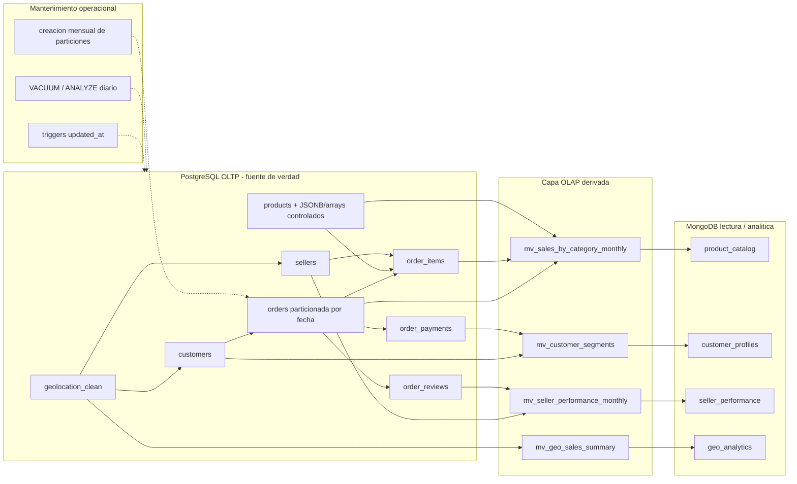
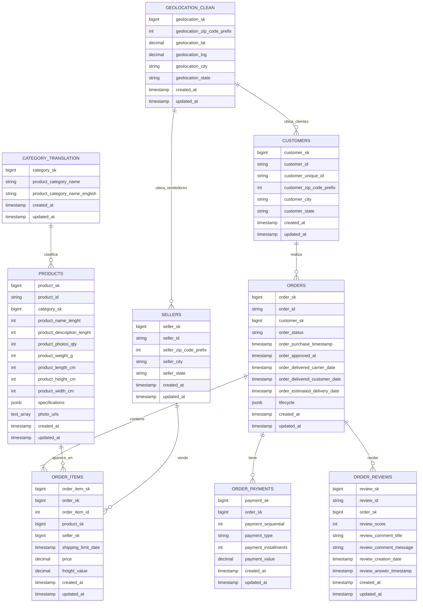
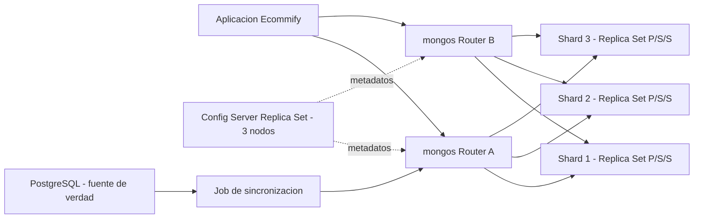
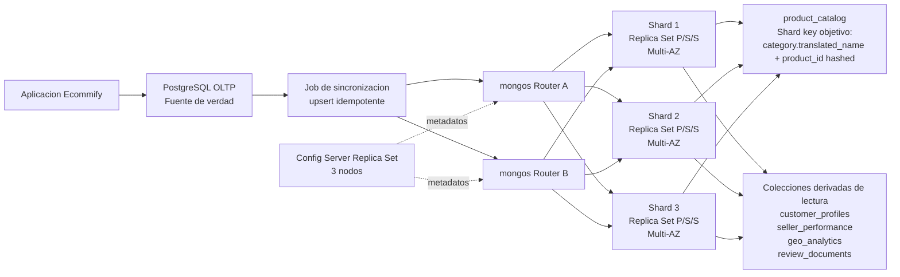

# Ecommify Database Design

## Estructura actual del proyecto

```text
Ecommify_Database_Design/
|-- README.md
|-- docs/
|   |-- Documento_Tecnico_Diseno_Etapa_2.md
|   |-- Documento_Tecnico_Diseno_Etapa_2.pdf
|   |-- Modelo_Entidad_Relacion.md
|   |-- modelo_entidad_relacion.mmd
|   `-- pdf-style.css
|-- postgresql/
|   |-- README.md
|   |-- schema/
|   |   |-- README.md
|   |   |-- paso_01_crear_esquema.sql
|   |   |-- paso_02_crear_tablas_base.sql
|   |   |-- paso_03_crear_indices.sql
|   |   |-- paso_04_crear_triggers_updated_at.sql
|   |   |-- paso_05_crear_vistas_materializadas.sql
|   |   `-- paso_06_borrador_particionamiento_orders.sql
|   |-- queries/
|   |   |-- README.md
|   |   |-- paso_07_refrescar_vistas_materializadas.sql
|   |   `-- paso_08_consultas_analiticas_ejemplo.sql
|   `-- seed_data/
|       `-- README.md
|-- mongodb/
|   |-- README.md
|   |-- schema/
|   |   |-- README.md
|   |   `-- paso_09_crear_colecciones_validadores.js
|   |-- queries/
|   |   |-- README.md
|   |   `-- paso_10_consultas_analiticas_ejemplo.js
|   `-- seed_data/
|       `-- README.md
`-- notebooks/
    `-- Data_Exploration_Analysis.ipynb
```

### Secuencia tecnica de artefactos

| Orden | Carpeta / archivo | Proposito |
|---|---|---|
| 01 | `postgresql/schema/paso_01_crear_esquema.sql` | Crear el esquema `ecommify`. |
| 02 | `postgresql/schema/paso_02_crear_tablas_base.sql` | Crear tablas base, llaves tecnicas, IDs Olist `TEXT UNIQUE`, restricciones y tipos avanzados. |
| 03 | `postgresql/schema/paso_03_crear_indices.sql` | Crear indices para IDs Olist, FK internas, fechas, `JSONB` y arrays. |
| 04 | `postgresql/schema/paso_04_crear_triggers_updated_at.sql` | Crear triggers de mantenimiento de `updated_at`. |
| 05 | `postgresql/schema/paso_05_crear_vistas_materializadas.sql` | Crear vistas materializadas para analitica. |
| 06 | `postgresql/schema/paso_06_borrador_particionamiento_orders.sql` | Alternativa tecnica de particionamiento de `orders` para evaluar el diseno fisico hot/cold. |
| 07 | `postgresql/queries/paso_07_refrescar_vistas_materializadas.sql` | Poblar o refrescar vistas materializadas despues de cargar datos. |
| 08 | `postgresql/queries/paso_08_consultas_analiticas_ejemplo.sql` | Consultas de control tecnico y analitica. |
| 09 | `mongodb/schema/paso_09_crear_colecciones_validadores.js` | Crear colecciones, validadores e indices de MongoDB. |
| 10 | `mongodb/queries/paso_10_consultas_analiticas_ejemplo.js` | Consultas analiticas sobre documentos derivados. |

### Artefactos tecnicos

- `docs/Documento_Tecnico_Diseno_Etapa_2.md`: documento tecnico editable del diseno conceptual y logico.
- `docs/Documento_Tecnico_Diseno_Etapa_2.pdf`: version PDF del documento tecnico.
- `docs/Modelo_Entidad_Relacion.md`: modelo entidad-relacion en Markdown.
- `docs/modelo_entidad_relacion.mmd`: fuente Mermaid del diagrama entidad-relacion.
- `docs/pdf-style.css`: estilos de exportacion PDF para tablas y bloques largos.
- `postgresql/seed_data/` y `mongodb/seed_data/`: criterios tecnicos de carga y sincronizacion de datos.
## Indice

- [Estructura actual del proyecto](#estructura-actual-del-proyecto)
- [Etapa 1 - Investigacion y decisiones tecnicas](#etapa-1---investigacion-y-decisiones-tecnicas)
  - [Analisis de tipos avanzados en PostgreSQL](#1-analisis-de-tipos-avanzados-en-postgresql)
  - [Comparacion inicial: JSONB vs columnas normalizadas](#2-comparacion-inicial-jsonb-vs-columnas-normalizadas)
  - [Decisiones tecnicas derivadas del analisis](#3-decisiones-tecnicas-derivadas-del-analisis)
  - [Discusiones tecnicas abiertas](#4-discusiones-tecnicas-abiertas)
  - [Modelado hibrido OLTP/OLAP](#5-modelado-hibrido-oltp--olap)
    - [Requisitos OLTP vs OLAP de Ecommify](#51-requisitos-oltp-vs-olap-de-ecommify)
    - [Particionamiento de orders por fecha](#52-particionamiento-de-orders-por-fecha)
    - [Vistas materializadas para dashboards](#53-vistas-materializadas-para-dashboards)
    - [Triggers para updated_at](#54-triggers-para-updated_at)
    - [Estrategia de mantenimiento](#55-estrategia-de-mantenimiento)
  - [Metricas de monitoreo OLTP y OLAP](#56-metricas-de-monitoreo-oltp-y-olap)
  - [Estrategia de escalamiento](#57-estrategia-de-escalamiento)
  - [Referencias de trabajo](#6-referencias-de-trabajo)
- [Requisitos y restricciones de negocio adoptadas](#requisitos-y-restricciones-de-negocio-adoptadas)
- [Hallazgos del EDA inicial](#1-hallazgos-del-eda-inicial---dataset-olist--ecommify)
- [Estructura general del dataset](#1-estructura-general-del-dataset)
- [Volumen de datos](#2-volumen-de-datos)
- [Revision de claves y cardinalidad](#3-revision-de-claves-y-cardinalidad)
- [Relaciones principales identificadas](#4-relaciones-principales-identificadas)
- [Calidad de datos y valores nulos](#5-calidad-de-datos-y-valores-nulos)
- [Duplicados](#6-duplicados)
- [Distribucion temporal](#7-distribucion-temporal)
- [Distribucion geografica](#8-distribucion-geografica)
- [Vista integrada orders_full](#9-vista-integrada-orders_full)
- [Implicaciones para el diseño de base de datos](#10-implicaciones-para-el-diseno-de-base-de-datos)
- [Decision arquitectonica preliminar](#11-decision-arquitectonica-preliminar)
- [Matriz de decision PostgreSQL vs MongoDB](#12-matriz-de-decision-postgresql-vs-mongodb)
  - [Ajustes aplicados desde la Etapa 1](#ajustes-aplicados-desde-la-etapa-1)
- [Conclusion tecnica inicial](#13-conclusion-tecnica-inicial)
- [Primera Forma Normal - 1FN](#primera-forma-normal---1fn)
- [Segunda Forma Normal - 2FN](#segunda-forma-normal---2fn)
- [Tercera Forma Normal - 3FN](#tercera-forma-normal---3fn)
- [Esquema normalizado final](#5-esquema-normalizado-final)
- [Identificacion de claves primarias y foraneas](#6-identificacion-de-claves-primarias-y-foraneas)
- [Analisis de trade-offs de alta normalizacion](#7-analisis-de-trade-offs-de-alta-normalizacion)
- [Tablas a normalizar y desnormalizacion estrategica](#8-que-tablas-normalizar-hasta-3fn-y-donde-considerar-desnormalizacion)

---

## Etapa 1 - Investigacion y decisiones tecnicas

Esta seccion documenta los criterios tecnicos que conectan el analisis exploratorio, la normalizacion y las decisiones de diseno fisico/logico para PostgreSQL, MongoDB y las vistas analiticas.

### 1. Analisis de tipos avanzados en PostgreSQL

El analisis inicial nos indica evaluar `JSONB`, arrays, `hstore`, composite types y ranges para identificar ventajas, casos de uso y diferencias frente a columnas normalizadas. A partir del README consolidado, el criterio inicial es conservar el nucleo transaccional en tablas normalizadas y usar tipos avanzados solo cuando aporten flexibilidad real sin romper integridad.

| Tipo avanzado | Ventajas | Posible uso en Ecommify | Riesgo / limite | Decision preliminar |
|---|---|---|---|---|
| `JSONB` | Permite guardar estructuras flexibles, consultar claves internas e indexar con GIN. Es mas eficiente para consulta que `json`. | Atributos variables de producto, eventos de ciclo de vida de una orden, metadatos analiticos derivados. | Puede esconder atributos que deberian estar normalizados y dificultar constraints. | Usarlo solo para datos variables o secundarios, no para claves, precios, pagos, estados principales ni relaciones. |
| Arrays | Permiten almacenar listas simples de valores del mismo tipo. | Lista de URLs de fotos de producto, etiquetas internas de catalogo, flags simples de segmentacion. | No son ideales si cada elemento necesita atributos propios o relaciones. | Usarlos para listas atomicas simples; si el dato necesita detalle, crear tabla relacionada. |
| `hstore` | Modelo clave-valor simple para texto; util cuando todos los valores son cadenas. | Alternativa ligera para atributos simples heredados o metadata textual. | Menos expresivo que `JSONB`; se solapa con casos que `JSONB` resuelve mejor. | No priorizarlo; preferir `JSONB` salvo que se necesite clave-valor textual muy simple. |
| Composite types | Agrupan varios campos bajo un tipo reutilizable. | Direccion logica, dimensiones de producto o coordenadas si se quisiera encapsular estructura. | Pueden reducir claridad si se abusa; las consultas y constraints pueden ser mas incomodas que columnas normales. | Evaluarlo solo para estructuras muy estables y repetidas; inicialmente mantener columnas normalizadas. |
| Ranges | Modelan intervalos con operadores nativos para solapamiento, inclusion y busqueda por rango. | Periodos de promocion, ventanas de entrega, vigencia de campañas o estados temporales. | No aplica a todos los campos de fecha; requiere consultas orientadas a intervalos. | Incorporarlo si se agregan promociones o ventanas de entrega como entidad del proyecto. |

### 2. Comparacion inicial: `JSONB` vs columnas normalizadas

| Criterio | Columnas normalizadas | `JSONB` |
|---|---|---|
| Integridad referencial | Alta: permite PK, FK, `NOT NULL`, `CHECK` y tipos especificos. | Limitada: se puede validar parcialmente, pero no reemplaza relaciones. |
| Consultas transaccionales | Mejor para ordenes, pagos, clientes, productos base y vendedores. | Mejor para atributos flexibles o documentos derivados. |
| Evolucion del esquema | Requiere migraciones al agregar columnas. | Permite agregar claves sin alterar la tabla. |
| Rendimiento | Predecible con indices tradicionales. | Bueno con indices GIN, pero depende del patron de consulta. |
| Uso recomendado en Ecommify | Datos maestros y transaccionales. | Especificaciones variables, metadata y estructuras analiticas complementarias. |

Decision de trabajo: en el modelo de Ecommify, las columnas normalizadas deben seguir siendo la base para `customers`, `orders`, `order_items`, `order_payments`, `products`, `sellers` y `category_translation`. `JSONB` se propone como extension controlada para atributos variables del catalogo o eventos de negocio que no definan la integridad central.

### 3. Decisiones tecnicas derivadas del analisis

| Decision tecnica | Tabla / modulo | Criterio de diseno | PostgreSQL | MongoDB | Estado tecnico |
|---|---|---|---|---|---|
| Incorporar `products.specifications JSONB` | `products` | Los atributos variables de catalogo no justifican nuevas columnas por cada categoria. | Columna `JSONB` con indice GIN si se consultan claves internas. | Subdocumento `specifications` en `product_catalog`. | Adoptado |
| Incorporar `products.photo_urls TEXT[]` | `products` | Una lista simple de URLs puede representarse como arreglo si no tiene metadata propia. | Columna `TEXT[]`; si las imagenes tienen atributos, se modela tabla `product_images`. | Arreglo `photos` en `product_catalog`. | Adoptado como extension de negocio |
| Mantener dimensiones como columnas | `products` | Peso, alto, ancho y largo son medibles, consultables y validables. | Columnas numericas con restricciones de valores no negativos o positivos segun regla. | Subdocumento `dimensions` derivado para lectura. | Adoptado |
| Mantener pagos normalizados | `order_payments` | Los pagos requieren consistencia financiera, secuencia e integridad referencial. | `payment_sk` como PK tecnica y `UNIQUE (order_sk, payment_sequential)`. | Resumen derivado, no fuente de verdad. | Adoptado |
| Incorporar `orders.lifecycle JSONB` | `orders` | Los eventos complementarios del ciclo de vida pueden variar sin reemplazar fechas principales. | Columna `JSONB` para historial complementario; fechas operativas siguen normalizadas. | Timeline derivado en documentos analiticos. | Adoptado |
| Excluir promociones con ranges del alcance inicial | `promotions` | El dataset base no incluye promociones ni campañas. | No se crea modulo inicial de promociones. | No se crea coleccion documental inicial. | Descartado para esta version |
| Descartar `hstore` | PostgreSQL | `JSONB` cubre mejor los casos flexibles previstos. | No se habilita la extension `hstore`. | Sin impacto documental. | Descartado |
| Descartar composite type para dimensiones | `products` | Las columnas simples facilitan constraints, indices y lectura del modelo. | No se crea composite type; se conservan columnas numericas. | `dimensions` puede existir solo como subdocumento derivado. | Descartado |
### 4. Discusiones tecnicas abiertas

- Que atributos variables reales tendria un producto tecnologico en Ecommify: marca, modelo, garantia, color, memoria, compatibilidad, condicion?
- Las fotos del producto deben ser solo una cantidad (`product_photos_qty`) como en Olist o una lista real de URLs?
- El ciclo de vida de una orden debe quedarse solo con fechas principales o conviene guardar eventos historicos adicionales?
- El proyecto incluira promociones, campañas o ventanas de entrega que justifiquen usar ranges?
- Se requiere que algun atributo flexible sea consultado frecuentemente? Si la respuesta es si, se debe definir indice o columna normalizada.


### 5. Modelado hibrido OLTP / OLAP

El analisis de cargas nos indica la necesidad de estudiar tecnicas de modelado hibrido, es decir, un diseño que soporte transacciones operacionales y consultas analiticas sin mezclar responsabilidades. Para Ecommify, la decision preliminar es mantener PostgreSQL como fuente de verdad transaccional y construir estructuras analiticas derivadas mediante vistas materializadas, particiones, jobs programados y documentos MongoDB orientados a lectura.

#### Diagrama de arquitectura hibrida OLTP / OLAP



#### 5.1 Requisitos OLTP vs OLAP de Ecommify

| Tipo de carga | Necesidad en Ecommify | Tablas / estructuras involucradas | Criterio de diseño |
|---|---|---|---|
| OLTP | Registrar ordenes, items, pagos, clientes, productos y vendedores con consistencia. | `orders`, `order_items`, `order_payments`, `customers`, `products`, `sellers`. | Modelo relacional normalizado, PK/FK, constraints e indices sobre claves de busqueda. |
| OLTP | Consultar estado de una orden y sus pagos. | `orders`, `order_payments`, `order_items`. | Acceso por `order_id`, consistencia fuerte y pagos fuera de `JSONB`. |
| OLTP | Mantener datos maestros de productos y vendedores. | `products`, `sellers`, `category_translation`. | 3FN con extensiones controladas: `products.specifications JSONB` y `products.photo_urls TEXT[]`. |
| OLAP | Analizar ventas por categoria, mes, estado, vendedor y producto. | Vistas materializadas sobre `orders`, `order_items`, `products`, `sellers`, `customers`, `order_payments`. | Precalcular agregados para dashboards y evitar joins costosos en cada consulta. |
| OLAP | Segmentar clientes por comportamiento de compra. | `customers`, `orders`, `order_payments`, `order_reviews`. | Vista materializada o coleccion MongoDB derivada para perfiles analiticos. |
| OLAP | Analisis geografico y logistico. | `customers`, `sellers`, `geolocation_clean`, `orders`. | Limpiar geolocalizacion, agregar por region y considerar PostGIS en fase posterior. |

Decision de trabajo: el modelo OLTP no debe sacrificarse para facilitar dashboards. Las consultas analiticas deben apoyarse en vistas materializadas, particiones, indices, jobs de mantenimiento y, cuando tenga sentido, documentos MongoDB derivados.

#### 5.2 Particionamiento de `orders` por fecha

La tabla `orders` es candidata a particionamiento por fecha porque concentra el evento transaccional principal (`order_purchase_timestamp`) y es la base de reportes mensuales, tendencias y consultas historicas.

| Elemento | Decision preliminar |
|---|---|
| Tabla particionada | `orders` |
| Columna de particion | `order_purchase_timestamp` |
| Tipo de particion | Rango mensual |
| Particiones hot | Mes actual y meses recientes, usadas para consultas frecuentes y operaciones activas. |
| Particiones cold | Meses historicos, usadas principalmente para analitica y auditoria. |
| Beneficio esperado | Reducir escaneo de datos historicos, facilitar mantenimiento y mejorar consultas por periodo. |

Ejemplo conceptual de particiones:

```sql
orders_2017_10
orders_2017_11
orders_2017_12
orders_2018_01
...
```

Impacto en el diseño:

- El EDA debe conservar el analisis temporal por `order_purchase_timestamp`.
- La normalizacion no cambia: `orders` sigue siendo entidad central en 3FN.
- El documento tecnico debe justificar el particionamiento por volumen, consultas por fecha y separacion hot/cold.
- PostgreSQL debe incluir DDL de particionamiento en `postgresql/schema`.
- MongoDB no reemplaza el particionamiento; puede consumir datos agregados derivados.

#### 5.3 Vistas materializadas para dashboards

Las vistas materializadas permiten resolver necesidades OLAP sin convertir `orders_full` en tabla transaccional. Se proponen como estructuras derivadas para dashboards y consultas recurrentes.

| Vista materializada | Fuente principal | Uso analitico | Frecuencia sugerida |
|---|---|---|---|
| `mv_sales_by_category_monthly` | `orders`, `order_items`, `products`, `category_translation`, `order_payments` | Ventas mensuales por categoria, ingresos, cantidad de ordenes e items. | Refresh semanal o diario si el dashboard lo requiere. |
| `mv_customer_segments` | `customers`, `orders`, `order_payments`, `order_reviews` | Segmentacion de clientes por frecuencia, gasto, recencia y satisfaccion. | Refresh semanal. |
| `mv_seller_performance_monthly` | `sellers`, `order_items`, `orders`, `order_reviews` | Desempeño de vendedores por ventas, entregas y calificacion. | Refresh semanal. |
| `mv_geo_sales_summary` | `customers`, `sellers`, `orders`, `geolocation_clean` | Analisis por estado, ciudad o prefijo postal. | Refresh semanal o mensual. |

Decision de trabajo: `orders_full` se mantiene como vista exploratoria o base conceptual, pero los dashboards deben apoyarse en vistas materializadas especificas y documentadas.

#### 5.4 Triggers para `updated_at`

Para mantener trazabilidad operacional, las tablas transaccionales y maestras deberian incluir `created_at` y `updated_at`. El campo `updated_at` se puede mantener mediante trigger.

| Tabla | Requiere `created_at` / `updated_at` | Motivo |
|---|---|---|
| `customers` | Si | Cambios en datos maestros del cliente. |
| `orders` | Si | Cambios de estado, fechas o lifecycle. |
| `order_items` | Si | Ajustes de detalle de orden si el proceso lo permite. |
| `order_payments` | Si | Trazabilidad de pagos, sin moverlos a `JSONB`. |
| `products` | Si | Cambios en catalogo, especificaciones o fotos. |
| `sellers` | Si | Cambios en datos maestros de vendedor. |
| `order_reviews` | Opcional | Puede ser util si se actualizan respuestas o correcciones. |

Ejemplo conceptual:

```sql
CREATE OR REPLACE FUNCTION set_updated_at()
RETURNS trigger AS $$
BEGIN
  NEW.updated_at = now();
  RETURN NEW;
END;
$$ LANGUAGE plpgsql;
```

Impacto en el documento: agregar en el diseño logico una subseccion de auditoria operacional y triggers. En PostgreSQL, esto se convertira en script DDL. En MongoDB, `updated_at` puede existir en documentos derivados, pero no debe ser la fuente de verdad.

#### 5.5 Estrategia de mantenimiento

| Job programado | Frecuencia propuesta | Objetivo | Impacto |
|---|---|---|---|
| `VACUUM` / `ANALYZE` | Diario | Mantener estadisticas e higiene de tablas transaccionales. | Mejora planes de consulta y reduce degradacion. |
| Refresh de vistas materializadas | Semanal inicialmente | Actualizar dashboards sin sobrecargar consultas OLTP. | Mantiene datos analiticos suficientemente frescos. |
| Creacion de particiones | Mensual | Preparar la siguiente particion de `orders`. | Evita fallos de insercion y mantiene estrategia hot/cold. |
| Revision de indices | Mensual | Detectar indices no usados o faltantes. | Optimiza rendimiento OLTP/OLAP. |
| Limpieza/consolidacion de `geolocation` | Inicial y luego bajo demanda | Reducir duplicados y preparar referencia geografica. | Mejora analisis logistico y geografico. |

Decision de trabajo: documentar estos jobs como parte del plan de mantenimiento, aunque la implementacion exacta dependa de Supabase, cron externo o jobs administrados.

#### 5.6 Metricas de monitoreo OLTP y OLAP

| Categoria | Metrica | Uso |
|---|---|---|
| OLTP | Latencia de insercion de ordenes | Validar que el particionamiento e indices no afecten operaciones criticas. |
| OLTP | Tiempo de consulta por `order_id` | Medir experiencia de soporte/consulta operacional. |
| OLTP | Errores de FK o constraints | Detectar problemas de integridad. |
| OLTP | Crecimiento mensual de `orders` y `order_items` | Planificar particiones y almacenamiento. |
| OLAP | Tiempo de refresh de vistas materializadas | Ajustar frecuencia de mantenimiento. |
| OLAP | Tiempo de consulta de dashboards | Validar si las vistas materializadas son suficientes. |
| OLAP | Desfase entre datos transaccionales y analiticos | Medir frescura de informacion para reportes. |
| OLAP | Tamaño de vistas materializadas y documentos MongoDB | Planificar almacenamiento y escalamiento. |

#### 5.7 Estrategia de escalamiento

| Escenario | Señal de alerta | Accion propuesta |
|---|---|---|
| Free tier o instancia inicial se queda corta | Consultas lentas, refresh muy largo, almacenamiento alto. | Optimizar indices, reducir frecuencia de refresh o subir plan. |
| `orders` crece rapidamente | Escaneos por fecha tardan demasiado. | Activar particionamiento mensual y revisar pruning de particiones. |
| Dashboards afectan OLTP | Carga alta durante consultas analiticas. | Usar vistas materializadas, replicas de lectura o MongoDB derivado. |
| Geolocalizacion pesa demasiado | Consultas geograficas lentas o duplicados altos. | Consolidar `geolocation_clean`, agregar indices y evaluar PostGIS. |
| Catalogo requiere atributos muy variables | Muchas migraciones para nuevas columnas. | Usar `products.specifications JSONB` con gobernanza de claves permitidas. |

Decision de trabajo: el escalamiento debe empezar por diseño fisico, indices, particiones y vistas materializadas antes de desnormalizar el nucleo transaccional.

### 6. Referencias de trabajo

- PostgreSQL 16 Documentation - JSON Types: https://www.postgresql.org/docs/16/datatype-json.html
- PostgreSQL 16 Documentation - Arrays: https://www.postgresql.org/docs/16/arrays.html
- PostgreSQL 16 Documentation - hstore: https://www.postgresql.org/docs/16/hstore.html
- PostgreSQL 16 Documentation - Composite Types: https://www.postgresql.org/docs/16/rowtypes.html
- PostgreSQL 16 Documentation - Range Types: https://www.postgresql.org/docs/16/rangetypes.html

---

## Requisitos y restricciones de negocio adoptadas

Esta seccion incorpora decisiones utiles del documento de trabajo de la unidad 2 y las alinea con el marco definido en este README. No cambia la arquitectura acordada: PostgreSQL conserva el nucleo transaccional y MongoDB queda como capa documental/analitica derivada.

### Requisitos funcionales adoptados

| Requisito funcional | Como aparece en el documento | Como queda alineado en este README | Impacto en el modelo |
|---|---|---|---|
| Gestion de catalogo | Administracion de productos, dimensiones, pesos y categorias jerarquicas. | Se conserva `products` como tabla base en PostgreSQL y se permite catalogo enriquecido en MongoDB. | `products` mantiene columnas normalizadas para dimensiones y agrega `specifications JSONB` y `photo_urls TEXT[]` como flexibilidad controlada. |
| Gestion transaccional | Procesamiento atomico de pedidos, pagos y seguimiento logistico. | PostgreSQL es la fuente de verdad para `orders`, `order_items` y `order_payments`. | Se mantienen PK/FK, pagos fuera de `JSONB`, constraints y claves compuestas donde aplica. |
| Gestion analitica y feedback | Registro de reseñas y analisis geografico basado en prefijos postales. | Reseñas y geografia se mantienen relacionadas con el nucleo, pero pueden alimentar documentos y vistas analiticas. | `order_reviews` puede existir en PostgreSQL y MongoDB derivado; `geolocation` debe limpiarse como `geolocation_clean`. |
| Trazabilidad logistica | Gestion de fechas de compra, aprobacion, despacho, entrega estimada y entrega real. | Las fechas principales permanecen como columnas de `orders`; `orders.lifecycle JSONB` solo complementa eventos. | `order_purchase_timestamp` es clave para consultas temporales y particionamiento de `orders`. |

### Requisitos no funcionales adoptados

| Requisito no funcional | Como aparece en el documento | Como queda alineado en este README | Impacto en el modelo |
|---|---|---|---|
| Consistencia | Garantizar integridad referencial en transacciones ACID. | PostgreSQL prioriza consistencia para ordenes, items, pagos, clientes, productos y vendedores. | Uso de PK, FK, `NOT NULL`, `CHECK` e indices transaccionales. |
| Flexibilidad | Manejar datos dispersos o variables en catalogo y reseñas. | La flexibilidad no reemplaza el modelo relacional; se usa en `JSONB`, arrays y MongoDB derivado. | `products.specifications JSONB`, `products.photo_urls TEXT[]` y documentos `product_catalog`. |
| Escalabilidad | Soportar crecimiento de `orders` y `order_items` sin degradar rendimiento. | Se adopta modelado hibrido OLTP/OLAP con particiones, vistas materializadas y documentos derivados. | `orders` particionada por fecha, MVs para dashboards y jobs de mantenimiento. |
| Rendimiento | Optimizar busquedas geograficas y por texto. | Se mantiene como decision tecnica para indices y extensiones. | Posible uso de `pg_trgm`, indices por fecha/clave y futura evaluacion de PostGIS para geografia. |

### Restricciones de negocio adoptadas

Estas restricciones se incorporan porque fortalecen la consistencia del modelo y conectan directamente con los hallazgos del EDA.

| Restriccion | Tabla / campo | Regla adoptada | Justificacion |
|---|---|---|---|
| Precio no negativo | `order_items.price` | `CHECK (price >= 0)` | Un item de orden no debe registrar precios negativos por errores de captura o carga. |
| Flete no negativo | `order_items.freight_value` | `CHECK (freight_value >= 0)` | El valor de envio debe ser cero o positivo. |
| Pago no negativo | `order_payments.payment_value` | `CHECK (payment_value >= 0)` | Los pagos son financieros y requieren validacion estricta. |
| Pagos secuenciales por orden | `order_payments` | `payment_sk` como PK tecnica y `UNIQUE (order_sk, payment_sequential)` | Una orden puede tener varios pagos; la combinacion natural se conserva como restriccion unica auditable. |
| Fecha de compra obligatoria | `orders.order_purchase_timestamp` | `NOT NULL` | Toda orden debe tener fecha de compra; ademas soporta analisis temporal y particionamiento. |
| Estado de orden obligatorio | `orders.order_status` | `NOT NULL` recomendado | Permite seguimiento operacional y segmentacion de ordenes por estado. |
| Categoria de producto controlada | `products.product_category_name` | FK hacia `category_translation` cuando exista la categoria limpia | Evita inconsistencias de catalogo y permite analisis por categoria. |
| Reseñas con score valido | `order_reviews.review_score` | `CHECK (review_score BETWEEN 1 AND 5)` | La escala de reseñas debe mantenerse dentro del rango valido. |

### Decision de llaves tecnicas y trazabilidad

El analisis de implementacion en PostgreSQL indica que no conviene usar todos los IDs originales de Olist como claves primarias fisicas. Aunque `customer_id`, `order_id`, `product_id`, `seller_id` y `review_id` son utiles para trazabilidad, son identificadores externos de texto y generan indices mas grandes que una llave numerica interna.

Decision adoptada:

| Criterio | Decision | Justificacion |
|---|---|---|
| PK fisicas | Usar llaves tecnicas `BIGINT GENERATED ALWAYS AS IDENTITY` con sufijo `_sk`. | Mejora rendimiento de joins, reduce tamano de indices y evita depender de IDs externos. |
| IDs Olist | Mantenerlos como `TEXT UNIQUE`. | Conservan trazabilidad con los CSV originales y permiten busqueda operacional. |
| FK internas | Usar `customer_sk`, `order_sk`, `product_sk`, `seller_sk`, `category_sk`. | Las relaciones quedan estables y eficientes en PostgreSQL. |
| Claves naturales | Mantenerlas con `UNIQUE` cuando representan reglas de negocio. | Por ejemplo, pagos conserva `UNIQUE (order_sk, payment_sequential)`. |
| UUID | No adoptarlo inicialmente. | Los IDs Olist no son UUID generados por el sistema; convertirlos artificialmente no aporta valor al alcance actual. |

### Implicaciones para SQL preliminar

Estas reglas deben reflejarse posteriormente en los scripts DDL dentro de `postgresql/schema`:

```sql
price DECIMAL(10,2) CHECK (price >= 0)
freight_value DECIMAL(10,2) CHECK (freight_value >= 0)
payment_value DECIMAL(10,2) CHECK (payment_value >= 0)
payment_sk BIGINT GENERATED ALWAYS AS IDENTITY PRIMARY KEY
UNIQUE (order_sk, payment_sequential)
order_purchase_timestamp TIMESTAMP NOT NULL
review_score INTEGER CHECK (review_score BETWEEN 1 AND 5)
```

### Implicaciones para MongoDB

MongoDB debe recibir datos derivados, no reemplazar las restricciones transaccionales de PostgreSQL. Por tanto:

- `payment_summary` en documentos analiticos se deriva desde `order_payments`, pero no reemplaza esa tabla.
- `product_catalog` puede incluir `specifications`, `photos` y `dimensions`, pero la fuente base del producto sigue en PostgreSQL.
- `reviews` puede almacenar texto libre y campos opcionales, pero `review_score` debe conservar la escala valida.
- Los documentos deben usar tipos propios de MongoDB (`object`, `array`, `string`, `number`, `date`) y no declarar `JSONB` como tipo documental.

---

## 1. Hallazgos del EDA inicial - Dataset Olist / Ecommify

## Introduccion

Para esta actividad nuestro caso se basará en Ecommify es una plataforma de e-commerce multivendedor enfocada en productos tecnológicos. Como parte de la actividad que trabajaremos a lo largo del ciclo nos enfocaremos en diseñar la base de su arquitectura de datos, para la actividad estamos trabajando con el dataset real "Brazilian E-commerce (Olist)" extraído de Kaggle. El objetivo de este informe es trazar nuestra hoja de ruta técnica y definir cómo vamos a estructurar el sistema para que soporte tanto las ventas como la parte analítica del negocio.

## 1. Estructura general del dataset

El dataset analizado corresponde al conjunto de datos Brazilian E-commerce Public Dataset by Olist, utilizado como base para el caso académico Ecommify.

El conjunto de datos está compuesto por 9 archivos CSV relacionados con clientes, órdenes, productos, vendedores, pagos, reseñas, geolocalización y categorías de producto:

| Tabla | Descripción general |
|---|---|
| `customers` | Información de clientes, ciudad, estado y código postal. |
| `geolocation` | Información geográfica por prefijo de código postal. |
| `order_items` | Detalle de productos incluidos en cada orden. |
| `order_payments` | Información de pagos asociados a las órdenes. |
| `order_reviews` | Reseñas y calificaciones realizadas por los clientes. |
| `orders` | Información principal de las órdenes y sus estados. |
| `products` | Información base de productos, dimensiones y categorías. |
| `sellers` | Información de vendedores. |
| `category_translation` | Traducción de categorías de producto. |

El dataset presenta una estructura principalmente relacional, ya que existen identificadores comunes entre tablas, como `order_id`, `customer_id`, `product_id`, `seller_id` y `product_category_name`.

---

## 2. Volumen de datos

Al subir los archivos a Colab y hacer las relaciones entre las llaves y estructura de cada uno de los archivos, consolidamos un dataset maestro con 119,143 registros y 36 columnas. Esto nos permitió entender el contexto general de cómo se conectan los clientes, los pedidos, los pagos y los productos.

Durante el EDA se identificó el volumen de registros y columnas por cada tabla:

| Tabla | Filas | Columnas |
|---|---:|---:|
| `geolocation` | 1.000.163 | 5 |
| `order_items` | 112.650 | 7 |
| `order_payments` | 103.886 | 5 |
| `customers` | 99.441 | 5 |
| `orders` | 99.441 | 8 |
| `order_reviews` | 99.224 | 7 |
| `products` | 32.951 | 9 |
| `sellers` | 3.095 | 4 |
| `category_translation` | 71 | 2 |

La tabla con mayor volumen es `geolocation`, con más de un millón de registros. Le siguen `order_items`, `order_payments`, `customers`, `orders` y `order_reviews`, que concentran la mayor parte de la información transaccional del e-commerce.

Este volumen permite identificar dos necesidades principales:

1. Un modelo transaccional estructurado para órdenes, clientes, pagos, productos y vendedores.
2. Un modelo analítico o agregado para información geográfica, reseñas y análisis de comportamiento.

---

## 3. Revisión de claves y cardinalidad

Se revisaron las columnas principales de cada tabla para identificar posibles claves primarias y relaciones entre entidades.

| Tabla | Columna evaluada | Filas | Valores únicos | Duplicados en la clave |
|---|---|---:|---:|---:|
| `customers` | `customer_id` | 99.441 | 99.441 | 0 |
| `orders` | `order_id` | 99.441 | 99.441 | 0 |
| `order_items` | `order_id` | 112.650 | 98.666 | 13.984 |
| `order_payments` | `order_id` | 103.886 | 99.440 | 4.446 |
| `order_reviews` | `order_id` | 99.224 | 98.673 | 551 |
| `products` | `product_id` | 32.951 | 32.951 | 0 |
| `sellers` | `seller_id` | 3.095 | 3.095 | 0 |
| `geolocation` | `geolocation_zip_code_prefix` | 1.000.163 | 19.015 | 981.148 |
| `category_translation` | `product_category_name` | 71 | 71 | 0 |

Se identificó que `customers.customer_id`, `orders.order_id`, `products.product_id`, `sellers.seller_id` y `category_translation.product_category_name` tienen comportamiento adecuado como claves únicas.

En cambio, `order_items.order_id`, `order_payments.order_id` y `order_reviews.order_id` presentan valores repetidos. Esto no necesariamente representa un error, ya que una orden puede tener varios ítems, varios pagos o más de una relación asociada. En estos casos, se requiere analizar claves compuestas o relaciones 1:N.

La tabla `geolocation` presenta una alta cantidad de valores repetidos en `geolocation_zip_code_prefix`, lo cual indica que esta tabla requiere limpieza, agregación o consolidación antes de ser utilizada en el modelo final.

---

## 4. Relaciones principales identificadas

Se validaron las relaciones principales entre tablas mediante comparación de valores entre columnas origen y destino.

| Tabla origen | Columna origen | Tabla destino | Columna destino | Valores sin relación |
|---|---|---|---|---:|
| `orders` | `customer_id` | `customers` | `customer_id` | 0 |
| `order_items` | `order_id` | `orders` | `order_id` | 0 |
| `order_payments` | `order_id` | `orders` | `order_id` | 0 |
| `order_reviews` | `order_id` | `orders` | `order_id` | 0 |
| `order_items` | `product_id` | `products` | `product_id` | 0 |
| `order_items` | `seller_id` | `sellers` | `seller_id` | 0 |
| `products` | `product_category_name` | `category_translation` | `product_category_name` | 2 |

Las relaciones principales entre órdenes, clientes, pagos, productos y vendedores no presentan valores huérfanos, lo cual evidencia una estructura consistente para un modelo relacional.

La única relación con diferencias se encuentra entre `products.product_category_name` y `category_translation.product_category_name`, donde se identificaron 2 valores sin relación. Esto debe revisarse en la fase de limpieza o transformación de datos.

---

## 5. Calidad de datos y valores nulos

Se identificaron valores nulos en columnas específicas del dataset:

| Tabla | Columna | Nulos | Porcentaje |
|---|---|---:|---:|
| `order_reviews` | `review_comment_title` | 87.656 | 88,34% |
| `order_reviews` | `review_comment_message` | 58.247 | 58,70% |
| `orders` | `order_delivered_customer_date` | 2.965 | 2,98% |
| `products` | `product_name_lenght` | 610 | 1,85% |
| `products` | `product_category_name` | 610 | 1,85% |
| `products` | `product_description_lenght` | 610 | 1,85% |
| `products` | `product_photos_qty` | 610 | 1,85% |
| `orders` | `order_delivered_carrier_date` | 1.783 | 1,79% |
| `orders` | `order_approved_at` | 160 | 0,16% |
| `products` | `product_weight_g` | 2 | 0,01% |
| `products` | `product_length_cm` | 2 | 0,01% |
| `products` | `product_height_cm` | 2 | 0,01% |
| `products` | `product_width_cm` | 2 | 0,01% |

Los valores nulos más relevantes se encuentran en `order_reviews`, especialmente en `review_comment_title` y `review_comment_message`. Esto puede considerarse normal dentro del negocio, ya que no todos los clientes dejan comentarios escritos aunque sí puedan registrar una calificación.

En la tabla `orders`, los nulos en fechas de entrega o aprobación pueden estar asociados a órdenes canceladas, no entregadas o con estados incompletos. Estos registros requieren análisis adicional antes de ser utilizados para métricas logísticas.

En la tabla `products`, los nulos están asociados principalmente a categoría, descripción, fotos y dimensiones. Estos campos deben ser revisados antes de construir un catálogo enriquecido.

---

## 6. Duplicados

Se realizó una validación de registros duplicados completos por tabla.

| Tabla | Duplicados completos |
|---|---:|
| `customers` | 0 |
| `geolocation` | 261.831 |
| `order_items` | 0 |
| `order_payments` | 0 |
| `order_reviews` | 0 |
| `orders` | 0 |
| `products` | 0 |
| `sellers` | 0 |
| `category_translation` | 0 |

La única tabla con duplicados completos es `geolocation`, con 261.831 registros duplicados. Esto indica que la información geográfica debe ser depurada o agregada antes de incorporarse al modelo final.

Para efectos de arquitectura, `geolocation` puede tratarse como una fuente de datos analítica o de referencia, no necesariamente como una tabla transaccional central.

---

## 7. Distribución temporal

La distribución temporal de órdenes se analizó a partir de la columna `order_purchase_timestamp`.

Esta variable permite observar el comportamiento de las compras en el tiempo y puede ser útil para:

- Analizar estacionalidad de ventas.
- Identificar periodos de mayor volumen transaccional.
- Diseñar estrategias de particionamiento por fecha en PostgreSQL.
- Definir índices sobre columnas temporales.
- Construir indicadores mensuales para análisis en MongoDB o dashboards.

Desde el punto de vista del diseño de bases de datos, las columnas de fecha de la tabla `orders` son relevantes para consultas frecuentes como:

- Órdenes por mes.
- Órdenes entregadas vs no entregadas.
- Tiempo entre compra y entrega.
- Cumplimiento de fecha estimada de entrega.

---

## 8. Distribución geográfica

Se analizaron distribuciones geográficas de clientes, vendedores y órdenes por estado.

Las columnas más relevantes para este análisis son:

- `customer_state`
- `customer_city`
- `customer_zip_code_prefix`
- `seller_state`
- `seller_city`
- `seller_zip_code_prefix`
- `geolocation_zip_code_prefix`

La información geográfica permite identificar concentración de clientes, vendedores y órdenes por región. Este tipo de información es útil para análisis de cobertura, logística, comportamiento regional y segmentación comercial.

Dado que `geolocation` es la tabla de mayor volumen y presenta duplicados, se recomienda usarla como fuente para construir agregaciones geográficas, en lugar de usarla directamente como una tabla operacional sin limpieza previa.

---

## 9. Vista integrada `orders_full`

Se construyó una vista integrada denominada `orders_full`, uniendo las tablas principales:

- `orders`
- `customers`
- `order_items`
- `products`
- `sellers`
- `order_payments`
- `order_reviews`

Esta vista permite observar una versión denormalizada del proceso de compra, integrando información de cliente, orden, producto, vendedor, pago y reseña.

La vista `orders_full` es útil para análisis exploratorio, pero no debería ser el modelo físico principal de una base transaccional, ya que puede generar duplicidad de datos y redundancia. Sin embargo, puede ser una base útil para construir documentos analíticos en MongoDB o datasets preparados para visualización.

---

## 10. Implicaciones para el diseño de base de datos

El EDA evidencia que el dataset tiene una estructura relacional clara para las entidades centrales del negocio:

- Clientes.
- Órdenes.
- Ítems de orden.
- Pagos.
- Productos.
- Vendedores.
- Categorías.

Estas entidades presentan relaciones fuertes y requieren integridad referencial, por lo que son candidatas naturales para PostgreSQL.

Por otro lado, también se identifican datos con características analíticas o flexibles:

- Reseñas con campos opcionales y texto libre.
- Catálogo de productos enriquecido.
- Datos geográficos de alto volumen.
- Vistas agregadas por cliente, producto, vendedor o región.
- Indicadores para análisis de comportamiento de compra.

Estos datos pueden modelarse como documentos o estructuras desnormalizadas en MongoDB.

---

## 11. Decisión arquitectónica preliminar

A partir del EDA, se propone una arquitectura híbrida transaccional-analítica basada en PostgreSQL y MongoDB.

PostgreSQL será utilizado como base de datos principal para el módulo transaccional, almacenando entidades estructuradas como clientes, órdenes, pagos, productos, vendedores e ítems de pedido. Esta decisión se justifica porque estas entidades presentan relaciones claras, no evidencian valores huérfanos en sus relaciones principales y requieren consistencia en operaciones críticas como la creación de órdenes y el registro de pagos.

MongoDB será utilizado como base de datos complementaria para el módulo analítico, almacenando documentos enriquecidos de catálogo, reseñas, comportamiento de compra y análisis geográfico. Esta decisión se justifica porque estos datos pueden consultarse de forma flexible, agregada y orientada a lectura, sin depender de múltiples JOIN entre tablas.

La arquitectura permite separar responsabilidades:

- PostgreSQL garantiza consistencia, integridad referencial y control transaccional.
- MongoDB permite flexibilidad, consultas analíticas, documentos enriquecidos y exploración de datos.

Ajuste derivado de la Etapa 1: PostgreSQL sigue siendo la fuente de verdad relacional, pero se incorporan tipos avanzados de forma controlada. Se aprueba agregar `products.specifications JSONB`, `products.photo_urls TEXT[]` y `orders.lifecycle JSONB`. Se mantiene `order_payments` como tabla relacional, se descarta `hstore`, se rechaza el modulo de promociones con `TSTZRANGE` para el alcance inicial y no se usara composite type para dimensiones porque las dimensiones se conservan como columnas simples.


---

## 12. Matriz de decisión PostgreSQL vs MongoDB

| Entidad / elemento | Decisión en PostgreSQL | Decisión en MongoDB | Justificación / decisión aplicada |
|---|---|---|---|
| `customers` | Tabla base normalizada y fuente de verdad para clientes. | Resumen derivado en `customer_profiles`. | Entidad estructurada relacionada con órdenes; MongoDB solo consolida métricas analíticas de comportamiento. |
| `orders` | Tabla transaccional principal, con `order_purchase_timestamp NOT NULL`, `orders.lifecycle JSONB`, particionamiento mensual por fecha y triggers de `updated_at`. | Timeline o resumen derivado de orden en documentos analíticos. | Núcleo OLTP del negocio; MongoDB no reemplaza la integridad ni el particionamiento, solo facilita lectura y dashboards. |
| `order_items` | Tabla relacional que conecta orden, producto y vendedor, con precios y fletes validados. | Agregados de ventas por producto, categoría o vendedor. | Se mantiene normalizada para integridad; puede alimentar métricas OLAP y documentos derivados. |
| `order_payments` | Tabla relacional con `payment_sk` como PK tecnica, `UNIQUE (order_sk, payment_sequential)` y `CHECK (payment_value >= 0)`. | Solo resumen derivado de pagos. | Los pagos requieren consistencia transaccional; no se mueven a `JSONB` ni a documento como fuente principal. |
| `products` | Tabla base con categoría, dimensiones como columnas, `specifications JSONB` y `photo_urls TEXT[]`. | Catálogo enriquecido `product_catalog` con `specifications`, `photos`, `dimensions`, reseñas y métricas. | PostgreSQL conserva el producto maestro; MongoDB mejora lecturas de catálogo enriquecido sin romper normalización. |
| `category_translation` | Tabla de referencia normalizada para traducir categorías. | Campo embebido o derivado dentro de `product_catalog`. | Es pequeña, estable y útil para FK en PostgreSQL; en MongoDB solo se replica para consulta. |
| `sellers` | Tabla base normalizada de vendedores. | Resumen derivado en `seller_performance`. | Entidad estructurada con relaciones transaccionales; MongoDB consolida desempeño, ventas y métricas. |
| `order_reviews` | Tabla relacional asociada a órdenes, con validación de `review_score BETWEEN 1 AND 5`. | Documentos enriquecidos de reseñas y feedback. | El texto libre y campos opcionales justifican una capa documental derivada para análisis de experiencia. |
| `geolocation` | Tabla limpia o consolidada para referencia geográfica. | Colección `geo_analytics` con agregados por ciudad, estado o región. | El alto volumen y duplicados requieren limpieza; MongoDB se usa para lectura geográfica agregada. |
| `orders_full` | No se adopta como modelo físico transaccional. | Puede alimentar documentos analíticos o datasets de dashboard. | Es útil como vista denormalizada de análisis, pero no debe reemplazar el modelo normalizado. |
| Promociones con rangos | Fuera del alcance inicial. | Fuera del alcance inicial. | Se rechaza para esta versión del diseño; los tipos `range` quedan evaluados pero no implementados. |
| `hstore` | No se usa. | Sin impacto. | Se descarta porque `JSONB` cubre mejor los casos flexibles previstos. |
| Composite type para dimensiones | No se usa; dimensiones quedan como columnas numéricas. | Puede representarse como subdocumento `dimensions` solo de lectura. | Se rechaza como decisión inicial para mantener claridad, validación simple y consultas directas. |
| Vistas materializadas | `mv_sales_by_category_monthly`, `mv_customer_segments`, `mv_seller_performance_monthly`, `mv_geo_sales_summary`. | Pueden alimentar colecciones analíticas derivadas. | Aprobadas para dashboards y consultas OLAP sin afectar las tablas OLTP. |
| Jobs de mantenimiento | `VACUUM/ANALYZE`, refresh de MVs, creación mensual de particiones y revisión de índices. | Sincronización o refresh de documentos derivados. | Aprobado como estrategia operativa para sostener rendimiento y escalabilidad. |


---

## 13. Conclusión técnica inicial

El EDA permitió comprender la estructura, volumen, relaciones y calidad de los datos del dataset Olist utilizado para el caso Ecommify.

Los resultados muestran que el dataset tiene una base relacional sólida para representar procesos transaccionales como clientes, órdenes, pagos, productos y vendedores. Las principales relaciones entre estas entidades no presentan valores huérfanos, lo cual facilita el diseño de un modelo relacional normalizado en PostgreSQL.

También se identificaron componentes con orientación analítica o flexible, como reseñas, catálogo enriquecido, geolocalización y vistas integradas de órdenes. Estos elementos pueden beneficiarse de un modelo documental en MongoDB, especialmente para consultas agregadas, dashboards y análisis exploratorio.

Por lo tanto, el EDA respalda la selección de una arquitectura híbrida transaccional-analítica para Ecommify, en la cual PostgreSQL actúa como fuente principal de verdad para los datos operacionales y MongoDB como base complementaria para análisis, documentos enriquecidos y consultas flexibles.


---

## Primera Forma Normal - 1FN

La Primera Forma Normal exige que cada celda contenga un único valor atómico. En el dataset de Olist, la tabla `order_items` permite representar una orden con múltiples productos mediante filas independientes, evitando almacenar listas de productos dentro de una misma celda.

Por ejemplo, una orden con varios productos no se almacena como una lista en una columna, sino como varios registros asociados al mismo `order_id`. Esto permite mantener la atomicidad de los datos y cumplir con 1FN.


---

## Segunda Forma Normal - 2FN

La Segunda Forma Normal exige que una tabla cumpla 1FN y que todos sus atributos no clave dependan de la clave completa. Esta forma normal es especialmente importante cuando existe una clave compuesta.

Para el análisis se tomó como referencia la vista denormalizada `orders_full`, la cual integra información de órdenes, clientes, productos, vendedores, pagos y reseñas.

En esta vista, una fila puede estar determinada por una combinación de columnas como `order_id`, `order_item_id`, `payment_sequential` y `review_id`, dependiendo del resultado de las uniones realizadas. Sin embargo, varios atributos no dependen de toda esa combinación, sino de una entidad específica.

Por ejemplo, los datos de estado y fechas de la orden dependen de `order_id`; los datos de ciudad y estado del cliente dependen de `customer_id`; los datos de categoría, peso y dimensiones dependen de `product_id`; los datos de ubicación del vendedor dependen de `seller_id`; los datos de pago dependen de `order_id` y `payment_sequential`; y los datos de reseña dependen de `review_id`.

Esto evidencia una ruptura de 2FN en `orders_full`, porque la tabla contiene atributos que no dependen de la clave completa de la fila integrada, sino de claves parciales o entidades individuales.

Para corregir esta situación, el modelo debe mantenerse separado en tablas como `orders`, `customers`, `order_items`, `products`, `sellers`, `order_payments` y `order_reviews`. De esta forma, cada tabla conserva únicamente los atributos que dependen de su propia clave.

---

## Tercera Forma Normal - 3FN

La Tercera Forma Normal exige que una tabla cumpla 2FN y que no existan dependencias transitivas. Una dependencia transitiva ocurre cuando un atributo no clave depende de otro atributo no clave, en lugar de depender directamente de la clave principal.

Para el análisis se tomó como referencia la vista denormalizada `orders_full`, la cual integra información de órdenes, clientes, productos, vendedores, pagos y reseñas.

En esta vista se identifican posibles dependencias transitivas. Por ejemplo, una orden referencia un cliente mediante `customer_id`, pero los datos como `customer_city` y `customer_state` pertenecen al cliente y no directamente a la orden. De manera similar, un ítem de orden referencia un producto mediante `product_id`, pero atributos como `product_category_name`, peso y dimensiones pertenecen al producto. También ocurre con el vendedor, donde `seller_city` y `seller_state` dependen de `seller_id`.

Adicionalmente, al integrar la tabla `category_translation`, se observa la dependencia `product_id → product_category_name → product_category_name_english`. Esto significa que la traducción de la categoría depende de la categoría del producto, no directamente del producto ni de la orden.

| Dependencia transitiva | Explicación | Corrección |
|---|---|---|
| `order_id → customer_id → customer_city/customer_state` | La ubicación pertenece al cliente, no directamente a la orden. | Mantener `customers` como tabla separada. |
| `order_id + order_item_id → product_id → product_category_name` | La categoría pertenece al producto, no al ítem de orden. | Mantener `products` como tabla separada. |
| `product_id → product_category_name → product_category_name_english` | La traducción depende de la categoría. | Mantener `category_translation` como tabla de referencia. |
| `order_id + order_item_id → seller_id → seller_city/seller_state` | La ubicación pertenece al vendedor. | Mantener `sellers` como tabla separada. |
| `customer_zip_code_prefix → customer_city/customer_state` | La ciudad y estado pueden depender del código postal. | Evaluar limpieza y consolidación de `geolocation`. |
| `seller_zip_code_prefix → seller_city/seller_state` | La ciudad y estado pueden depender del código postal del vendedor. | Evaluar limpieza y consolidación de `geolocation`. |

Por lo anterior, `orders_full` no debe utilizarse como tabla transaccional final, ya que concentra atributos que dependen indirectamente de otras entidades. Para cumplir 3FN en el modelo relacional, se deben mantener separadas las tablas `orders`, `customers`, `order_items`, `products`, `sellers`, `order_payments`, `order_reviews` y `category_translation`.

La tabla `geolocation` debe analizarse con especial cuidado, ya que presenta alto volumen y duplicados. Por tanto, antes de usarla como referencia geográfica, se recomienda realizar limpieza, deduplicación o agregación.

---

## 5. Esquema normalizado final

A partir del análisis de 1FN, 2FN y 3FN, se propone mantener un esquema relacional normalizado para el componente transaccional de Ecommify. El objetivo es separar correctamente las entidades principales del negocio y evitar que una tabla integrada como `orders_full` sea usada como modelo transaccional final.

La vista `orders_full` es útil para análisis exploratorio, pero no debe ser la estructura principal de almacenamiento porque mezcla datos de órdenes, clientes, productos, vendedores, pagos y reseñas. Esto genera redundancia y dependencias incorrectas entre atributos.

El esquema normalizado propuesto mantiene las siguientes entidades:

- `customers`
- `orders`
- `order_items`
- `products`
- `sellers`
- `order_payments`
- `order_reviews`
- `category_translation`
- `geolocation`, previa limpieza o consolidación

Ajuste aplicado: el esquema sigue normalizado y adopta llaves tecnicas internas `BIGINT IDENTITY` para PK/FK, manteniendo los IDs Olist como `TEXT UNIQUE`. Ademas, se agregan columnas avanzadas controladas. En `products` se incorporan `specifications JSONB` y `photo_urls TEXT[]`; en `orders` se incorpora `lifecycle JSONB`. Estas columnas no reemplazan claves, relaciones ni atributos medibles principales. Los pagos permanecen en `order_payments` y las dimensiones del producto siguen como columnas numericas.

## Diagrama del esquema normalizado final


Nota: en el diagrama Mermaid algunos atributos se simplifican para evitar errores de renderizado. Las claves compuestas y foraneas completas se mantienen documentadas en las tablas de claves primarias y foraneas anteriores.

## 6. Identificación de claves primarias y foráneas

## Claves primarias propuestas

| Tabla | Clave primaria tecnica | Identificador Olist / natural | Justificación |
|---|---|---|---|
| `customers` | `customer_sk` | `customer_id TEXT UNIQUE` | La PK interna optimiza relaciones; `customer_id` conserva trazabilidad Olist. |
| `orders` | `order_sk` | `order_id TEXT UNIQUE` | La orden se relaciona internamente por `order_sk`; `order_id` permite busqueda y auditoria. |
| `order_items` | `order_item_sk` | `UNIQUE (order_sk, order_item_id)` | Cada linea de orden tiene PK tecnica y conserva la regla natural de item dentro de una orden. |
| `order_payments` | `payment_sk` | `UNIQUE (order_sk, payment_sequential)` | La secuencia de pago sigue siendo unica por orden, pero no se usa como PK fisica. |
| `products` | `product_sk` | `product_id TEXT UNIQUE` | El producto conserva el ID Olist como identificador externo. |
| `sellers` | `seller_sk` | `seller_id TEXT UNIQUE` | El vendedor conserva trazabilidad y usa PK interna para joins. |
| `order_reviews` | `review_sk` | `UNIQUE (review_id, order_sk)` | La PK tecnica evita depender de posibles duplicidades del identificador de resena. |
| `category_translation` | `category_sk` | `product_category_name TEXT UNIQUE` | La categoria original queda como clave natural unica. |
| `geolocation_clean` | `geolocation_sk` | `geolocation_zip_code_prefix` indexado | La geolocalizacion requiere limpieza; el prefijo postal no se usa como PK fisica. |

## Claves foráneas propuestas

| Tabla origen | Columna FK interna | Tabla destino | Columna destino | Relación |
|---|---|---|---|---|
| `orders` | `customer_sk` | `customers` | `customer_sk` | Un cliente puede tener muchas ordenes. |
| `products` | `category_sk` | `category_translation` | `category_sk` | Una categoria puede clasificar muchos productos. |
| `order_items` | `order_sk` | `orders` | `order_sk` | Una orden puede tener muchos items. |
| `order_items` | `product_sk` | `products` | `product_sk` | Un producto puede aparecer en muchos items de orden. |
| `order_items` | `seller_sk` | `sellers` | `seller_sk` | Un vendedor puede vender muchos items. |
| `order_payments` | `order_sk` | `orders` | `order_sk` | Una orden puede tener uno o varios pagos. |
| `order_reviews` | `order_sk` | `orders` | `order_sk` | Una orden puede tener una o varias resenas. |

Nota: las asociaciones con `geolocation_clean` se mantienen como relacion logica por prefijo postal, ciudad y estado hasta completar limpieza y deduplicacion geografica.
## 7. Análisis de trade-offs de alta normalización

La normalización permite organizar los datos, reducir redundancia y mejorar la integridad del modelo. Sin embargo, no siempre debe aplicarse de forma extrema, ya que el diseño debe responder al problema de negocio y a los patrones de consulta esperados.

## Ventajas de una alta normalización

| Ventaja | Explicación aplicada al proyecto |
|---|---|
| Menor redundancia | Los datos de clientes, productos, vendedores y categorías no se repiten innecesariamente en cada orden. |
| Mayor integridad referencial | Se pueden controlar relaciones mediante claves primarias y foráneas. |
| Mejor mantenimiento | Si cambia la información de un producto, vendedor o categoría, se actualiza en una sola tabla. |
| Menos anomalías de actualización | Se reducen inconsistencias al modificar, insertar o eliminar registros. |
| Diseño más claro | Cada tabla representa una entidad específica del negocio. |
| Mejor soporte transaccional | PostgreSQL puede garantizar consistencia en operaciones críticas como órdenes y pagos. |

## Desventajas de una alta normalización

| Desventaja | Explicación aplicada al proyecto |
|---|---|
| Mayor cantidad de joins | Consultas analíticas pueden requerir unir muchas tablas. |
| Consultas más complejas | Reportes como ventas por región, producto y categoría pueden ser más difíciles de construir. |
| Posible impacto en rendimiento analítico | Consultas con muchos joins pueden ser costosas si no hay buenos índices. |
| Mayor esfuerzo de diseño | Se requiere definir correctamente claves, relaciones y restricciones. |
| Menor flexibilidad para datos variables | Información como reseñas, comentarios o catálogo enriquecido puede cambiar de estructura. |
| No siempre es óptima para dashboards | Los tableros suelen requerir datos ya agregados o desnormalizados. |

## Conclusión del trade-off

Para el componente transaccional de Ecommify se recomienda normalizar hasta 3FN, especialmente en las entidades relacionadas con clientes, órdenes, pagos, productos, vendedores e ítems de orden.

Sin embargo, para consultas analíticas, dashboards, catálogo enriquecido, análisis geográfico y reseñas, se recomienda aplicar desnormalización estratégica en una capa complementaria, preferiblemente en MongoDB.

## 8. ¿Qué tablas normalizar hasta 3FN y dónde considerar desnormalización?

## Tablas recomendadas para normalización hasta 3FN

| Tabla | Decisión | Justificación |
|---|---|---|
| `customers` | Normalizar hasta 3FN | Contiene datos propios del cliente y se relaciona con órdenes. |
| `orders` | Normalizar hasta 3FN con extension controlada | Es la entidad principal del proceso transaccional. Se permite `lifecycle JSONB` como historial complementario sin reemplazar las fechas principales. |
| `order_items` | Normalizar hasta 3FN | Representa el detalle de productos por orden. |
| `order_payments` | Normalizar hasta 3FN | Contiene pagos asociados a órdenes y requiere consistencia. No se mueve a `JSONB`. |
| `products` | Normalizar hasta 3FN con atributos flexibles controlados | Contiene atributos propios del producto. Las dimensiones permanecen como columnas; `specifications JSONB` y `photo_urls TEXT[]` se agregan solo para flexibilidad de catalogo. |
| `sellers` | Normalizar hasta 3FN | Contiene información propia del vendedor. |
| `category_translation` | Normalizar como tabla de referencia | Evita repetir la traducción de categorías en cada producto. |
| `order_reviews` | Normalizar en PostgreSQL, pero también considerar MongoDB | Puede mantenerse relacionada con órdenes, pero sus campos de texto y nulos la hacen candidata para documentos. |
| `geolocation` | Limpiar y consolidar antes de normalizar | Tiene alto volumen y duplicados, por lo que requiere tratamiento previo. |

## Casos de uso para desnormalización estratégica

La desnormalización estratégica consiste en combinar datos de varias tablas para mejorar consultas analíticas o de lectura, aceptando cierta redundancia controlada.

| Caso de uso | Datos combinados | Tecnología recomendada | Justificación |
|---|---|---|---|
| Catálogo enriquecido de productos | `products`, `category_translation`, `specifications`, `photo_urls`, dimensiones, métricas de ventas, reseñas | MongoDB | Permite consultar el producto con categoría, especificaciones flexibles, fotos, calificación y métricas en un solo documento. |
| Resumen analítico de órdenes | `orders`, `orders.lifecycle`, `customers`, `order_items`, `payments` | MongoDB o vista materializada | Facilita reportes de ventas y seguimiento del ciclo de vida sin hacer múltiples joins. |
| Análisis de comportamiento de cliente | `customers`, `orders`, `payments`, `reviews` | MongoDB | Permite construir perfiles analíticos por cliente. |
| Análisis geográfico | `customers`, `sellers`, `geolocation`, `orders` | MongoDB | Permite consultas por estado, ciudad o región de forma agregada. |
| Dashboard de ventas | Órdenes, productos, pagos, estados y fechas | MongoDB o tabla agregada | Mejora rendimiento para visualizaciones y reportes. |
| Documentos de reviews | `order_reviews`, datos básicos de orden y producto | MongoDB | Las reseñas tienen texto libre, campos opcionales y alto porcentaje de nulos. |
| Vista `orders_full` | Órdenes, clientes, ítems, pagos, productos, vendedores y reseñas | Solo analítica | No debe usarse como tabla transaccional, pero sí como base para análisis o documentos derivados. |

## Decisión final

Para el proyecto Ecommify se propone mantener un modelo relacional normalizado hasta 3FN en PostgreSQL para las operaciones transaccionales. Este modelo debe incluir clientes, órdenes, ítems de orden, pagos, productos, vendedores y categorías.

La desnormalización se considera únicamente para necesidades analíticas, consultas de lectura, dashboards, catálogo enriquecido, reseñas y análisis geográfico. En estos casos, MongoDB puede almacenar documentos derivados que integren información de varias tablas sin afectar la integridad del modelo transaccional.

En conclusión:

| Necesidad | Decisión |
|---|---|
| Operación transaccional | PostgreSQL normalizado hasta 3FN |
| Integridad de órdenes y pagos | PostgreSQL; pagos permanecen en `order_payments`, con `payment_sk` como PK y secuencia unica por orden |
| Catálogo enriquecido | MongoDB con `specifications`, `photo_urls` y `dimensions` derivados desde PostgreSQL |
| Reviews y comentarios | MongoDB |
| Análisis geográfico | MongoDB |
| Dashboards y reportes | Vistas materializadas en PostgreSQL y documentos MongoDB derivados |
| Particionamiento de ordenes | `orders` particionada por fecha con estrategia hot/cold |
| Mantenimiento operativo | Triggers `updated_at`, `VACUUM/ANALYZE`, refresh de MVs y creacion mensual de particiones |
| Monitoreo OLTP/OLAP | Medir latencia transaccional, refresh de vistas, tiempo de dashboards y crecimiento de datos |
| `orders_full` | Vista analítica, no modelo transaccional final |





  


---

## 9. Validaciones reproducibles del análisis

Las siguientes celdas conservan el código necesario para reproducir la carga, el EDA, la construcción de `orders_full` y las validaciones de normalización. Se mantiene una sola versión del bloque de carga y exploración para evitar duplicidad entre notebooks.

# Actividad U3
## Etapa 2: Estructuracion. Planificacion de estrategias de sharding y replica sets
### Arquitectura distribuida de MongoDB para Ecommify

## 1. Objetivo y alineacion con el proyecto

El presente entregable establece la estrategia de escalamiento horizontal y alta disponibilidad para el componente MongoDB de Ecommify. La arquitectura conserva las decisiones adoptadas previamente:

- PostgreSQL permanece como fuente de verdad para clientes, ordenes, items, pagos, productos y vendedores.
- MongoDB funciona como una capa documental derivada, orientada a lectura y analitica.
- Las colecciones MongoDB se construyen o refrescan desde PostgreSQL mediante jobs de sincronizacion. La adopcion de CDC queda diferida hasta que exista un requisito de menor latencia de actualizacion.
- Las operaciones financieras y el estado transaccional definitivo de las ordenes deben consultarse en PostgreSQL.

Las colecciones documentales existentes son:

| Coleccion | Proposito | Fuente relacional principal |
|---|---|---|
| `product_catalog` | Catalogo enriquecido con categoria, dimensiones, especificaciones, fotos y metricas. | `products`, `category_translation`, `order_items`, `order_reviews` |
| `customer_profiles` | Perfil analitico y segmentacion de clientes. | `customers`, `orders`, `order_payments`, `order_reviews` |
| `seller_performance` | Desempeno comercial de vendedores. | `sellers`, `order_items`, `orders`, `order_reviews` |
| `geo_analytics` | Agregados de ventas, clientes y vendedores por ciudad o estado. | `geolocation_clean`, `customers`, `sellers`, `orders`, `order_payments` |
| `review_documents` | Resenas enriquecidas con contexto de orden, producto y cliente. | `order_reviews`, `orders`, `order_items`, `products`, `customers` |

La estrategia descrita en esta etapa corresponde a la arquitectura objetivo para un escenario de crecimiento. El volumen actual del dataset permite trabajar sin sharding; por tanto, la activacion de esta capacidad queda condicionada a metricas de trafico, almacenamiento y carga analitica.

---

## 2. Investigacion de arquitectura distribuida en MongoDB

### 2.1 Replica sets

Un **replica set** es un grupo de procesos `mongod` que mantienen copias redundantes del mismo conjunto de datos. Su objetivo principal es mejorar la disponibilidad y permitir recuperacion automatica ante la falla de un nodo.

| Componente | Definicion | Rol propuesto en Ecommify |
|---|---|---|
| **Primary** | Nodo que recibe las escrituras del replica set. Registra las operaciones en el `oplog` para que los secundarios puedan replicarlas. | Recibir los documentos generados por el job de sincronizacion desde PostgreSQL. |
| **Secondary** | Nodo que replica de forma asincrona las operaciones del `oplog`. Puede atender lecturas cuando la estrategia de lectura lo permita. | Atender consultas de catalogo o analitica que toleren un desfase controlado. |
| **Arbiter** | Nodo que participa en elecciones, pero no almacena una copia de los datos. | Se estudia como concepto y se descarta para Ecommify porque no aporta redundancia de datos. |
| **Election** | Proceso mediante el cual los miembros eligen un nuevo Primary cuando el anterior deja de estar disponible. | Permitir continuidad operativa ante la falla de un nodo. |
| **Oplog** | Registro ordenado de operaciones que los secundarios consumen para mantener sus copias actualizadas. | Medir su ventana disponible para evitar que un secundario atrasado requiera resincronizacion completa. |

Ecommify adopta como topologia objetivo tres nodos que almacenan datos: `Primary + Secondary + Secondary`. Esta configuracion conserva un numero impar de votos y, al mismo tiempo, mantiene tres copias de los documentos.

### 2.2 Read preference, read concern y write concern

Estos conceptos resuelven preguntas diferentes y no deben confundirse:

| Concepto | Pregunta que responde |
|---|---|
| **Read preference** | Desde que tipo de nodo se intenta leer: Primary, Secondary o el nodo apropiado segun latencia. |
| **Read concern** | Que nivel de consistencia debe cumplir la informacion leida. |
| **Write concern** | Cuantos miembros deben confirmar una escritura antes de considerarla exitosa. |

#### Opciones principales de read preference

| Read preference | Comportamiento | Uso recomendado |
|---|---|---|
| `primary` | Lee unicamente desde el Primary. | Validaciones posteriores a una sincronizacion o lecturas que requieren la version mas reciente disponible en MongoDB. |
| `primaryPreferred` | Prefiere el Primary y usa un Secondary si no esta disponible. | Lecturas donde la frescura importa, pero se quiere mantener disponibilidad durante un failover. |
| `secondary` | Lee unicamente desde nodos Secondary. | Procesos analiticos controlados que pueden tolerar indisponibilidad temporal si no hay secundarios elegibles. |
| `secondaryPreferred` | Prefiere secundarios y usa el Primary como respaldo. | Dashboards y analitica derivada. |
| `nearest` | Selecciona un miembro elegible segun latencia de red. | Catalogo publico orientado a baja latencia, con un limite de desfase configurado. |

Leer desde `primary` no sustituye la configuracion de `read concern`. La preferencia define el nodo; el concern define la garantia de lectura.

#### Niveles relevantes de write concern

| Write concern | Comportamiento | Trade-off |
|---|---|---|
| `{ w: 1 }` | El Primary confirma la escritura. | Menor latencia, pero menor tolerancia frente a fallas antes de que la operacion se replique. |
| `{ w: "majority" }` | La escritura debe ser confirmada por la mayoria calculada por MongoDB. | Mayor durabilidad a cambio de latencia adicional. |
| `{ j: true }` | Solicita confirmacion de journaling segun la configuracion del motor. | Reduce el riesgo de perdida ante una falla abrupta. |
| `{ wtimeout: 5000 }` | Limita el tiempo de espera de la confirmacion, expresado en milisegundos. | Evita esperas indefinidas cuando no se puede cumplir el nivel solicitado. |

Para los jobs de sincronizacion de Ecommify se define:

```javascript
{
  writeConcern: {
    w: "majority",
    j: true,
    wtimeout: 5000
  }
}
```

### 2.3 Sharding

El **sharding** distribuye horizontalmente los documentos de una coleccion entre varios grupos de servidores. Mientras un replica set mantiene copias redundantes de los mismos datos, el sharding divide la carga y el volumen total. Ambas estrategias son complementarias: en produccion, cada shard debe operar como un replica set.

| Componente | Definicion | Responsabilidad |
|---|---|---|
| **Shard** | Replica set que almacena una parte de los documentos. | Distribuir almacenamiento y carga de consultas. |
| **Config Server Replica Set (CSRS)** | Replica set que conserva los metadatos del cluster sharded. | Registrar la ubicacion de rangos y chunks. |
| **`mongos` Router** | Proceso que recibe consultas de la aplicacion y las dirige a los shards relevantes. | Evitar que la aplicacion necesite conocer la ubicacion fisica de los datos. |
| **Shard key** | Campo o combinacion de campos que MongoDB usa para distribuir documentos. | Determinar distribucion, escalabilidad y eficiencia de las consultas. |
| **Chunk** | Rango logico de valores de shard key administrado por MongoDB. | Unidad de distribucion que puede moverse entre shards. |
| **Balancer** | Proceso que redistribuye rangos cuando existe desbalance. | Mantener una distribucion razonable entre shards. |
| **Hotspot** | Concentracion excesiva de lecturas o escrituras sobre una parte del cluster. | Riesgo que debe mitigarse mediante una shard key apropiada. |
| **Scatter-gather** | Consulta que debe solicitar informacion a multiples shards porque sus filtros no permiten dirigirla con precision. | Patron que debe medirse y reducirse para consultas frecuentes. |

### 2.4 Tipos de shard key

| Tipo | Ejemplo | Ventaja | Riesgo |
|---|---|---|---|
| **Ranged** | `{ "category.translated_name": 1 }` | Favorece consultas por igualdad o rangos sobre el prefijo. | Un campo con baja cardinalidad o valores dominantes puede concentrar carga. |
| **Hashed** | `{ product_id: "hashed" }` | Distribuye valores de alta cardinalidad de forma mas uniforme. | Las consultas por rango del campo hasheado pierden eficiencia. |
| **Compound** | `{ "category.translated_name": 1, product_id: "hashed" }` | Combina un prefijo util para consultas con un sufijo orientado a distribucion. | Requiere validar el workload real y puede involucrar varios shards incluso cuando se filtra por el prefijo. |

Una shard key no debe elegirse solo por uniformidad teorica. Tambien debe corresponder a los filtros mas frecuentes de la aplicacion.

---

## 3. Analisis de distribucion de datos

### 3.1 Evidencia del dataset Olist

El analisis se realizo sobre los CSV de la carpeta `raw/`. Los resultados reproducibles son:

| Metrica | Resultado |
|---|---:|
| Productos | `32.951` |
| Categorias registradas en `category_translation` | `71` |
| Productos sin categoria | `610` (`1,85 %`) |
| Items de orden | `112.650` |
| Sellers | `3.095` |
| Sellers ubicados en Sao Paulo (`SP`) | `1.849` (`59,74 %`) |

Las categorias con mas productos son:

| Categoria | Productos | Participacion |
|---|---:|---:|
| `cama_mesa_banho` | `3.029` | `9,19 %` |
| `esporte_lazer` | `2.867` | `8,70 %` |
| `moveis_decoracao` | `2.657` | `8,06 %` |
| `beleza_saude` | `2.444` | `7,42 %` |
| `utilidades_domesticas` | `2.335` | `7,09 %` |

Las categorias con mayor cantidad de items vendidos son:

| Categoria | Items de orden | Participacion |
|---|---:|---:|
| `cama_mesa_banho` | `11.115` | `9,87 %` |
| `beleza_saude` | `9.670` | `8,58 %` |
| `esporte_lazer` | `8.641` | `7,67 %` |
| `moveis_decoracao` | `8.334` | `7,40 %` |
| `informatica_acessorios` | `7.827` | `6,95 %` |

Los estados con mayor cantidad de sellers son:

| Estado | Sellers | Participacion |
|---|---:|---:|
| `SP` | `1.849` | `59,74 %` |
| `PR` | `349` | `11,28 %` |
| `MG` | `244` | `7,88 %` |
| `SC` | `190` | `6,14 %` |
| `RJ` | `171` | `5,53 %` |

### 3.2 Indice de concentracion HHI

El indice Herfindahl-Hirschman (HHI) permite comparar el nivel de concentracion de una distribucion. Se calcula sumando el cuadrado de la participacion de cada grupo:

```text
HHI = sum(participacion_i ^ 2)
```

El HHI se usa aqui como indicador comparativo, no como umbral rigido de negocio. Un valor mayor indica que pocos grupos concentran una parte mas importante de los registros.

| Distribucion | HHI | Interpretacion para Ecommify |
|---|---:|---|
| Productos por categoria | `0,049451` | Las categorias tienen dispersion moderada. Ninguna categoria domina por si sola el catalogo, pero usar solo categoria limita la cardinalidad de la shard key. |
| Items vendidos por categoria | `0,051360` | La carga de lectura potencial por categoria tambien presenta dispersion moderada, con algunas categorias mas activas. |
| Sellers por estado | `0,384786` | Existe concentracion geografica alta: `SP` agrupa `59,74 %` de los sellers. Usar solo el estado produciria una distribucion deficiente. |

Codigo reproducible:

```python
category_share = products["product_category_name"].value_counts(
    normalize=True,
    dropna=False
)
hhi_products_by_category = (category_share ** 2).sum()

seller_share = sellers["seller_state"].value_counts(
    normalize=True,
    dropna=False
)
hhi_sellers_by_state = (seller_share ** 2).sum()
```

### 3.3 Riesgos de hotspots

Se descarta el uso exclusivo de la categoria como shard key:

- Solo existen `71` categorias registradas.
- Algunas categorias concentran cerca del `10 %` de los productos o items vendidos.
- El catalogo puede crecer de manera desigual.
- Los productos sin categoria se agruparian bajo un valor nulo si no se normalizan durante la sincronizacion.

La categoria `cama_mesa_banho` no constituye actualmente un Jumbo Chunk demostrado. Representa un **riesgo futuro de concentracion** que debe monitorearse si se implementa sharding.

Se descarta tambien el uso exclusivo del estado del seller:

- `SP` concentra `59,74 %` de los vendedores.
- El HHI geografico (`0,384786`) evidencia una distribucion mucho mas concentrada que la distribucion de productos por categoria.

### 3.4 Tratamiento de categorias faltantes

El dataset contiene `610` productos sin categoria y el analisis relacional identifico dos valores de categoria sin correspondencia en `category_translation`.

Durante la construccion de `product_catalog` se establece:

1. Mantener `category.name` con el valor original cuando exista.
2. Mantener `category.translated_name` con la traduccion validada cuando exista.
3. Asignar un valor controlado como `uncategorized` cuando no sea posible establecer una categoria traducida.
4. Monitorear el porcentaje de documentos enviados a `uncategorized`.

Esta normalizacion evita concentrar valores ausentes bajo `null` y hace explicita la calidad del dato.

### 3.5 Conclusion del analisis cuantitativo

Los graficos y el HHI permiten consolidar tres decisiones:

1. La categoria aporta valor como prefijo de consulta para `product_catalog`, pero no debe utilizarse de forma aislada porque su cardinalidad es limitada y el crecimiento futuro puede ser desigual.
2. El identificador `product_id` aporta la cardinalidad necesaria para distribuir documentos dentro de cada categoria.
3. El estado del seller no puede utilizarse de forma aislada como shard key debido a la concentracion de `SP`.

El analisis cuantitativo respalda el uso de una shard key compuesta para la arquitectura objetivo de `product_catalog`.

---

## 4. Patrones de consulta del repositorio

El script `mongodb/queries/paso_10_consultas_analiticas_ejemplo.js` permite identificar los filtros documentales actuales:

| Coleccion | Patron de consulta documentado | Campo utilizado |
|---|---|---|
| `product_catalog` | Catalogo por categoria traducida. | `category.translated_name` |
| `customer_profiles` | Clientes principales por valor pagado. | `payment_summary.total_payment_value` |
| `seller_performance` | Vendedores por estado. | `location.state` |
| `geo_analytics` | Analitica geografica por estado. | `state` |
| `review_documents` | Resenas con calificacion baja. | `review_score` |

`product_catalog` es la primera coleccion candidata para evaluar sharding porque combina exposicion a consultas del catalogo, crecimiento potencial y documentos enriquecidos. Las demas colecciones deben monitorearse antes de fragmentarse: agregar shards introduce complejidad operacional y no debe aplicarse sin una necesidad medible.

---

## 5. Evaluacion y seleccion de shard key

### 5.1 Alternativas para `product_catalog`

| Alternativa | Ventajas | Desventajas | Decision |
|---|---|---|---|
| `{ product_id: 1 }` | Permite busquedas dirigidas por ID y puede soportar unicidad sobre la propia shard key. | No favorece consultas por categoria y puede distribuir menos uniformemente que una clave hashed. | Alternativa si la unicidad global dentro de MongoDB se vuelve requisito principal. |
| `{ product_id: "hashed" }` | Alta cardinalidad y distribucion uniforme. Las busquedas por igualdad de `product_id` pueden dirigirse eficientemente. | Las consultas por categoria pueden requerir scatter-gather. No permite declarar el indice hashed como unico. | Alternativa simple si predominan las consultas por ID. |
| `{ "category.translated_name": 1 }` | Facilita consultas por categoria. | Cardinalidad limitada y riesgo de concentracion ante categorias populares. | Descartada como clave unica. |
| `{ "category.translated_name": 1, product_id: "hashed" }` | Combina el filtro de categoria usado por el catalogo con distribucion adicional dentro de cada categoria. | Una consulta por categoria puede seguir involucrando varios shards. Las busquedas que solo incluyen `product_id` no aprovechan el prefijo completo. Requiere revisar la politica de unicidad documental. | **Seleccionada como shard key objetivo** para un despliegue sharded. |

### 5.2 Decision adoptada para `product_catalog`

Se adopta la siguiente shard key para la arquitectura objetivo de `product_catalog`:

```javascript
{
  "category.translated_name": 1,
  product_id: "hashed"
}
```

Justificacion:

1. El repositorio ya consulta el catalogo por `category.translated_name`.
2. El prefijo por categoria permite que `mongos` reduzca el alcance de las consultas que incluyan ese filtro.
3. El sufijo hashed de `product_id` mejora la distribucion dentro de categorias con crecimiento desigual.
4. La estrategia evita depender exclusivamente de un campo de baja cardinalidad.

La decision **reduce** el riesgo de hotspots, pero no garantiza su eliminacion completa. Su activacion debe validarse mediante metricas de produccion: distribucion de chunks, latencia, operaciones scatter-gather y proporcion de documentos examinados frente a retornados.

La representacion teorica del comando es:

```javascript
sh.shardCollection(
  "ecommify_analytics.product_catalog",
  {
    "category.translated_name": 1,
    product_id: "hashed"
  }
);
```

Este comando no debe ejecutarse en el Free cluster. Se incluye para documentar la estrategia.

### 5.3 Restriccion de unicidad en una coleccion sharded

El script actual crea el siguiente indice:

```javascript
targetDb.product_catalog.createIndex(
  { product_id: 1 },
  { unique: true }
);
```

Este indice es apropiado para la implementacion actual no fragmentada. Sin embargo, al migrar a una coleccion sharded se debe revisar:

- MongoDB exige que los indices unicos compatibles con sharding incluyan la shard key como prefijo.
- Un indice hashed no puede aplicar una restriccion `unique`.
- La shard key adoptada no permite conservar sin cambios el indice unico independiente `{ product_id: 1 }`.

Decision para Ecommify:

- PostgreSQL conserva `product_id TEXT UNIQUE` como garantia de integridad.
- El proceso de sincronizacion debe usar operaciones idempotentes, por ejemplo `upsert` por `product_id`.
- Antes de una migracion real a sharding se debe crear una variante de indices para produccion y retirar el indice unico incompatible.

Si en el futuro la unicidad global dentro de MongoDB se vuelve un requisito obligatorio, se debe reevaluar la shard key y considerar `{ product_id: 1 }` como alternativa.

### 5.4 Decision para `seller_performance`

La coleccion `seller_performance` contiene actualmente un documento por seller. Se determina que no requiere sharding dentro del alcance actual. Si crece significativamente o incorpora series historicas mas detalladas, queda registrada la siguiente alternativa:

```javascript
{
  "location.state": 1,
  seller_id: "hashed"
}
```

Esta clave evita depender exclusivamente de `location.state`, especialmente porque `SP` concentra `59,74 %` de los sellers. La alternativa queda diferida hasta que las metricas de crecimiento justifiquen su activacion.

---

## 6. Configuracion teorica de replica sets y cluster sharded

### 6.1 Replica set de tres nodos multi-AZ

Cada shard se define como un replica set con tres nodos que almacenan datos:

| Nodo | Rol inicial | Zona de disponibilidad |
|---|---|---|
| Nodo 1 | Primary | AZ-A |
| Nodo 2 | Secondary | AZ-B |
| Nodo 3 | Secondary | AZ-C |

La topologia distribuye los nodos entre zonas de disponibilidad distintas. Si el Primary falla, los miembros restantes pueden realizar una eleccion y promover un Secondary elegible.

Se descarta el uso de un Arbiter:

- Un Arbiter aporta voto, pero no conserva datos.
- Un tercer nodo con datos mejora simultaneamente quorum y redundancia.
- Ecommify prioriza disponibilidad de los documentos derivados sin perder copias utiles.

### 6.2 Arquitectura teorica completa



Decisiones:

- Desplegar al menos dos procesos `mongos` para evitar un punto unico de falla en el enrutamiento.
- Usar tres nodos para el Config Server Replica Set.
- Usar tres nodos con datos por shard, distribuidos en distintas AZ.
- Mantener PostgreSQL como origen de los documentos sincronizados.

---

## 7. Estrategia de consistencia, lectura y escritura

### 7.1 Consistencia eventual

Los Secondary replican de manera asincrona. Por lo tanto, una lectura desde un Secondary puede devolver temporalmente una version anterior del documento. La diferencia temporal se denomina **replication lag**.

No debe asumirse que el lag siempre sera de pocos milisegundos. Su comportamiento depende de la carga, la red, el tamano de las operaciones y la capacidad de los nodos. Debe medirse y monitorearse.

Ecommify puede tolerar consistencia eventual en:

- Catalogo enriquecido.
- Dashboards.
- Metricas agregadas de vendedores.
- Analitica geografica.
- Segmentacion de clientes.

Ecommify no debe depender de consistencia eventual para:

- Confirmacion de pagos.
- Estado transaccional definitivo de una orden.
- Validaciones financieras.
- Integridad referencial.

Estas operaciones pertenecen a PostgreSQL.

### 7.2 Estrategia diferenciada por operacion

Las escrituras MongoDB se dirigen al Primary. No existe una configuracion denominada "write preference"; la durabilidad se controla mediante `write concern`.

| Operacion | Coleccion | Read preference | Read concern | Write concern | Justificacion |
|---|---|---|---|---|---|
| Sincronizar documentos derivados | Todas | No aplica | No aplica | `{ w: "majority", j: true, wtimeout: 5000 }` | Reduce el riesgo de confirmar una sincronizacion que no tenga durabilidad suficiente. |
| Validar inmediatamente un refresh | Todas | `primary` | `majority` | No aplica | Permite comprobar una version confirmada despues de sincronizar. |
| Navegar por el catalogo web | `product_catalog` | `nearest` con `maxStalenessSeconds` | `local` | No aplica | Prioriza latencia, aceptando un desfase acotado para datos derivados. |
| Consultar dashboards | `seller_performance`, `geo_analytics`, `customer_profiles` | `secondaryPreferred` | `local` | No aplica | Descarga lecturas analiticas del Primary y conserva fallback. |
| Consultar una orden o pago critico | PostgreSQL | No aplica | No aplica | No aplica | MongoDB no es la fuente de verdad para operaciones OLTP. |

### 7.3 Read-your-own-writes y causal consistency

Cuando un flujo documental requiera observar una escritura previa realizada dentro de la misma secuencia logica, se utilizaran sesiones con consistencia causal.

Configuracion definida para estos flujos:

```text
causalConsistency: true
read concern: "majority"
write concern: { w: "majority" }
```

El driver administra el contexto causal de la sesion. No se debe depender de que la aplicacion manipule manualmente `clusterTime` salvo que exista una necesidad tecnica especifica y documentada.

Para pagos y ordenes, la mitigacion principal sigue siendo consultar PostgreSQL.

---

## 8. Plan de monitoreo

### 8.1 Replica sets

| Metrica | Proposito | Senal de alerta |
|---|---|---|
| Replication lag | Medir desfase entre Primary y Secondary. | Incremento sostenido o desfase superior al SLA analitico. |
| Oplog window | Verificar cuanto tiempo de operaciones conserva el oplog. | Ventana menor que el tiempo esperado de recuperacion de un secundario. |
| Elecciones y cambios de Primary | Detectar inestabilidad del replica set. | Elecciones frecuentes o failovers no planificados. |
| Write concern timeouts | Detectar imposibilidad de alcanzar confirmacion suficiente. | Incremento de errores de sincronizacion. |
| Latencia de lectura y escritura | Validar experiencia de consulta y costo de sincronizacion. | Degradacion sostenida frente a la linea base. |

### 8.2 Sharding

| Metrica | Proposito | Senal de alerta |
|---|---|---|
| Distribucion de chunks o rangos por shard | Evaluar balance del cluster. | Un shard concentra una proporcion desmedida de datos. |
| Actividad del balancer | Verificar redistribucion. | Movimientos constantes o incapacidad de corregir desbalance. |
| Jumbo chunks | Detectar rangos dificiles de dividir o mover. | Aparicion de chunks que no pueden redistribuirse normalmente. |
| Query targeting ratio | Comparar documentos examinados y retornados. | Ratio alto en consultas frecuentes. |
| Scatter-gather operations | Detectar consultas que involucran multiples shards. | Crecimiento sostenido en el catalogo o dashboards. |
| Tamano por shard | Planificar capacidad. | Crecimiento desigual o cercano al limite operativo. |

### 8.3 Sincronizacion PostgreSQL a MongoDB

| Metrica | Proposito |
|---|---|
| Diferencia entre `updated_at` de origen y destino | Medir frescura de documentos derivados. |
| Duracion de cada job | Detectar degradacion del proceso de sincronizacion. |
| Documentos procesados, actualizados y fallidos | Controlar completitud. |
| Cantidad de `upsert` duplicados o rechazados | Validar idempotencia y calidad de datos. |
| Porcentaje de productos `uncategorized` | Vigilar calidad del catalogo. |

---

## 9. Limitaciones del Free cluster y aproximacion teorica

El antiguo nivel `M0` de MongoDB Atlas se denomina actualmente **Free cluster**. Este entorno es apropiado para aprendizaje y pruebas de concepto, pero no permite validar toda la arquitectura objetivo.

| Capacidad | Free cluster | Consecuencia para esta actividad |
|---|---|---|
| Crear colecciones, validadores e indices | Disponible | Se pueden demostrar los scripts actuales del repositorio. |
| Replica set administrado | Configuracion fija de tres nodos | Permite comprender replicacion, pero no personalizar la topologia multi-AZ. |
| Sharding | No disponible | La estrategia de shards, `mongos` y Config Servers se documenta teoricamente. |
| Pruebas de failover del Primary | No disponibles para el usuario | La recuperacion automatica se explica conceptualmente. |
| Almacenamiento | Hasta `0,5 GB` | Limita cargas completas o escenarios volumetricos. |
| Conexiones | Hasta `500` | Limita pruebas de concurrencia. |
| Operaciones por segundo | Hasta `100` | No permite representar una carga productiva alta. |

Los limites de Atlas pueden cambiar. Antes de una implementacion real se debe validar el plan vigente en la documentacion oficial.

---

## 10. Consolidacion de decisiones arquitectonicas

La Etapa 2 concluye con las siguientes decisiones. Esta seccion constituye el registro consolidado de arquitectura para el componente MongoDB de Ecommify.

### 10.1 Arquitectura objetivo consolidada



El diagrama representa la arquitectura objetivo para el crecimiento de la capa documental. PostgreSQL conserva las operaciones OLTP y la integridad relacional. El job de sincronizacion construye documentos derivados y los publica a traves de routers `mongos`. Cada shard se despliega como un replica set de tres nodos distribuidos entre zonas de disponibilidad. La primera coleccion candidata a fragmentacion es `product_catalog`.

### 10.2 Decisiones adoptadas

| Tema | Decision adoptada | Evidencia o criterio | Efecto tecnico |
|---|---|---|---|
| Fuente de verdad | PostgreSQL conserva integridad relacional, pagos y estado transaccional de ordenes. | Arquitectura hibrida definida en etapas anteriores. | MongoDB no reemplaza validaciones OLTP. |
| Rol de MongoDB | MongoDB opera como capa documental derivada para lectura y analitica. | Colecciones y validadores existentes. | Los documentos se reconstruyen o actualizan desde PostgreSQL. |
| Despliegue actual | El volumen actual no requiere activar sharding. | `32.951` productos y `3.095` sellers. | La implementacion vigente puede mantenerse en un replica set administrado. |
| Arquitectura objetivo | El escalamiento futuro se resuelve mediante un cluster sharded con al menos dos routers `mongos`, Config Server Replica Set y shards desplegados como replica sets. | Requisitos de disponibilidad y crecimiento. | Se evita un punto unico de falla en el enrutamiento y se distribuye carga. |
| Primera coleccion candidata | `product_catalog` es la primera coleccion que debe migrarse si las metricas justifican sharding. | Catalogo expuesto a consultas frecuentes y enriquecimiento documental. | El escalamiento se aplica de forma focalizada. |
| Shard key objetivo | `{ "category.translated_name": 1, product_id: "hashed" }`. | Consulta existente por categoria, HHI de productos `0,049451` y necesidad de alta cardinalidad. | Se combinan direccionamiento por categoria y distribucion dentro de cada categoria. |
| Categorias faltantes | Los productos sin categoria traducida se sincronizan como `uncategorized`. | `610` productos sin categoria (`1,85 %`). | Se evita agrupar valores ausentes bajo `null` y se monitorea calidad de datos. |
| Unicidad de `product_id` | PostgreSQL mantiene la garantia de unicidad. La variante sharded retira el indice documental incompatible y conserva un indice de consulta no unico cuando corresponda. | Restricciones de indices unicos en colecciones sharded con campo hashed. | El job de sincronizacion debe aplicar `upsert` idempotente por `product_id`. |
| Replica set por shard | Cada shard utiliza tres nodos con datos: `Primary + Secondary + Secondary`, distribuidos en distintas AZ. | Alta disponibilidad y redundancia. | Se conserva quorum y tres copias utiles. |
| Arbiter | Se descarta el uso de Arbiter. | No almacena datos y no mejora redundancia. | El tercer voto corresponde a un nodo con datos. |
| Escrituras derivadas | `{ w: "majority", j: true, wtimeout: 5000 }`. | Necesidad de durabilidad en la sincronizacion. | El job detecta fallas de confirmacion y evita esperas indefinidas. |
| Lecturas analiticas | `secondaryPreferred` con `read concern: "local"`. | Dashboards tolerantes a desfase controlado. | Se descarga el Primary y se conserva fallback. |
| Catalogo de baja latencia | `nearest` con `maxStalenessSeconds` y `read concern: "local"`. | Catálogo derivado orientado a experiencia de consulta. | Se prioriza latencia sin aceptar secundarios excesivamente desactualizados. |
| Consistencia eventual | Se acepta para catalogo y analitica; se excluye para pagos y ordenes criticas. | Separacion OLTP/OLAP. | Las operaciones criticas continúan consultando PostgreSQL. |

### 10.3 Decisiones diferidas

| Tema | Decision diferida | Condicion de activacion |
|---|---|---|
| Activacion de sharding | No se activa en el Free cluster ni con el volumen actual. | Crecimiento de almacenamiento, latencia, scatter-gather o desbalance que supere el SLA definido. |
| Sharding de `seller_performance` | Se registra como alternativa `{ "location.state": 1, seller_id: "hashed" }`. | Crecimiento significativo de documentos o series historicas por seller. |
| CDC | Se mantiene el job de sincronizacion como mecanismo base. CDC queda como evolucion posible. | Requisito de menor latencia de actualizacion entre PostgreSQL y MongoDB. |

### 10.4 Alternativas descartadas

| Alternativa | Motivo de descarte |
|---|---|
| Shard key basada solo en `category.translated_name` | Cardinalidad limitada y riesgo de crecimiento desigual por categoria. |
| Shard key basada solo en `location.state` para sellers | `SP` concentra `59,74 %` de los vendedores y el HHI geografico es `0,384786`. |
| Uso de Arbiter como tercer voto | Aporta quorum, pero no una copia adicional de datos. |
| Implementacion sharded en Free cluster | Atlas Free cluster no permite desplegar sharding ni personalizar la topologia multi-AZ. |

## 11. Referencias oficiales

- MongoDB, Inc. Replica Set Primary: https://www.mongodb.com/docs/manual/core/replica-set-primary/
- MongoDB, Inc. Replica Set Secondary: https://www.mongodb.com/docs/manual/core/replica-set-secondary/
- MongoDB, Inc. Read Preference: https://www.mongodb.com/docs/manual/core/read-preference/
- MongoDB, Inc. Read Concern: https://www.mongodb.com/docs/manual/reference/read-concern/
- MongoDB, Inc. Write Concern: https://www.mongodb.com/docs/manual/reference/write-concern/
- MongoDB, Inc. Sharding: https://www.mongodb.com/docs/manual/sharding/
- MongoDB, Inc. Shard Keys: https://www.mongodb.com/docs/manual/core/sharding-shard-key/
- MongoDB, Inc. Shard Key Indexes: https://www.mongodb.com/docs/manual/core/sharding-shard-key-indexes/
- MongoDB, Inc. Hashed Sharding: https://www.mongodb.com/docs/manual/core/hashed-sharding/
- MongoDB, Inc. Causal Consistency: https://www.mongodb.com/docs/manual/core/causal-consistency-read-write-concerns/
- MongoDB, Inc. Atlas Free Cluster Limitations: https://www.mongodb.com/docs/atlas/reference/free-shared-limitations/
