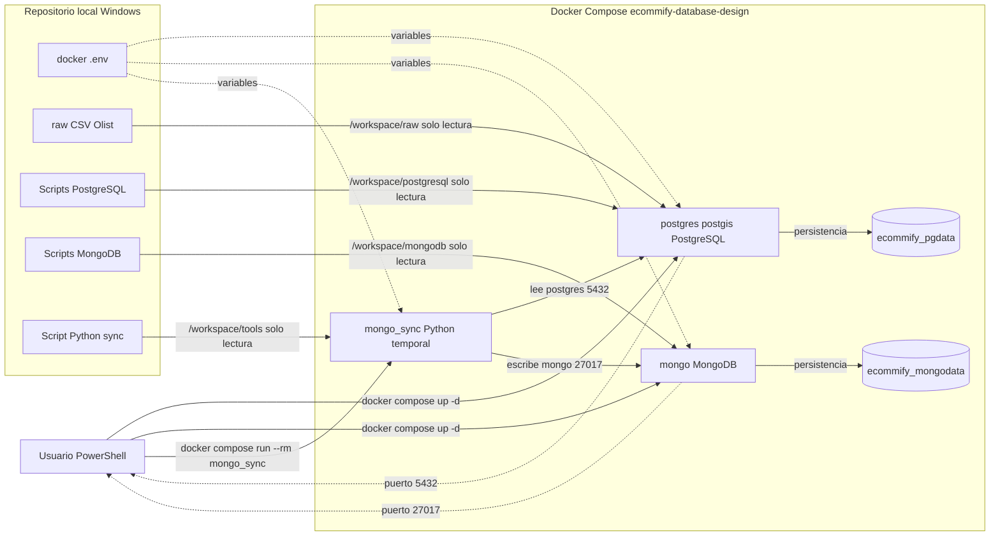

# Docker local - Ecommify Database Design

Este directorio contiene el ambiente local reproducible para la Actividad U5 Etapa 2.

La fuente de verdad del diseno sigue siendo el `README.md` principal del repositorio. Docker solo automatiza la ejecucion local de las decisiones ya definidas.

## Que levanta Docker

| Servicio | Imagen | Proposito |
|---|---|---|
| `postgres` | `postgis/postgis:16-3.4` | PostgreSQL 16 con PostGIS disponible para el modelo OLTP y geografia. |
| `mongo` | `mongo:7` | MongoDB local para colecciones analiticas derivadas. |

## Arquitectura de comunicacion

El archivo `arquitectura_docker.md` contiene tres diagramas Mermaid del ambiente local:

1. Creacion del ambiente Docker.
2. Migracion y sincronizacion de datos.
3. Comunicacion final limpia entre bases de datos activas y volumenes persistentes.



Lectura del diagrama:

1. `postgres` y `mongo` quedan en la misma red interna de Docker Compose.
2. `mongo_sync` es temporal: se crea con `docker compose run --rm mongo_sync`, lee PostgreSQL y escribe MongoDB.
3. Los volumenes `ecommify_pgdata` y `ecommify_mongodata` conservan los datos aunque se ejecute `docker compose down`.
4. Los montajes `:ro` son de solo lectura; permiten que los contenedores lean scripts y CSV sin modificar el repositorio.
5. Los puertos `5432` y `27017` permiten entrar desde PowerShell o herramientas externas, pero la comunicacion entre contenedores usa los nombres de servicio `postgres` y `mongo`.

## Que ocurre al iniciar por primera vez

Docker crea volumenes persistentes y ejecuta scripts de inicializacion solo cuando el volumen esta vacio.

PostgreSQL ejecuta automaticamente:

1. `postgresql/schema/paso_01_crear_esquema.sql`
2. `postgresql/schema/paso_02_crear_tablas_base.sql`
3. `postgresql/schema/paso_03_crear_indices.sql`
4. `postgresql/schema/paso_04_crear_triggers_updated_at.sql`
5. `postgresql/schema/paso_05_crear_vistas_materializadas.sql`

MongoDB ejecuta automaticamente:

1. `mongodb/schema/paso_09_crear_colecciones_validadores.js`

## Comandos basicos

Desde la carpeta `docker/`:

```powershell
cd docker
copy .env.example .env
docker compose up -d
```

Ver contenedores:

```powershell
docker compose ps
```

Ver logs de PostgreSQL:

```powershell
docker compose logs postgres
```

Ver logs de MongoDB:

```powershell
docker compose logs mongo
```

Apagar sin borrar datos:

```powershell
docker compose down
```

Apagar y borrar volumenes para reinicializar desde cero:

```powershell
docker compose down -v
```

## Validaciones PostgreSQL

Entrar a PostgreSQL:

```powershell
docker compose exec postgres psql -U ecommify_user -d ecommify_db
```

Validar extensiones:

```sql
SELECT extname
FROM pg_extension
WHERE extname IN ('postgis', 'pg_trgm');
```

Validar tabla espacial:

```sql
SELECT column_name, udt_name
FROM information_schema.columns
WHERE table_schema = 'ecommify'
  AND table_name = 'geolocation_clean'
  AND column_name = 'geog';
```

Validar indices clave:

```sql
SELECT indexname
FROM pg_indexes
WHERE schemaname = 'ecommify'
  AND indexname IN ('idx_geolocation_clean_geog_gist', 'idx_customers_city_trgm');
```

## Validaciones MongoDB

Entrar a MongoDB:

```powershell
docker compose exec mongo mongosh -u ecommify_admin -p ecommify_password --authenticationDatabase admin
```

Validar base y colecciones:

```javascript
use ecommify_analytics
show collections
db.product_catalog.getIndexes()
```

Ejecutar consultas analiticas de MongoDB:

```powershell
docker compose exec mongo mongosh -u ecommify_admin -p ecommify_password --authenticationDatabase admin /workspace/mongodb/queries/paso_10_consultas_analiticas_ejemplo.js
```

Si el contenedor responde `ENOENT` para `/workspace/mongodb/queries/...`, recrea solo el servicio MongoDB para aplicar el montaje de la carpeta `mongodb/queries` sin borrar datos:

```powershell
docker compose up -d --force-recreate mongo
```

## Nota importante sobre datos

Este primer ambiente crea estructuras, extensiones, validadores e indices. La carga del dataset Olist y la sincronizacion PostgreSQL -> MongoDB son pasos posteriores de la actividad.

## Sincronizar PostgreSQL hacia MongoDB

Despues de cargar PostgreSQL y refrescar vistas materializadas, MongoDB sigue vacio porque solo tiene colecciones, validadores e indices. Para poblar documentos derivados se ejecuta el servicio temporal `mongo_sync`.

Desde la carpeta `docker/`:

```powershell
docker compose run --rm mongo_sync
```

Que hace este comando:

1. Crea un contenedor temporal con Python.
2. Instala las dependencias de `tools/requirements-sync.txt`.
3. Ejecuta `tools/sync_postgres_to_mongo.py`.
4. Lee datos desde PostgreSQL.
5. Escribe documentos derivados en MongoDB usando `upsert`.
6. El contenedor temporal se elimina al finalizar por `--rm`.

Colecciones pobladas:

| Coleccion | Fuente PostgreSQL |
|---|---|
| `product_catalog` | `products`, `category_translation`, `order_items`, `order_reviews` |
| `customer_profiles` | `mv_customer_segments` |
| `seller_performance` | `mv_seller_performance_monthly` |
| `geo_analytics` | `mv_geo_sales_summary` |
| `review_documents` | `order_reviews`, `orders`, `customers`, `order_items`, `products` |

Validacion posterior en MongoDB:

```powershell
docker compose exec mongo mongosh -u ecommify_admin -p ecommify_password --authenticationDatabase admin
```

```javascript
use ecommify_analytics
db.product_catalog.countDocuments()
db.customer_profiles.countDocuments()
db.seller_performance.countDocuments()
db.geo_analytics.countDocuments()
db.review_documents.countDocuments()
```

Si `review_documents` queda con un conteo muy inferior al de reseñas cargadas en PostgreSQL, actualiza los validadores e indices de MongoDB antes de repetir la sincronizacion. Esto aplica cuando el ambiente se habia inicializado con el indice historico unico por `review_id`.

```powershell
docker compose exec mongo mongosh -u ecommify_admin -p ecommify_password --authenticationDatabase admin /workspace/mongodb/schema/paso_09_crear_colecciones_validadores.js
docker compose run --rm mongo_sync
```

## Solucion de problemas

Si `mongo_sync` falla con `InvalidDocument: cannot encode object: datetime.date(...)`, significa que una fecha de PostgreSQL llego a MongoDB como `date` sin hora. El script `tools/sync_postgres_to_mongo.py` convierte esos valores a `datetime` UTC antes de guardarlos, porque BSON requiere fechas con componente de hora.
