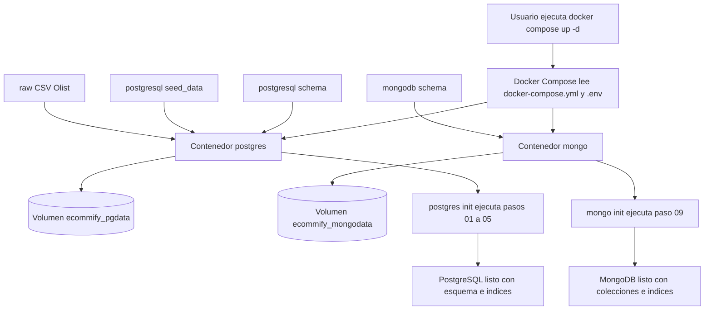
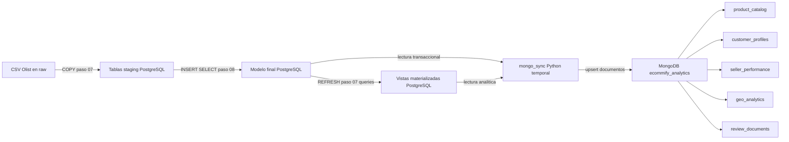
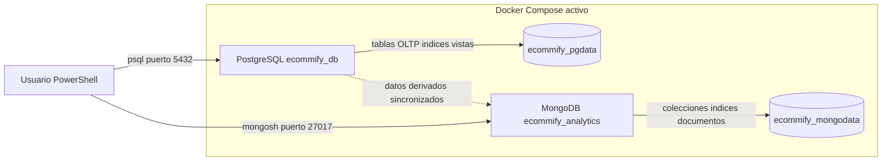

# Arquitectura Docker local

Este archivo complementa `docker/README.md` con tres vistas del ambiente local: creacion inicial, migracion de datos y comunicacion final. La fuente de verdad de decisiones tecnicas sigue siendo el `README.md` principal del repositorio.

## 1. Creacion del ambiente

Este diagrama muestra que ocurre cuando se ejecuta `docker compose up -d` por primera vez. Docker crea los contenedores, monta carpetas del repositorio y ejecuta scripts de inicializacion cuando los volumenes estan vacios.

## 2. Migracion y sincronizacion de datos

Este diagrama muestra el flujo ejecutado despues de crear el ambiente. Primero se cargan los CSV en PostgreSQL, luego se insertan en el modelo final, se refrescan vistas materializadas y finalmente `mongo_sync` construye documentos derivados en MongoDB.

## 3. Comunicacion final del ambiente

Este diagrama muestra el estado final limpio despues de crear estructuras, cargar PostgreSQL y sincronizar MongoDB. En esta vista ya no se representan scripts de inicializacion, archivos CSV ni montajes de soporte, porque su funcion pertenece a los pasos de creacion y migracion.

