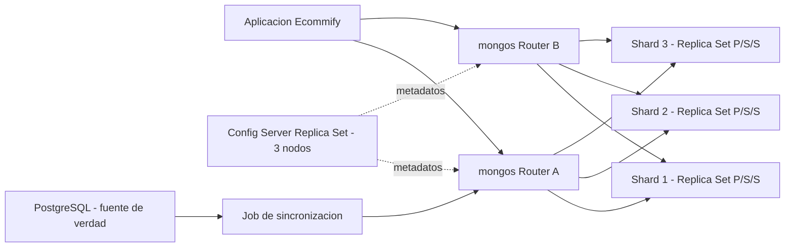
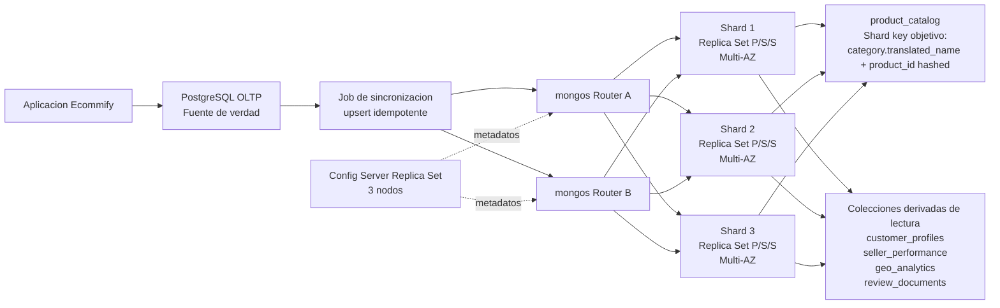

# Ecommify_Olist
**Integrantes Grupo1:** 
  * Jorge Andres Ayala Valero - jorgeayva@unisabana.edu.co
  * Pablo Andres Melo Garcia - pablomega@unisabana.edu.co
  * Camilo Andres Padilla Garcia - camilopaga@unisabana.edu.co

# Actividad U3
## Etapa 2: Estructuracion. Planificacion de estrategias de sharding y replica sets
### Arquitectura distribuida de MongoDB para Ecommify

## 1. Objetivo y alineacion con el proyecto

El presente entregable establece la estrategia de escalamiento horizontal y alta disponibilidad para el componente MongoDB de Ecommify. La arquitectura conserva las decisiones adoptadas previamente:

- PostgreSQL permanece como fuente de verdad para clientes, ordenes, items, pagos, productos y vendedores.
- MongoDB funciona como una capa documental derivada, orientada a lectura y analitica.
- Las colecciones MongoDB se construyen o refrescan desde PostgreSQL mediante jobs de sincronizacion. La adopcion de CDC queda diferida hasta que exista un requisito de menor latencia de actualizacion.
- Las operaciones financieras y el estado transaccional definitivo de las ordenes deben consultarse en PostgreSQL.

Las colecciones documentales existentes son:

| Coleccion | Proposito | Fuente relacional principal |
|---|---|---|
| `product_catalog` | Catalogo enriquecido con categoria, dimensiones, especificaciones, fotos y metricas. | `products`, `category_translation`, `order_items`, `order_reviews` |
| `customer_profiles` | Perfil analitico y segmentacion de clientes. | `customers`, `orders`, `order_payments`, `order_reviews` |
| `seller_performance` | Desempeno comercial de vendedores. | `sellers`, `order_items`, `orders`, `order_reviews` |
| `geo_analytics` | Agregados de ventas, clientes y vendedores por ciudad o estado. | `geolocation_clean`, `customers`, `sellers`, `orders`, `order_payments` |
| `review_documents` | Resenas enriquecidas con contexto de orden, producto y cliente. | `order_reviews`, `orders`, `order_items`, `products`, `customers` |

La estrategia descrita en esta etapa corresponde a la arquitectura objetivo para un escenario de crecimiento. El volumen actual del dataset permite trabajar sin sharding; por tanto, la activacion de esta capacidad queda condicionada a metricas de trafico, almacenamiento y carga analitica.

---

## 2. Investigacion de arquitectura distribuida en MongoDB

### 2.1 Replica sets

Un **replica set** es un grupo de procesos `mongod` que mantienen copias redundantes del mismo conjunto de datos. Su objetivo principal es mejorar la disponibilidad y permitir recuperacion automatica ante la falla de un nodo.

| Componente | Definicion | Rol propuesto en Ecommify |
|---|---|---|
| **Primary** | Nodo que recibe las escrituras del replica set. Registra las operaciones en el `oplog` para que los secundarios puedan replicarlas. | Recibir los documentos generados por el job de sincronizacion desde PostgreSQL. |
| **Secondary** | Nodo que replica de forma asincrona las operaciones del `oplog`. Puede atender lecturas cuando la estrategia de lectura lo permita. | Atender consultas de catalogo o analitica que toleren un desfase controlado. |
| **Arbiter** | Nodo que participa en elecciones, pero no almacena una copia de los datos. | Se estudia como concepto y se descarta para Ecommify porque no aporta redundancia de datos. |
| **Election** | Proceso mediante el cual los miembros eligen un nuevo Primary cuando el anterior deja de estar disponible. | Permitir continuidad operativa ante la falla de un nodo. |
| **Oplog** | Registro ordenado de operaciones que los secundarios consumen para mantener sus copias actualizadas. | Medir su ventana disponible para evitar que un secundario atrasado requiera resincronizacion completa. |

Ecommify adopta como topologia objetivo tres nodos que almacenan datos: `Primary + Secondary + Secondary`. Esta configuracion conserva un numero impar de votos y, al mismo tiempo, mantiene tres copias de los documentos.

### 2.2 Read preference, read concern y write concern

Estos conceptos resuelven preguntas diferentes y no deben confundirse:

| Concepto | Pregunta que responde |
|---|---|
| **Read preference** | Desde que tipo de nodo se intenta leer: Primary, Secondary o el nodo apropiado segun latencia. |
| **Read concern** | Que nivel de consistencia debe cumplir la informacion leida. |
| **Write concern** | Cuantos miembros deben confirmar una escritura antes de considerarla exitosa. |

#### Opciones principales de read preference

| Read preference | Comportamiento | Uso recomendado |
|---|---|---|
| `primary` | Lee unicamente desde el Primary. | Validaciones posteriores a una sincronizacion o lecturas que requieren la version mas reciente disponible en MongoDB. |
| `primaryPreferred` | Prefiere el Primary y usa un Secondary si no esta disponible. | Lecturas donde la frescura importa, pero se quiere mantener disponibilidad durante un failover. |
| `secondary` | Lee unicamente desde nodos Secondary. | Procesos analiticos controlados que pueden tolerar indisponibilidad temporal si no hay secundarios elegibles. |
| `secondaryPreferred` | Prefiere secundarios y usa el Primary como respaldo. | Dashboards y analitica derivada. |
| `nearest` | Selecciona un miembro elegible segun latencia de red. | Catalogo publico orientado a baja latencia, con un limite de desfase configurado. |

Leer desde `primary` no sustituye la configuracion de `read concern`. La preferencia define el nodo; el concern define la garantia de lectura.

#### Niveles relevantes de write concern

| Write concern | Comportamiento | Trade-off |
|---|---|---|
| `{ w: 1 }` | El Primary confirma la escritura. | Menor latencia, pero menor tolerancia frente a fallas antes de que la operacion se replique. |
| `{ w: "majority" }` | La escritura debe ser confirmada por la mayoria calculada por MongoDB. | Mayor durabilidad a cambio de latencia adicional. |
| `{ j: true }` | Solicita confirmacion de journaling segun la configuracion del motor. | Reduce el riesgo de perdida ante una falla abrupta. |
| `{ wtimeout: 5000 }` | Limita el tiempo de espera de la confirmacion, expresado en milisegundos. | Evita esperas indefinidas cuando no se puede cumplir el nivel solicitado. |

Para los jobs de sincronizacion de Ecommify se define:

```javascript
{
  writeConcern: {
    w: "majority",
    j: true,
    wtimeout: 5000
  }
}
```

### 2.3 Sharding

El **sharding** distribuye horizontalmente los documentos de una coleccion entre varios grupos de servidores. Mientras un replica set mantiene copias redundantes de los mismos datos, el sharding divide la carga y el volumen total. Ambas estrategias son complementarias: en produccion, cada shard debe operar como un replica set.

| Componente | Definicion | Responsabilidad |
|---|---|---|
| **Shard** | Replica set que almacena una parte de los documentos. | Distribuir almacenamiento y carga de consultas. |
| **Config Server Replica Set (CSRS)** | Replica set que conserva los metadatos del cluster sharded. | Registrar la ubicacion de rangos y chunks. |
| **`mongos` Router** | Proceso que recibe consultas de la aplicacion y las dirige a los shards relevantes. | Evitar que la aplicacion necesite conocer la ubicacion fisica de los datos. |
| **Shard key** | Campo o combinacion de campos que MongoDB usa para distribuir documentos. | Determinar distribucion, escalabilidad y eficiencia de las consultas. |
| **Chunk** | Rango logico de valores de shard key administrado por MongoDB. | Unidad de distribucion que puede moverse entre shards. |
| **Balancer** | Proceso que redistribuye rangos cuando existe desbalance. | Mantener una distribucion razonable entre shards. |
| **Hotspot** | Concentracion excesiva de lecturas o escrituras sobre una parte del cluster. | Riesgo que debe mitigarse mediante una shard key apropiada. |
| **Scatter-gather** | Consulta que debe solicitar informacion a multiples shards porque sus filtros no permiten dirigirla con precision. | Patron que debe medirse y reducirse para consultas frecuentes. |

### 2.4 Tipos de shard key

| Tipo | Ejemplo | Ventaja | Riesgo |
|---|---|---|---|
| **Ranged** | `{ "category.translated_name": 1 }` | Favorece consultas por igualdad o rangos sobre el prefijo. | Un campo con baja cardinalidad o valores dominantes puede concentrar carga. |
| **Hashed** | `{ product_id: "hashed" }` | Distribuye valores de alta cardinalidad de forma mas uniforme. | Las consultas por rango del campo hasheado pierden eficiencia. |
| **Compound** | `{ "category.translated_name": 1, product_id: "hashed" }` | Combina un prefijo util para consultas con un sufijo orientado a distribucion. | Requiere validar el workload real y puede involucrar varios shards incluso cuando se filtra por el prefijo. |

Una shard key no debe elegirse solo por uniformidad teorica. Tambien debe corresponder a los filtros mas frecuentes de la aplicacion.

---

## 3. Analisis de distribucion de datos

### 3.1 Evidencia del dataset Olist

El analisis se realizo sobre los CSV de la carpeta `raw/`. Los resultados reproducibles son:

| Metrica | Resultado |
|---|---:|
| Productos | `32.951` |
| Categorias registradas en `category_translation` | `71` |
| Productos sin categoria | `610` (`1,85 %`) |
| Items de orden | `112.650` |
| Sellers | `3.095` |
| Sellers ubicados en Sao Paulo (`SP`) | `1.849` (`59,74 %`) |

Las categorias con mas productos son:

| Categoria | Productos | Participacion |
|---|---:|---:|
| `cama_mesa_banho` | `3.029` | `9,19 %` |
| `esporte_lazer` | `2.867` | `8,70 %` |
| `moveis_decoracao` | `2.657` | `8,06 %` |
| `beleza_saude` | `2.444` | `7,42 %` |
| `utilidades_domesticas` | `2.335` | `7,09 %` |

Las categorias con mayor cantidad de items vendidos son:

| Categoria | Items de orden | Participacion |
|---|---:|---:|
| `cama_mesa_banho` | `11.115` | `9,87 %` |
| `beleza_saude` | `9.670` | `8,58 %` |
| `esporte_lazer` | `8.641` | `7,67 %` |
| `moveis_decoracao` | `8.334` | `7,40 %` |
| `informatica_acessorios` | `7.827` | `6,95 %` |

Los estados con mayor cantidad de sellers son:

| Estado | Sellers | Participacion |
|---|---:|---:|
| `SP` | `1.849` | `59,74 %` |
| `PR` | `349` | `11,28 %` |
| `MG` | `244` | `7,88 %` |
| `SC` | `190` | `6,14 %` |
| `RJ` | `171` | `5,53 %` |

### 3.2 Indice de concentracion HHI

El indice Herfindahl-Hirschman (HHI) permite comparar el nivel de concentracion de una distribucion. Se calcula sumando el cuadrado de la participacion de cada grupo:

```text
HHI = sum(participacion_i ^ 2)
```

El HHI se usa aqui como indicador comparativo, no como umbral rigido de negocio. Un valor mayor indica que pocos grupos concentran una parte mas importante de los registros.

| Distribucion | HHI | Interpretacion para Ecommify |
|---|---:|---|
| Productos por categoria | `0,049451` | Las categorias tienen dispersion moderada. Ninguna categoria domina por si sola el catalogo, pero usar solo categoria limita la cardinalidad de la shard key. |
| Items vendidos por categoria | `0,051360` | La carga de lectura potencial por categoria tambien presenta dispersion moderada, con algunas categorias mas activas. |
| Sellers por estado | `0,384786` | Existe concentracion geografica alta: `SP` agrupa `59,74 %` de los sellers. Usar solo el estado produciria una distribucion deficiente. |

Codigo reproducible:

```python
category_share = products["product_category_name"].value_counts(
    normalize=True,
    dropna=False
)
hhi_products_by_category = (category_share ** 2).sum()

seller_share = sellers["seller_state"].value_counts(
    normalize=True,
    dropna=False
)
hhi_sellers_by_state = (seller_share ** 2).sum()
```

### 3.3 Riesgos de hotspots

Se descarta el uso exclusivo de la categoria como shard key:

- Solo existen `71` categorias registradas.
- Algunas categorias concentran cerca del `10 %` de los productos o items vendidos.
- El catalogo puede crecer de manera desigual.
- Los productos sin categoria se agruparian bajo un valor nulo si no se normalizan durante la sincronizacion.

La categoria `cama_mesa_banho` no constituye actualmente un Jumbo Chunk demostrado. Representa un **riesgo futuro de concentracion** que debe monitorearse si se implementa sharding.

Se descarta tambien el uso exclusivo del estado del seller:

- `SP` concentra `59,74 %` de los vendedores.
- El HHI geografico (`0,384786`) evidencia una distribucion mucho mas concentrada que la distribucion de productos por categoria.

### 3.4 Tratamiento de categorias faltantes

El dataset contiene `610` productos sin categoria y el analisis relacional identifico dos valores de categoria sin correspondencia en `category_translation`.

Durante la construccion de `product_catalog` se establece:

1. Mantener `category.name` con el valor original cuando exista.
2. Mantener `category.translated_name` con la traduccion validada cuando exista.
3. Asignar un valor controlado como `uncategorized` cuando no sea posible establecer una categoria traducida.
4. Monitorear el porcentaje de documentos enviados a `uncategorized`.

Esta normalizacion evita concentrar valores ausentes bajo `null` y hace explicita la calidad del dato.

### 3.5 Conclusion del analisis cuantitativo

Los graficos y el HHI permiten consolidar tres decisiones:

1. La categoria aporta valor como prefijo de consulta para `product_catalog`, pero no debe utilizarse de forma aislada porque su cardinalidad es limitada y el crecimiento futuro puede ser desigual.
2. El identificador `product_id` aporta la cardinalidad necesaria para distribuir documentos dentro de cada categoria.
3. El estado del seller no puede utilizarse de forma aislada como shard key debido a la concentracion de `SP`.

El analisis cuantitativo respalda el uso de una shard key compuesta para la arquitectura objetivo de `product_catalog`.

---

## 4. Patrones de consulta del repositorio

El script `mongodb/queries/paso_10_consultas_analiticas_ejemplo.js` permite identificar los filtros documentales actuales:

| Coleccion | Patron de consulta documentado | Campo utilizado |
|---|---|---|
| `product_catalog` | Catalogo por categoria traducida. | `category.translated_name` |
| `customer_profiles` | Clientes principales por valor pagado. | `payment_summary.total_payment_value` |
| `seller_performance` | Vendedores por estado. | `location.state` |
| `geo_analytics` | Analitica geografica por estado. | `state` |
| `review_documents` | Resenas con calificacion baja. | `review_score` |

`product_catalog` es la primera coleccion candidata para evaluar sharding porque combina exposicion a consultas del catalogo, crecimiento potencial y documentos enriquecidos. Las demas colecciones deben monitorearse antes de fragmentarse: agregar shards introduce complejidad operacional y no debe aplicarse sin una necesidad medible.

---

## 5. Evaluacion y seleccion de shard key

### 5.1 Alternativas para `product_catalog`

| Alternativa | Ventajas | Desventajas | Decision |
|---|---|---|---|
| `{ product_id: 1 }` | Permite busquedas dirigidas por ID y puede soportar unicidad sobre la propia shard key. | No favorece consultas por categoria y puede distribuir menos uniformemente que una clave hashed. | Alternativa si la unicidad global dentro de MongoDB se vuelve requisito principal. |
| `{ product_id: "hashed" }` | Alta cardinalidad y distribucion uniforme. Las busquedas por igualdad de `product_id` pueden dirigirse eficientemente. | Las consultas por categoria pueden requerir scatter-gather. No permite declarar el indice hashed como unico. | Alternativa simple si predominan las consultas por ID. |
| `{ "category.translated_name": 1 }` | Facilita consultas por categoria. | Cardinalidad limitada y riesgo de concentracion ante categorias populares. | Descartada como clave unica. |
| `{ "category.translated_name": 1, product_id: "hashed" }` | Combina el filtro de categoria usado por el catalogo con distribucion adicional dentro de cada categoria. | Una consulta por categoria puede seguir involucrando varios shards. Las busquedas que solo incluyen `product_id` no aprovechan el prefijo completo. Requiere revisar la politica de unicidad documental. | **Seleccionada como shard key objetivo** para un despliegue sharded. |

### 5.2 Decision adoptada para `product_catalog`

Se adopta la siguiente shard key para la arquitectura objetivo de `product_catalog`:

```javascript
{
  "category.translated_name": 1,
  product_id: "hashed"
}
```

Justificacion:

1. El repositorio ya consulta el catalogo por `category.translated_name`.
2. El prefijo por categoria permite que `mongos` reduzca el alcance de las consultas que incluyan ese filtro.
3. El sufijo hashed de `product_id` mejora la distribucion dentro de categorias con crecimiento desigual.
4. La estrategia evita depender exclusivamente de un campo de baja cardinalidad.

La decision **reduce** el riesgo de hotspots, pero no garantiza su eliminacion completa. Su activacion debe validarse mediante metricas de produccion: distribucion de chunks, latencia, operaciones scatter-gather y proporcion de documentos examinados frente a retornados.

La representacion teorica del comando es:

```javascript
sh.shardCollection(
  "ecommify_analytics.product_catalog",
  {
    "category.translated_name": 1,
    product_id: "hashed"
  }
);
```

Este comando no debe ejecutarse en el Free cluster. Se incluye para documentar la estrategia.

### 5.3 Restriccion de unicidad en una coleccion sharded

El script actual crea el siguiente indice:

```javascript
targetDb.product_catalog.createIndex(
  { product_id: 1 },
  { unique: true }
);
```

Este indice es apropiado para la implementacion actual no fragmentada. Sin embargo, al migrar a una coleccion sharded se debe revisar:

- MongoDB exige que los indices unicos compatibles con sharding incluyan la shard key como prefijo.
- Un indice hashed no puede aplicar una restriccion `unique`.
- La shard key adoptada no permite conservar sin cambios el indice unico independiente `{ product_id: 1 }`.

Decision para Ecommify:

- PostgreSQL conserva `product_id TEXT UNIQUE` como garantia de integridad.
- El proceso de sincronizacion debe usar operaciones idempotentes, por ejemplo `upsert` por `product_id`.
- Antes de una migracion real a sharding se debe crear una variante de indices para produccion y retirar el indice unico incompatible.

Si en el futuro la unicidad global dentro de MongoDB se vuelve un requisito obligatorio, se debe reevaluar la shard key y considerar `{ product_id: 1 }` como alternativa.

### 5.4 Decision para `seller_performance`

La coleccion `seller_performance` contiene actualmente un documento por seller. Se determina que no requiere sharding dentro del alcance actual. Si crece significativamente o incorpora series historicas mas detalladas, queda registrada la siguiente alternativa:

```javascript
{
  "location.state": 1,
  seller_id: "hashed"
}
```

Esta clave evita depender exclusivamente de `location.state`, especialmente porque `SP` concentra `59,74 %` de los sellers. La alternativa queda diferida hasta que las metricas de crecimiento justifiquen su activacion.

---

## 6. Configuracion teorica de replica sets y cluster sharded

### 6.1 Replica set de tres nodos multi-AZ

Cada shard se define como un replica set con tres nodos que almacenan datos:

| Nodo | Rol inicial | Zona de disponibilidad |
|---|---|---|
| Nodo 1 | Primary | AZ-A |
| Nodo 2 | Secondary | AZ-B |
| Nodo 3 | Secondary | AZ-C |

La topologia distribuye los nodos entre zonas de disponibilidad distintas. Si el Primary falla, los miembros restantes pueden realizar una eleccion y promover un Secondary elegible.

Se descarta el uso de un Arbiter:

- Un Arbiter aporta voto, pero no conserva datos.
- Un tercer nodo con datos mejora simultaneamente quorum y redundancia.
- Ecommify prioriza disponibilidad de los documentos derivados sin perder copias utiles.

### 6.2 Arquitectura teorica completa



Decisiones:

- Desplegar al menos dos procesos `mongos` para evitar un punto unico de falla en el enrutamiento.
- Usar tres nodos para el Config Server Replica Set.
- Usar tres nodos con datos por shard, distribuidos en distintas AZ.
- Mantener PostgreSQL como origen de los documentos sincronizados.

---

## 7. Estrategia de consistencia, lectura y escritura

### 7.1 Consistencia eventual

Los Secondary replican de manera asincrona. Por lo tanto, una lectura desde un Secondary puede devolver temporalmente una version anterior del documento. La diferencia temporal se denomina **replication lag**.

No debe asumirse que el lag siempre sera de pocos milisegundos. Su comportamiento depende de la carga, la red, el tamano de las operaciones y la capacidad de los nodos. Debe medirse y monitorearse.

Ecommify puede tolerar consistencia eventual en:

- Catalogo enriquecido.
- Dashboards.
- Metricas agregadas de vendedores.
- Analitica geografica.
- Segmentacion de clientes.

Ecommify no debe depender de consistencia eventual para:

- Confirmacion de pagos.
- Estado transaccional definitivo de una orden.
- Validaciones financieras.
- Integridad referencial.

Estas operaciones pertenecen a PostgreSQL.

### 7.2 Estrategia diferenciada por operacion

Las escrituras MongoDB se dirigen al Primary. No existe una configuracion denominada "write preference"; la durabilidad se controla mediante `write concern`.

| Operacion | Coleccion | Read preference | Read concern | Write concern | Justificacion |
|---|---|---|---|---|---|
| Sincronizar documentos derivados | Todas | No aplica | No aplica | `{ w: "majority", j: true, wtimeout: 5000 }` | Reduce el riesgo de confirmar una sincronizacion que no tenga durabilidad suficiente. |
| Validar inmediatamente un refresh | Todas | `primary` | `majority` | No aplica | Permite comprobar una version confirmada despues de sincronizar. |
| Navegar por el catalogo web | `product_catalog` | `nearest` con `maxStalenessSeconds` | `local` | No aplica | Prioriza latencia, aceptando un desfase acotado para datos derivados. |
| Consultar dashboards | `seller_performance`, `geo_analytics`, `customer_profiles` | `secondaryPreferred` | `local` | No aplica | Descarga lecturas analiticas del Primary y conserva fallback. |
| Consultar una orden o pago critico | PostgreSQL | No aplica | No aplica | No aplica | MongoDB no es la fuente de verdad para operaciones OLTP. |

### 7.3 Read-your-own-writes y causal consistency

Cuando un flujo documental requiera observar una escritura previa realizada dentro de la misma secuencia logica, se utilizaran sesiones con consistencia causal.

Configuracion definida para estos flujos:

```text
causalConsistency: true
read concern: "majority"
write concern: { w: "majority" }
```

El driver administra el contexto causal de la sesion. No se debe depender de que la aplicacion manipule manualmente `clusterTime` salvo que exista una necesidad tecnica especifica y documentada.

Para pagos y ordenes, la mitigacion principal sigue siendo consultar PostgreSQL.

---

## 8. Plan de monitoreo

### 8.1 Replica sets

| Metrica | Proposito | Senal de alerta |
|---|---|---|
| Replication lag | Medir desfase entre Primary y Secondary. | Incremento sostenido o desfase superior al SLA analitico. |
| Oplog window | Verificar cuanto tiempo de operaciones conserva el oplog. | Ventana menor que el tiempo esperado de recuperacion de un secundario. |
| Elecciones y cambios de Primary | Detectar inestabilidad del replica set. | Elecciones frecuentes o failovers no planificados. |
| Write concern timeouts | Detectar imposibilidad de alcanzar confirmacion suficiente. | Incremento de errores de sincronizacion. |
| Latencia de lectura y escritura | Validar experiencia de consulta y costo de sincronizacion. | Degradacion sostenida frente a la linea base. |

### 8.2 Sharding

| Metrica | Proposito | Senal de alerta |
|---|---|---|
| Distribucion de chunks o rangos por shard | Evaluar balance del cluster. | Un shard concentra una proporcion desmedida de datos. |
| Actividad del balancer | Verificar redistribucion. | Movimientos constantes o incapacidad de corregir desbalance. |
| Jumbo chunks | Detectar rangos dificiles de dividir o mover. | Aparicion de chunks que no pueden redistribuirse normalmente. |
| Query targeting ratio | Comparar documentos examinados y retornados. | Ratio alto en consultas frecuentes. |
| Scatter-gather operations | Detectar consultas que involucran multiples shards. | Crecimiento sostenido en el catalogo o dashboards. |
| Tamano por shard | Planificar capacidad. | Crecimiento desigual o cercano al limite operativo. |

### 8.3 Sincronizacion PostgreSQL a MongoDB

| Metrica | Proposito |
|---|---|
| Diferencia entre `updated_at` de origen y destino | Medir frescura de documentos derivados. |
| Duracion de cada job | Detectar degradacion del proceso de sincronizacion. |
| Documentos procesados, actualizados y fallidos | Controlar completitud. |
| Cantidad de `upsert` duplicados o rechazados | Validar idempotencia y calidad de datos. |
| Porcentaje de productos `uncategorized` | Vigilar calidad del catalogo. |

---

## 9. Limitaciones del Free cluster y aproximacion teorica

El antiguo nivel `M0` de MongoDB Atlas se denomina actualmente **Free cluster**. Este entorno es apropiado para aprendizaje y pruebas de concepto, pero no permite validar toda la arquitectura objetivo.

| Capacidad | Free cluster | Consecuencia para esta actividad |
|---|---|---|
| Crear colecciones, validadores e indices | Disponible | Se pueden demostrar los scripts actuales del repositorio. |
| Replica set administrado | Configuracion fija de tres nodos | Permite comprender replicacion, pero no personalizar la topologia multi-AZ. |
| Sharding | No disponible | La estrategia de shards, `mongos` y Config Servers se documenta teoricamente. |
| Pruebas de failover del Primary | No disponibles para el usuario | La recuperacion automatica se explica conceptualmente. |
| Almacenamiento | Hasta `0,5 GB` | Limita cargas completas o escenarios volumetricos. |
| Conexiones | Hasta `500` | Limita pruebas de concurrencia. |
| Operaciones por segundo | Hasta `100` | No permite representar una carga productiva alta. |

Los limites de Atlas pueden cambiar. Antes de una implementacion real se debe validar el plan vigente en la documentacion oficial.

---

## 10. Consolidacion de decisiones arquitectonicas

La Etapa 2 concluye con las siguientes decisiones. Esta seccion constituye el registro consolidado de arquitectura para el componente MongoDB de Ecommify.

### 10.1 Arquitectura objetivo consolidada



El diagrama representa la arquitectura objetivo para el crecimiento de la capa documental. PostgreSQL conserva las operaciones OLTP y la integridad relacional. El job de sincronizacion construye documentos derivados y los publica a traves de routers `mongos`. Cada shard se despliega como un replica set de tres nodos distribuidos entre zonas de disponibilidad. La primera coleccion candidata a fragmentacion es `product_catalog`.

### 10.2 Decisiones adoptadas

| Tema | Decision adoptada | Evidencia o criterio | Efecto tecnico |
|---|---|---|---|
| Fuente de verdad | PostgreSQL conserva integridad relacional, pagos y estado transaccional de ordenes. | Arquitectura hibrida definida en etapas anteriores. | MongoDB no reemplaza validaciones OLTP. |
| Rol de MongoDB | MongoDB opera como capa documental derivada para lectura y analitica. | Colecciones y validadores existentes. | Los documentos se reconstruyen o actualizan desde PostgreSQL. |
| Despliegue actual | El volumen actual no requiere activar sharding. | `32.951` productos y `3.095` sellers. | La implementacion vigente puede mantenerse en un replica set administrado. |
| Arquitectura objetivo | El escalamiento futuro se resuelve mediante un cluster sharded con al menos dos routers `mongos`, Config Server Replica Set y shards desplegados como replica sets. | Requisitos de disponibilidad y crecimiento. | Se evita un punto unico de falla en el enrutamiento y se distribuye carga. |
| Primera coleccion candidata | `product_catalog` es la primera coleccion que debe migrarse si las metricas justifican sharding. | Catalogo expuesto a consultas frecuentes y enriquecimiento documental. | El escalamiento se aplica de forma focalizada. |
| Shard key objetivo | `{ "category.translated_name": 1, product_id: "hashed" }`. | Consulta existente por categoria, HHI de productos `0,049451` y necesidad de alta cardinalidad. | Se combinan direccionamiento por categoria y distribucion dentro de cada categoria. |
| Categorias faltantes | Los productos sin categoria traducida se sincronizan como `uncategorized`. | `610` productos sin categoria (`1,85 %`). | Se evita agrupar valores ausentes bajo `null` y se monitorea calidad de datos. |
| Unicidad de `product_id` | PostgreSQL mantiene la garantia de unicidad. La variante sharded retira el indice documental incompatible y conserva un indice de consulta no unico cuando corresponda. | Restricciones de indices unicos en colecciones sharded con campo hashed. | El job de sincronizacion debe aplicar `upsert` idempotente por `product_id`. |
| Replica set por shard | Cada shard utiliza tres nodos con datos: `Primary + Secondary + Secondary`, distribuidos en distintas AZ. | Alta disponibilidad y redundancia. | Se conserva quorum y tres copias utiles. |
| Arbiter | Se descarta el uso de Arbiter. | No almacena datos y no mejora redundancia. | El tercer voto corresponde a un nodo con datos. |
| Escrituras derivadas | `{ w: "majority", j: true, wtimeout: 5000 }`. | Necesidad de durabilidad en la sincronizacion. | El job detecta fallas de confirmacion y evita esperas indefinidas. |
| Lecturas analiticas | `secondaryPreferred` con `read concern: "local"`. | Dashboards tolerantes a desfase controlado. | Se descarga el Primary y se conserva fallback. |
| Catalogo de baja latencia | `nearest` con `maxStalenessSeconds` y `read concern: "local"`. | Catálogo derivado orientado a experiencia de consulta. | Se prioriza latencia sin aceptar secundarios excesivamente desactualizados. |
| Consistencia eventual | Se acepta para catalogo y analitica; se excluye para pagos y ordenes criticas. | Separacion OLTP/OLAP. | Las operaciones criticas continúan consultando PostgreSQL. |

### 10.3 Decisiones diferidas

| Tema | Decision diferida | Condicion de activacion |
|---|---|---|
| Activacion de sharding | No se activa en el Free cluster ni con el volumen actual. | Crecimiento de almacenamiento, latencia, scatter-gather o desbalance que supere el SLA definido. |
| Sharding de `seller_performance` | Se registra como alternativa `{ "location.state": 1, seller_id: "hashed" }`. | Crecimiento significativo de documentos o series historicas por seller. |
| CDC | Se mantiene el job de sincronizacion como mecanismo base. CDC queda como evolucion posible. | Requisito de menor latencia de actualizacion entre PostgreSQL y MongoDB. |

### 10.4 Alternativas descartadas

| Alternativa | Motivo de descarte |
|---|---|
| Shard key basada solo en `category.translated_name` | Cardinalidad limitada y riesgo de crecimiento desigual por categoria. |
| Shard key basada solo en `location.state` para sellers | `SP` concentra `59,74 %` de los vendedores y el HHI geografico es `0,384786`. |
| Uso de Arbiter como tercer voto | Aporta quorum, pero no una copia adicional de datos. |
| Implementacion sharded en Free cluster | Atlas Free cluster no permite desplegar sharding ni personalizar la topologia multi-AZ. |

## 11. Referencias oficiales

- MongoDB, Inc. Replica Set Primary: https://www.mongodb.com/docs/manual/core/replica-set-primary/
- MongoDB, Inc. Replica Set Secondary: https://www.mongodb.com/docs/manual/core/replica-set-secondary/
- MongoDB, Inc. Read Preference: https://www.mongodb.com/docs/manual/core/read-preference/
- MongoDB, Inc. Read Concern: https://www.mongodb.com/docs/manual/reference/read-concern/
- MongoDB, Inc. Write Concern: https://www.mongodb.com/docs/manual/reference/write-concern/
- MongoDB, Inc. Sharding: https://www.mongodb.com/docs/manual/sharding/
- MongoDB, Inc. Shard Keys: https://www.mongodb.com/docs/manual/core/sharding-shard-key/
- MongoDB, Inc. Shard Key Indexes: https://www.mongodb.com/docs/manual/core/sharding-shard-key-indexes/
- MongoDB, Inc. Hashed Sharding: https://www.mongodb.com/docs/manual/core/hashed-sharding/
- MongoDB, Inc. Causal Consistency: https://www.mongodb.com/docs/manual/core/causal-consistency-read-write-concerns/
- MongoDB, Inc. Atlas Free Cluster Limitations: https://www.mongodb.com/docs/atlas/reference/free-shared-limitations/
