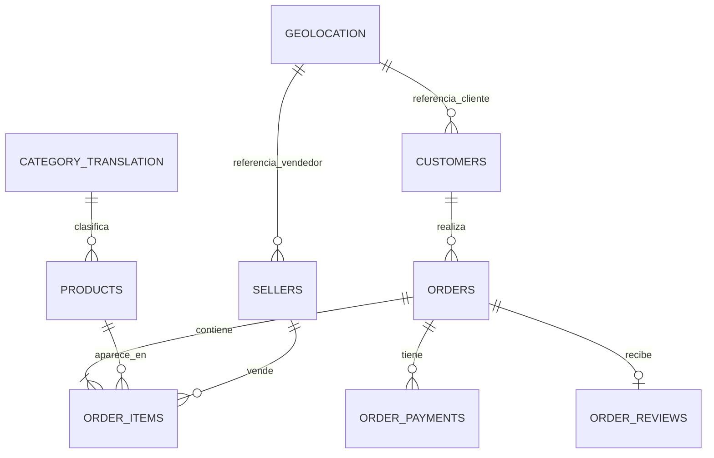

## Indice

1. [Portada y resumen ejecutivo](#1-portada-y-resumen-ejecutivo)
2. [Introduccion y alcance](#2-introduccion-y-alcance)
3. [Analisis de requisitos](#3-analisis-de-requisitos)
4. [Diseno conceptual](#4-diseno-conceptual)
5. [Diseno logico en PostgreSQL](#5-diseno-logico-en-postgresql)
6. [Diseno preliminar en MongoDB](#6-diseno-preliminar-en-mongodb)
7. [Decisiones arquitectonicas justificadas](#7-decisiones-arquitectonicas-justificadas)
8. [Estrategia hibrida OLTP/OLAP](#8-estrategia-hibrida-oltpolap)
9. [Anexos tecnicos](#9-anexos-tecnicos)
10. [Pendientes de cierre](#10-pendientes-de-cierre)

---

## 1. Portada y resumen ejecutivo

### 1.1 Portada

**Titulo del proyecto:** Ecommify Database Design  
**Base de datos de referencia:** Olist / Ecommify  
**Motor transaccional principal:** PostgreSQL  
**Capa documental / analitica derivada:** MongoDB  
**Integrantes Grupo1:** 
  * Jorge Andres Ayala Valero - jorgeayva@unisabana.edu.co
  * Pablo Andres Melo Garcia - pablomega@unisabana.edu.co
  * Camilo Andres Padilla Garcia - camilopaga@unisabana.edu.co


**Fecha:** 24/05/2026

### 1.2 Resumen ejecutivo

Este documento presenta el diseño conceptual y logico de la base de datos para Ecommify, tomando como punto de partida el analisis exploratorio del dataset Olist. La propuesta adopta una arquitectura hibrida en la que PostgreSQL funciona como fuente principal de verdad para los procesos transaccionales, mientras que MongoDB se utiliza como una capa derivada orientada a lectura, analitica, catalogo enriquecido, perfiles de clientes, desempeno de vendedores, analisis geografico y documentos de resenas.

El modelo relacional conserva las entidades estructurales del negocio: clientes, ordenes, items de orden, pagos, productos, vendedores, categorias, resenas y geolocalizacion. Estas entidades se normalizan hasta 3FN para reducir redundancia, preservar integridad referencial y garantizar consistencia en operaciones criticas. A la vez, se incorporan tipos avanzados de PostgreSQL de forma controlada: `products.specifications JSONB`, `products.photo_urls TEXT[]` y `orders.lifecycle JSONB`. La solucion tambien contempla particionamiento de `orders` por fecha, vistas materializadas para consultas OLAP, triggers de auditoria para `updated_at` y jobs programados de mantenimiento.

---

## 2. Introduccion y alcance

### 2.1 Contexto del proyecto

Ecommify requiere un modelo de datos capaz de soportar operaciones transaccionales de comercio electronico y consultas analiticas derivadas del comportamiento de clientes, productos, vendedores, pagos, resenas y ubicacion geografica. El analisis exploratorio evidencio que el dataset tiene una estructura relacional clara y que las entidades principales presentan relaciones estables, lo cual favorece un modelo normalizado en PostgreSQL.

### 2.2 Objetivo del documento

Definir el diseno conceptual y logico de la base de datos del proyecto, incluyendo:

- Requisitos funcionales y no funcionales.
- Entidades principales y relaciones de negocio.
- Modelo logico normalizado en PostgreSQL.
- Uso justificado de tipos avanzados.
- Diseno preliminar de documentos derivados en MongoDB.
- Decisiones arquitectonicas y trade-offs.
- Estrategia de soporte para cargas OLTP y OLAP.

### 2.3 Alcance de la Etapa 2

La Etapa 2 se enfoca en el diseno conceptual y logico. No reemplaza la implementacion final de scripts DDL, cargas de datos o dashboards, pero deja definidas las decisiones que esos artefactos deben seguir.

---

## 3. Analisis de requisitos

### 3.1 Requisitos funcionales

| Requisito | Descripcion | Decision de diseno |
|---|---|---|
| Gestion de catalogo | Administrar productos, categorias, dimensiones, peso y atributos variables. | `products` y `category_translation` se conservan en PostgreSQL; el catalogo enriquecido se deriva en MongoDB. |
| Gestion transaccional | Registrar ordenes, items de orden, pagos y estados logisticos. | PostgreSQL conserva `orders`, `order_items` y `order_payments` como tablas relacionales con PK, FK y constraints. |
| Gestion de clientes | Mantener clientes, ubicacion basica y relacion con ordenes. | `customers` queda como tabla base; `customer_profiles` se deriva para analitica. |
| Gestion de vendedores | Mantener vendedores y relacionarlos con productos vendidos e items de orden. | `sellers` queda como tabla base; `seller_performance` se deriva para reportes. |
| Gestion de resenas | Registrar calificaciones, comentarios y fechas de feedback. | `order_reviews` se conserva en PostgreSQL y puede derivarse a documentos enriquecidos en MongoDB. |
| Analisis geografico | Analizar comportamiento por ciudad, estado o prefijo postal. | `geolocation` se limpia/consolida en PostgreSQL y `geo_analytics` se deriva en MongoDB. |
| Dashboards analiticos | Consultar ventas, segmentos, desempeno y geografia sin afectar OLTP. | Se proponen vistas materializadas y documentos derivados. |

### 3.2 Requisitos no funcionales

| Requisito | Descripcion | Decision de diseno |
|---|---|---|
| Consistencia | Mantener integridad en ordenes, pagos, clientes, productos y vendedores. | PostgreSQL se define como fuente de verdad ACID. |
| Integridad referencial | Evitar registros huerfanos entre entidades principales. | Uso de PK, FK, `NOT NULL`, `CHECK` e indices. |
| Flexibilidad | Permitir atributos variables en catalogo y documentos enriquecidos. | Uso controlado de `JSONB`, arrays y MongoDB derivado. |
| Escalabilidad | Separar cargas transaccionales y analiticas. | Particionamiento, vistas materializadas, jobs y documentos de lectura. |
| Rendimiento | Evitar consultas analiticas pesadas sobre tablas OLTP. | Materialized views, indices y colecciones derivadas. |
| Trazabilidad | Registrar cambios y mantener fechas operacionales. | `created_at`, `updated_at` y triggers de mantenimiento. |

### 3.3 Restricciones de negocio

| Restriccion | Tabla / campo | Implementacion sugerida |
|---|---|---|
| El precio de item no puede ser negativo. | `order_items.price` | `CHECK (price >= 0)` |
| El valor de flete no puede ser negativo. | `order_items.freight_value` | `CHECK (freight_value >= 0)` |
| El valor de pago no puede ser negativo. | `order_payments.payment_value` | `CHECK (payment_value >= 0)` |
| Un pago se identifica por orden y secuencia. | `order_payments` | `PRIMARY KEY (order_id, payment_sequential)` |
| Toda orden debe tener fecha de compra. | `orders.order_purchase_timestamp` | `TIMESTAMP NOT NULL` |
| Toda orden debe tener estado. | `orders.order_status` | `NOT NULL` |
| La calificacion debe estar en rango valido. | `order_reviews.review_score` | `CHECK (review_score BETWEEN 1 AND 5)` |
| El producto debe mantener categoria controlada cuando aplique. | `products.product_category_name` | FK hacia `category_translation` o referencia validada |

---

## 4. Diseno conceptual

### 4.1 Entidades principales

| Entidad | Descripcion | Rol en el negocio |
|---|---|---|
| Customer | Cliente que realiza una o varias ordenes. | Actor transaccional principal. |
| Order | Pedido realizado por un cliente. | Nucleo del proceso de compra. |
| Order Item | Producto vendido dentro de una orden. | Relaciona orden, producto y vendedor. |
| Payment | Pago asociado a una orden. | Soporta informacion financiera y secuencias de pago. |
| Product | Producto ofrecido en el catalogo. | Entidad base del catalogo. |
| Category | Categoria traducida o normalizada del producto. | Referencia para clasificacion. |
| Seller | Vendedor asociado a items de orden. | Actor comercial de oferta. |
| Review | Resena o calificacion asociada a una orden. | Feedback del cliente. |
| Geolocation | Informacion geografica por prefijo postal, ciudad y estado. | Soporte para analisis geografico. |

### 4.2 Relaciones conceptuales

| Relacion | Cardinalidad | Descripcion |
|---|---|---|
| Customer - Order | 1:N | Un cliente puede realizar varias ordenes; una orden pertenece a un cliente. |
| Order - Order Item | 1:N | Una orden puede contener varios items. |
| Product - Order Item | 1:N | Un producto puede aparecer en multiples items de orden. |
| Seller - Order Item | 1:N | Un vendedor puede vender multiples items. |
| Order - Payment | 1:N | Una orden puede tener uno o varios pagos secuenciales. |
| Order - Review | 1:0..1 | Una orden puede tener una resena asociada. |
| Product - Category | N:1 | Muchos productos pueden pertenecer a una categoria. |
| Customer/Seller - Geolocation | N:1 logica | Clientes y vendedores pueden asociarse por prefijo postal, ciudad o estado. |

### 4.3 Diagrama conceptual



---

## 5. Diseno logico en PostgreSQL

### 5.1 Decision general

PostgreSQL se define como el motor principal para el modelo transaccional normalizado. Conserva las tablas base de clientes, ordenes, items de orden, pagos, productos, categorias, vendedores, resenas y geolocalizacion. Esta decision se fundamenta en la necesidad de integridad referencial, consistencia, constraints, transacciones ACID y control de claves.

### 5.2 Tablas relacionales principales

| Tabla | Proposito | Clave primaria propuesta | Observaciones |
|---|---|---|---|
| `customers` | Clientes del sistema. | `customer_id` | Mantener ID Olist como `TEXT`. |
| `orders` | Ordenes realizadas por clientes. | `order_id` | Incluir fechas principales, `order_status`, `lifecycle JSONB`, `created_at`, `updated_at`. |
| `order_items` | Items asociados a ordenes. | `(order_id, order_item_id)` | Relaciona orden, producto y vendedor; validar precio y flete. |
| `order_payments` | Pagos de una orden. | `(order_id, payment_sequential)` | No mover pagos a `JSONB`; mantener consistencia transaccional. |
| `products` | Producto base del catalogo. | `product_id` | Mantener dimensiones como columnas; agregar `specifications JSONB` y `photo_urls TEXT[]`. |
| `category_translation` | Traduccion y normalizacion de categorias. | `product_category_name` | Tabla de referencia. |
| `sellers` | Vendedores. | `seller_id` | Entidad estructurada transaccional. |
| `order_reviews` | Resenas y calificaciones. | `review_id` | Validar `review_score`; puede alimentar documentos derivados. |
| `geolocation` | Datos geograficos. | Por definir tras limpieza | Se recomienda consolidar duplicados antes de uso analitico. |

### 5.3 Normalizacion

El modelo se normaliza hasta 3FN:

- 1FN: los atributos se mantienen atomicos; las repeticiones se separan en tablas como `order_items` y `order_payments`.
- 2FN: los atributos de tablas con claves compuestas dependen de la clave completa, especialmente en `order_items` y `order_payments`.
- 3FN: se separan dependencias transitivas, por ejemplo categorias en `category_translation` y entidades independientes como clientes, vendedores y productos.

### 5.4 Tipos avanzados aprobados

| Tipo | Uso aprobado | Justificacion |
|---|---|---|
| `JSONB` | `products.specifications`, `orders.lifecycle` | Permite flexibilidad controlada sin reemplazar columnas normalizadas. |
| `TEXT[]` | `products.photo_urls` | Representa una lista simple de URLs de imagenes cuando no hay metadata compleja. |
| `hstore` | No usado | Se descarta porque `JSONB` cubre mejor los casos flexibles. |
| Composite type | No usado inicialmente | Se descarta para dimensiones; las dimensiones quedan como columnas simples. |
| Range types | Evaluado, no implementado | Promociones quedan fuera del alcance inicial. |

### 5.5 Auditoria operacional

Se recomienda agregar `created_at` y `updated_at` en tablas maestras y transaccionales relevantes:

- `customers`
- `orders`
- `order_items`
- `order_payments`
- `products`
- `sellers`
- `order_reviews`

El campo `updated_at` debe mantenerse mediante trigger para evitar depender de actualizaciones manuales desde la aplicacion.

### 5.6 Particionamiento

La tabla `orders` debe disenarse para particionamiento por rango mensual usando `order_purchase_timestamp`.

Decision:

- Particiones recientes como zona hot para consultas operativas frecuentes.
- Particiones historicas como zona cold para consultas historicas y analiticas.
- MongoDB no reemplaza el particionamiento; solo consume agregados o documentos derivados.

### 5.7 Vistas materializadas

| Vista materializada | Proposito | Tablas origen |
|---|---|---|
| `mv_sales_by_category_monthly` | Ventas mensuales por categoria. | `orders`, `order_items`, `products`, `category_translation` |
| `mv_customer_segments` | Segmentacion de clientes por frecuencia, valor y comportamiento. | `customers`, `orders`, `order_payments`, `order_reviews` |
| `mv_seller_performance_monthly` | Desempeno mensual de vendedores. | `sellers`, `order_items`, `orders`, `order_reviews` |
| `mv_geo_sales_summary` | Ventas agregadas por ciudad o estado. | `orders`, `customers`, `sellers`, `geolocation` |

---

## 6. Diseno preliminar en MongoDB

### 6.1 Decision general

MongoDB no reemplaza las tablas transaccionales de PostgreSQL. Su rol es almacenar documentos derivados, enriquecidos y orientados a lectura. Estos documentos deben reconstruirse o sincronizarse desde PostgreSQL segun jobs de actualizacion definidos.

### 6.2 Colecciones propuestas

| Coleccion | Fuente principal | Uso |
|---|---|---|
| `product_catalog` | `products`, `category_translation`, `order_reviews`, metricas de ventas | Catalogo enriquecido para consulta rapida. |
| `customer_profiles` | `customers`, `orders`, `order_payments`, `order_reviews` | Perfil analitico de clientes. |
| `seller_performance` | `sellers`, `order_items`, `orders`, `order_reviews` | Desempeno comercial de vendedores. |
| `geo_analytics` | `geolocation`, `customers`, `sellers`, `orders` | Analisis geografico agregado. |
| `review_documents` | `order_reviews`, `orders`, `products` | Resenas enriquecidas con contexto de orden y producto. |

### 6.3 Tipos documentales validos

MongoDB debe usar tipos documentales propios como:

- `object`
- `array`
- `string`
- `number`
- `date`
- `boolean`

No se debe declarar `JSONB` como tipo de MongoDB, porque `JSONB` es un tipo especifico de PostgreSQL.

### 6.4 Ejemplo conceptual de `product_catalog`

```json
{
  "product_id": "TEXT",
  "category": {
    "name": "TEXT",
    "translated_name": "TEXT"
  },
  "dimensions": {
    "weight_g": 0,
    "length_cm": 0,
    "height_cm": 0,
    "width_cm": 0
  },
  "specifications": {
    "color": "string",
    "material": "string"
  },
  "photos": ["https://example.com/photo-1.jpg"],
  "sales_metrics": {
    "total_orders": 0,
    "total_revenue": 0
  },
  "review_summary": {
    "avg_score": 0,
    "review_count": 0
  },
  "updated_at": "date"
}
```

---

## 7. Decisiones arquitectonicas justificadas

### 7.1 Matriz PostgreSQL vs MongoDB

| Entidad / elemento | Decision en PostgreSQL | Decision en MongoDB | Justificacion |
|---|---|---|---|
| `customers` | Tabla base normalizada. | Resumen derivado en `customer_profiles`. | PostgreSQL conserva integridad; MongoDB consolida comportamiento. |
| `orders` | Tabla transaccional principal, particionada por fecha. | Timeline o resumen derivado. | Las ordenes requieren consistencia y trazabilidad. |
| `order_items` | Tabla relacional. | Agregados de ventas. | Es relacion central entre orden, producto y vendedor. |
| `order_payments` | Tabla relacional con PK compuesta. | Solo resumen derivado. | Pagos requieren consistencia y validacion estricta. |
| `products` | Producto base con columnas normalizadas y tipos avanzados aprobados. | `product_catalog`. | PostgreSQL conserva el maestro; MongoDB enriquece lectura. |
| `category_translation` | Tabla de referencia. | Campo derivado en catalogo. | Referencia estable para normalizacion. |
| `sellers` | Tabla base. | `seller_performance`. | MongoDB consolida metricas derivadas. |
| `order_reviews` | Tabla asociada a ordenes. | Documentos enriquecidos. | Texto libre y campos opcionales favorecen documentos de lectura. |
| `geolocation` | Tabla limpia/consolidada. | `geo_analytics`. | Analisis geografico se beneficia de agregacion. |

### 7.2 Decision sobre IDs

Se recomienda mantener los IDs originales de Olist como `TEXT`:

- `order_id`
- `customer_id`
- `product_id`
- `seller_id`
- `review_id`

No se adopta `uuid-ossp` como decision inicial. Si se menciona, debe quedar como alternativa evaluada o futura, no como requisito del modelo base.

### 7.3 Trade-offs

| Decision | Ventaja | Costo / riesgo | Mitigacion |
|---|---|---|---|
| PostgreSQL como fuente de verdad | Integridad, ACID, constraints, FK. | Consultas analiticas pueden ser pesadas. | Vistas materializadas, indices y particiones. |
| MongoDB como capa derivada | Lectura flexible y documentos enriquecidos. | Riesgo de inconsistencia si no se sincroniza bien. | Jobs de refresh y definicion de fuente principal. |
| Uso de `JSONB` controlado | Flexibilidad para atributos variables. | Puede ocultar datos que deberian ser columnas. | Usarlo solo en `specifications` y `lifecycle`. |
| Dimensiones como columnas | Consultas y validaciones simples. | Menos flexible para estructuras anidadas. | Replicar como subdocumento solo en MongoDB. |
| Materialized views | Mejor rendimiento OLAP. | Datos no siempre en tiempo real. | Definir frecuencia de refresh. |

### 7.4 Consideraciones CAP

PostgreSQL prioriza consistencia para las operaciones transaccionales. MongoDB se usa como capa derivada de lectura, por lo que puede tolerar consistencia eventual en documentos analiticos. Esta separacion evita que la capa documental comprometa operaciones criticas como pagos, ordenes e integridad del catalogo base.

---

## 8. Estrategia hibrida OLTP/OLAP

### 8.1 Separacion de cargas

| Tipo de carga | Necesidad | Solucion propuesta |
|---|---|---|
| OLTP | Registrar ordenes, items, pagos y cambios operativos. | PostgreSQL normalizado con constraints, FK, indices y triggers. |
| OLAP | Consultar ventas, clientes, vendedores, categorias y geografia. | Vistas materializadas y MongoDB derivado. |

### 8.2 Jobs programados

| Job | Frecuencia sugerida | Objetivo |
|---|---|---|
| `VACUUM/ANALYZE` | Diario | Mantener estadisticas y salud de tablas. |
| Refresh de vistas materializadas | Semanal o segun necesidad | Actualizar dashboards y metricas. |
| Creacion de particiones | Mensual | Preparar nuevas particiones de `orders`. |
| Revision de indices | Mensual | Validar indices usados/no usados. |
| Sincronizacion MongoDB | Segun SLA analitico | Actualizar documentos derivados. |

### 8.3 Metricas de monitoreo

| Capa | Metrica | Uso |
|---|---|---|
| OLTP | Tiempo de insercion/actualizacion de ordenes | Medir rendimiento transaccional. |
| OLTP | Bloqueos y deadlocks | Detectar problemas de concurrencia. |
| OLTP | Crecimiento de particiones | Planificar almacenamiento. |
| OLAP | Tiempo de refresh de vistas materializadas | Controlar costo analitico. |
| OLAP | Tiempo de respuesta de dashboards | Validar experiencia de consulta. |
| MongoDB | Tamano y fecha de actualizacion de documentos | Controlar vigencia de datos derivados. |

---

## 9. Anexos tecnicos

### 9.1 Diccionario de datos

El diccionario de datos debe incluir, como minimo:

- Nombre de tabla o coleccion.
- Campo.
- Tipo de dato.
- Nulabilidad.
- Clave primaria o foranea.
- Restricciones.
- Descripcion funcional.
- Origen del dato.

### 9.2 Scripts SQL preliminares

Los scripts SQL deben estar alineados con estas decisiones:

- Mantener IDs Olist como `TEXT`.
- Crear PK y FK en tablas transaccionales.
- Agregar restricciones `CHECK`.
- Agregar `products.specifications JSONB`.
- Agregar `products.photo_urls TEXT[]`.
- Agregar `orders.lifecycle JSONB`.
- Agregar `created_at` y `updated_at`.
- Crear trigger de mantenimiento de `updated_at`.
- Definir particionamiento de `orders`.
- Crear vistas materializadas.

### 9.3 Esquemas MongoDB preliminares

Los esquemas MongoDB deben:

- Usar tipos documentales validos.
- Evitar `JSONB`.
- Indicar fuente relacional de cada campo.
- Aclarar frecuencia de actualizacion.
- Marcar cada coleccion como derivada/no fuente de verdad.

### 9.4 Consultas de ejemplo

Se recomiendan ejemplos de:

- Consulta de orden con items y pagos en PostgreSQL.
- Consulta de ventas mensuales por categoria usando materialized view.
- Consulta de catalogo enriquecido en MongoDB.
- Consulta de perfil de cliente en MongoDB.
- Consulta de desempeno de vendedor.

---

## 10. Pendientes de cierre

| Pendiente | Responsable | Estado |
|---|---|---|
| Confirmar frecuencia de refresh de vistas materializadas. | Equipo | Pendiente |
| Definir si `photo_urls TEXT[]` sera supuesto del negocio o dato enriquecido posterior. | Equipo | Pendiente |
| Consolidar reglas finales para `geolocation`. | Equipo | Pendiente |
| Redactar scripts DDL finales segun este documento. | Equipo | Pendiente |
| Corregir cualquier uso de `JSONB` en diseno MongoDB. | Equipo | Pendiente |

