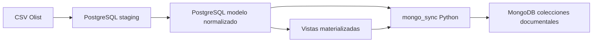

# Documento tecnico de implementacion - Unidad 5 Actividad 2

## a. Resumen ejecutivo

### Sintesis de implementacion realizada

Se implementa la arquitectura fisica objetivo de Ecommify sobre servicios cloud: Supabase para PostgreSQL/PostGIS y MongoDB Atlas para la capa documental derivada. Docker Compose se utiliza como ambiente reproducible de trabajo remoto, normalizacion, carga controlada, pruebas tecnicas y preparacion de artefactos de migracion. La implementacion materializa las decisiones definidas en el `README.md` principal y en el documento tecnico de diseno de la Etapa 2: PostgreSQL se mantiene como fuente de verdad transaccional y MongoDB opera como capa documental derivada para lectura y analitica.

El proceso ejecutado incluyo la creacion del ambiente local reproducible con PostgreSQL/PostGIS y MongoDB, la carga del dataset real Olist desde archivos CSV, la insercion en un modelo relacional normalizado con llaves tecnicas internas, la aplicacion de extensiones PostgreSQL, la creacion de indices especializados, el refresco de vistas materializadas, la sincronizacion PostgreSQL -> MongoDB y la validacion de consultas criticas con evidencias de rendimiento. Ese ambiente local sirvio como base controlada para migrar el modelo final a Supabase y las colecciones documentales a MongoDB Atlas.

La implementacion se construyo primero en Docker para reducir riesgos y permitir reproducibilidad, pero la arquitectura final validada para la actividad es cloud: Supabase queda como despliegue relacional/espacial con datos reales y MongoDB Atlas como despliegue documental derivado. Docker se conserva como entorno de reconstruccion, pruebas y soporte operativo, no como destino arquitectonico principal.

### Principales optimizaciones aplicadas

| Capa | Optimizacion | Justificacion tecnica |
|---|---|---|
| PostgreSQL | Indices B-tree sobre IDs Olist y FK internas | Mejoran busquedas OLTP y joins relacionales por llaves. |
| PostgreSQL | Indices GIN con `pg_trgm` | Permiten busqueda textual aproximada en ciudades y comentarios. |
| PostgreSQL | Columna `geog` e indice GiST PostGIS | Optimizan filtros espaciales con `ST_DWithin`. |
| PostgreSQL | Vistas materializadas | Reducen costo de consultas analiticas recurrentes. |
| MongoDB | Indices unicos por identificadores documentales | Mantienen trazabilidad y evitan duplicados logicos. |
| MongoDB | Indices secundarios por categoria, estado, ciudad y puntaje | Optimizan patrones de lectura analitica. |
| MongoDB | `upsert` en sincronizacion | Permite repetir el proceso sin duplicar documentos. |
| MongoDB | Indice compuesto en `review_documents` | Corrige la unicidad real de resenas por `{ review_id, order_id }`. |

### Resultados cuantitativos destacados

| Componente | Resultado validado |
|---|---:|
| `customers` | 99.441 registros |
| `orders` | 99.441 registros |
| `order_items` | 112.650 registros |
| `order_payments` | 103.886 registros |
| `order_reviews` | 99.224 registros |
| `products` | 32.951 registros |
| `sellers` | 3.095 registros |
| `category_translation` | 71 registros |
| `geolocation_clean` | 27.912 registros |
| `mv_sales_by_category_monthly` | 1.274 registros |
| `mv_customer_segments` | 99.441 registros |
| `mv_seller_performance_monthly` | 16.441 registros |
| `mv_geo_sales_summary` | 21.698 registros |
| `product_catalog` | 32.951 documentos |
| `customer_profiles` | 99.441 documentos |
| `seller_performance` | 3.095 documentos |
| `geo_analytics` | 21.698 documentos |
| `review_documents` | 99.224 documentos |

Resultados de rendimiento mas relevantes:

| Motor | Consulta | Antes | Despues | Mejora |
|---|---|---:|---:|---:|
| PostgreSQL | OLTP order lookup | 25.899 ms | 0.043 ms | 99.83% menos tiempo |
| PostgreSQL | `pg_trgm` customer city search | 136.633 ms | 46.813 ms | 65.74% menos tiempo |
| PostgreSQL | PostGIS radius search | 26.105 ms | 0.351 ms | 98.66% menos tiempo |
| MongoDB | `geo_analytics` por estado/ciudad | 20.888 docs examinados | 20 docs examinados | 99.90% menos documentos examinados |
| MongoDB | `product_catalog` por categoria | 353 docs examinados | 20 docs examinados | 94.33% menos documentos examinados |

## b. Implementacion PostgreSQL

### Scripts DDL ejecutados

La guia solicita reportar scripts DDL ejecutados en Supabase. En esta iteracion los DDL se construyeron y validaron primero en PostgreSQL/PostGIS local mediante Docker, para asegurar normalizacion, restricciones e indices antes de tocar cloud. Luego se importo una version compatible en Supabase. La version cloud excluyo staging y `benchmark_results`, y ajusto referencias de PostGIS y `pg_trgm` al schema `extensions`, que es donde Supabase aloja estas extensiones.

| Orden | Script | Funcion | Estado |
|---|---|---|---|
| 01 | `postgresql/schema/paso_01_crear_esquema.sql` | Crea esquema `ecommify` y habilita `pg_trgm` / PostGIS. | Ejecutado en Docker |
| 02 | `postgresql/schema/paso_02_crear_tablas_base.sql` | Crea tablas base, PK, FK, `CHECK`, `UNIQUE` y tipos avanzados. | Ejecutado en Docker |
| 03 | `postgresql/schema/paso_03_crear_indices.sql` | Crea indices OLTP, OLAP, PostGIS y `pg_trgm`. | Ejecutado en Docker |
| 04 | `postgresql/schema/paso_04_crear_triggers_updated_at.sql` | Crea funcion y triggers de auditoria `updated_at`. | Ejecutado en Docker |
| 05 | `postgresql/schema/paso_05_crear_vistas_materializadas.sql` | Crea vistas materializadas analiticas. | Ejecutado en Docker |
| 06 | `postgresql/seed_data/paso_06_crear_staging.sql` | Crea tablas staging para CSV Olist. | Ejecutado en Docker |
| 07 | `postgresql/seed_data/paso_07_cargar_csv_staging.sql` | Carga CSV reales a staging. | Ejecutado en Docker |
| 08 | `postgresql/seed_data/paso_08_insertar_modelo_final.sql` | Inserta al modelo final resolviendo llaves tecnicas. | Ejecutado en Docker |
| 09 | `postgresql/seed_data/paso_09_validar_carga.sql` | Valida conteos y columna espacial generada. | Ejecutado en Docker |
| 10 | postgresql/queries/paso_09_benchmark_antes_despues_indices.sql | Persiste benchmarks antes/despues en ecommify.benchmark_results. | Ejecutado en Docker |
| 11 | `postgresql/cloud/cloud_supabase_schema_supabase.sql` | DDL final compatible con Supabase, sin staging ni benchmark local. | Ejecutado en Supabase |

En Supabase se validaron `postgis 3.3.7` y `pg_trgm 1.6` en el schema `extensions`. La carga se realizo desde el modelo final validado en Docker usando `pg_dump --data-only` y `COPY`, no desde staging, para reducir consumo del plan gratuito.

### Estrategia de indexacion con justificacion tecnica

| Tipo de indice | Ejemplos | Justificacion tecnica |
|---|---|---|
| B-tree por IDs Olist | `idx_orders_order_id`, `idx_products_product_id`, `idx_customers_customer_id` | Permiten busquedas puntuales por identificadores originales del dataset. |
| B-tree por FK internas | `idx_order_items_order_sk`, `idx_order_payments_order_sk` | Reducen costo de joins entre ordenes, items, pagos y clientes. |
| B-tree analiticos | `idx_orders_purchase_timestamp`, `idx_order_reviews_score` | Soportan filtros por fecha, estado y calificacion. |
| GIN sobre `JSONB` | `idx_products_specifications_gin`, `idx_orders_lifecycle_gin` | Permiten consultar atributos flexibles sin romper el modelo relacional. |
| GIN sobre `TEXT[]` | `idx_products_photo_urls_gin` | Soportan busquedas sobre arreglos. |
| GIN `pg_trgm` | `idx_customers_city_trgm`, `idx_order_reviews_message_trgm` | Optimizan busqueda aproximada en texto libre. |
| GiST PostGIS | `idx_geolocation_clean_geog_gist` | Acelera consultas espaciales sobre `GEOGRAPHY(Point, 4326)`. |

### Particionamiento aplicado

No se aplico particionamiento fisico en la implementacion ejecutada. La decision se documento en `postgresql/schema/paso_06_borrador_particionamiento_orders.sql`.

La razon tecnica es que `orders` usa `order_sk BIGINT IDENTITY` como PK interna y `order_id TEXT UNIQUE` como identificador Olist. En PostgreSQL, una PK o UNIQUE en tabla particionada debe incluir la clave de particion. Si `orders` se particiona por `order_purchase_timestamp`, las FK desde `order_items`, `order_payments` y `order_reviews` requeririan redisenar llaves o replicar la clave temporal.

Decision: mantener integridad referencial simple en esta etapa y dejar el particionamiento como evolucion futura.

### Evidencias de mejoras: EXPLAIN antes/despues y graficas

El benchmark PostgreSQL se guardo en `ecommify.benchmark_results`. El escenario base deshabilito `enable_indexscan` y `enable_bitmapscan` en la sesion. El escenario optimizado restauro el plan normal con indices.

| Query critica | Escenario base | Escenario optimizado | Mejora |
|---|---:|---:|---:|
| OLTP order lookup | 25.899 ms | 0.043 ms | 99.83% |
| `pg_trgm` customer city search | 136.633 ms | 46.813 ms | 65.74% |
| PostGIS radius search | 26.105 ms | 0.351 ms | 98.66% |
| Materialized view sales dashboard | No aplica | 0.231 ms | Lectura materializada |

Grafica textual de tiempo de ejecucion:

```text
OLTP order lookup
Antes    25.899 ms | ##########################
Despues   0.043 ms |

pg_trgm customer city search
Antes   136.633 ms | ########################################################################
Despues  46.813 ms | #########################

PostGIS radius search
Antes    26.105 ms | ##########################
Despues   0.351 ms |

Materialized view sales dashboard
Despues   0.231 ms |
```


### Implementacion cloud PostgreSQL/PostGIS en Supabase

La migracion a Supabase materializa la capa relacional/espacial de la arquitectura cloud objetivo. Docker no se reemplaza ni compite con Supabase; queda como ambiente de preparacion y reconstruccion. El proyecto Supabase `Ecommify Olist` quedo en region `us-east-2`, con PostgreSQL `17.6`, PostGIS `3.3.7` y `pg_trgm 1.6`.

| Evidencia Supabase | Resultado |
|---|---:|
| Tamano final de base | 210 MB |
| `category_translation` | 71 registros |
| `customers` | 99.441 registros |
| `sellers` | 3.095 registros |
| `products` | 32.951 registros |
| `orders` | 99.441 registros |
| `order_items` | 112.650 registros |
| `order_payments` | 103.886 registros |
| `order_reviews` | 99.224 registros |
| `geolocation_clean` | 27.912 registros |
| Filas con `geog` PostGIS | 27.912 registros |

Tambien se validaron indices criticos en Supabase: `idx_category_name_trgm`, `idx_customers_city_trgm`, `idx_geolocation_clean_geog_gist`, `idx_order_reviews_message_trgm` e `idx_sellers_city_trgm`.

Los `EXPLAIN ANALYZE` ejecutados en Supabase confirmaron uso de indices:

| Query critica en Supabase | Indice / acceso observado | Execution Time |
|---|---|---:|
| OLTP por `order_id` | `idx_orders_order_id`, PK de clientes e `idx_order_payments_order_sk` | 14.619 ms |
| `pg_trgm` por ciudad | `idx_customers_city_trgm` con Bitmap Index Scan | 838.341 ms |
| PostGIS por radio | `idx_geolocation_clean_geog_gist` con Index Scan | 161.061 ms |
| Vista materializada de ventas | `ux_mv_sales_by_category_monthly` | 3.160 ms |

Los tiempos cloud son mayores que Docker local por red, pooler, plan gratuito, cache y recursos compartidos. La evidencia relevante para esta actividad es que Supabase ejecuta el modelo final con datos reales y usa los indices/extensiones esperados.
### Queries criticas optimizadas

| Query critica | Optimizacion validada | Resultado |
|---|---|---|
| Buscar orden por `order_id` con cliente y pagos | B-tree sobre `orders.order_id` y FK internas | 0.043 ms en benchmark optimizado |
| Buscar clientes por similitud textual de ciudad | `pg_trgm` + GIN sobre `customer_city` | 46.813 ms en benchmark optimizado |
| Buscar geolocalizacion dentro de un radio | PostGIS + GiST sobre `geog` | 0.351 ms en benchmark optimizado |
| Consultar dashboard de ventas por categoria y mes | Vista materializada | 0.231 ms |

## c. Implementacion MongoDB

### Colecciones creadas y esquemas de documentos

| Coleccion | Proposito | Fuente principal |
|---|---|---|
| `product_catalog` | Catalogo enriquecido por producto | `products`, `category_translation`, ventas y resenas |
| `customer_profiles` | Perfil analitico por cliente | `mv_customer_segments` |
| `seller_performance` | Desempeno de vendedores | `mv_seller_performance_monthly` |
| `geo_analytics` | Analitica geografica por estado, ciudad y mes | `mv_geo_sales_summary` |
| `review_documents` | Resenas enriquecidas con contexto de orden y producto | `order_reviews`, `orders`, `customers`, `order_items`, `products` |

Los esquemas se definieron con validadores JSON Schema en MongoDB. Se usaron estructuras documentales con objetos anidados, arreglos y fechas BSON. MongoDB no reemplaza el modelo transaccional; almacena proyecciones derivadas para lectura.

### Indices implementados con justificacion

| Coleccion | Indices | Justificacion |
|---|---|---|
| `product_catalog` | `{ product_id: 1 } unique`, `{ "category.translated_name": 1 }` | Trazabilidad y busqueda por categoria. |
| `customer_profiles` | `{ customer_id: 1 } unique`, `{ segment: 1 }`, `{ "location.state": 1 }` | Consulta por cliente, segmento y region. |
| `seller_performance` | `{ seller_id: 1 } unique`, `{ "location.state": 1 }` | Consulta por vendedor y estado. |
| `geo_analytics` | `{ geo_key: 1 } unique`, `{ state: 1, city: 1 }` | Consulta geografica eficiente. |
| `review_documents` | `{ review_id: 1, order_id: 1 } unique`, `{ review_id: 1 }`, `{ order_id: 1 }`, `{ review_score: 1 }` | Evita duplicados reales y permite consultar por resena, orden o puntaje. |

### Aggregation pipelines optimizados

En esta implementacion no se usaron pipelines complejos con `$lookup` o `$group` como mecanismo principal, porque las colecciones ya llegan preagregadas desde PostgreSQL y vistas materializadas. Esta decision evita repetir joins costosos en MongoDB y mantiene a PostgreSQL como responsable de integridad y consolidacion.

Las consultas optimizadas se ejecutaron sobre documentos ya preparados mediante `find`, `sort`, `limit`, proyecciones e indices. Academicamente, esto representa un patron valido de optimizacion documental: precomputar en la fuente relacional y consultar en MongoDB con estructuras orientadas a lectura.

### Evidencias de mejoras: `.explain()` antes/despues y metricas

El benchmark MongoDB se guardo en `ecommify_analytics.benchmark_results`. El escenario base uso `hint({ $natural: 1 })` para forzar recorrido natural de coleccion. El escenario optimizado uso `hint()` sobre el indice esperado.

| Consulta | Escenario | Docs examinados | Keys examinadas | Tiempo | Efficiency ratio |
|---|---|---:|---:|---:|---:|
| `product_catalog` por categoria | Base COLLSCAN | 353 | 0 | 0 ms | 0.0567 |
| `product_catalog` por categoria | Optimizado IXSCAN | 20 | 20 | 0 ms | 1.0000 |
| `customer_profiles` por estado | Base COLLSCAN | 39 | 0 | 0 ms | 0.5128 |
| `customer_profiles` por estado | Optimizado IXSCAN | 20 | 20 | 1 ms | 1.0000 |
| `geo_analytics` por estado/ciudad | Base COLLSCAN | 20.888 | 0 | 9 ms | 0.0010 |
| `geo_analytics` por estado/ciudad | Optimizado IXSCAN | 20 | 20 | 0 ms | 1.0000 |
| `review_documents` por baja calificacion | Base COLLSCAN | 157 | 0 | 0 ms | 0.1274 |
| `review_documents` por baja calificacion | Optimizado IXSCAN | 20 | 20 | 0 ms | 1.0000 |

Grafica textual de documentos examinados:

```text
product_catalog por categoria
Antes       353 docs | #################
Despues      20 docs | #

customer_profiles por estado
Antes        39 docs | ##
Despues      20 docs | #

geo_analytics por estado/ciudad
Antes    20.888 docs | ########################################################################
Despues      20 docs | #

review_documents baja calificacion
Antes       157 docs | ########
Despues      20 docs | #
```


### Implementacion cloud MongoDB Atlas

La migracion a MongoDB Atlas materializa la capa documental cloud de la arquitectura objetivo. La carga se ejecuto desde MongoDB local usando `mongodump` y `mongorestore`, porque Docker ya contenia una copia derivada y validada desde PostgreSQL. El objetivo fue llevar a Atlas las colecciones documentales finales sin usar MongoDB como fuente transaccional.

| Evidencia Atlas | Resultado |
|---|---:|
| Conexion `ping` | `{ ok: 1 }` |
| Colecciones creadas | 5 |
| Archivo dump local | `/tmp/ecommify_analytics.archive`, 21 MB |
| Documentos restaurados | 256.417 |
| Fallos de restauracion | 0 |
| `product_catalog` | 32.951 documentos |
| `customer_profiles` | 99.441 documentos |
| `seller_performance` | 3.095 documentos |
| `geo_analytics` | 21.698 documentos |
| `review_documents` | 99.224 documentos |

La restauracion incluyo temporalmente `benchmark_results` con 8 documentos, pero esta coleccion se elimino de Atlas porque corresponde a evidencia local y no al modelo documental funcional.

Durante `mongorestore` se registro una advertencia de version: el dump provenia de MongoDB `7.0.37` y Atlas ejecutaba MongoDB `8.0.26`. Aunque el proceso finalizo con 0 fallos y conteos correctos, se documenta como una limitacion a controlar en migraciones productivas.

Tambien se ejecutaron pruebas `.explain("executionStats")` directamente sobre Atlas para confirmar uso de indices:

| Coleccion Atlas | Indice validado | Documentos retornados | Documentos examinados | Llaves examinadas | Tiempo |
|---|---|---:|---:|---:|---:|
| `product_catalog` | `category.translated_name_1` | 20 | 20 | 20 | 0 ms |
| `customer_profiles` | `location.state_1` | 20 | 20 | 20 | 0 ms |
| `geo_analytics` | `state_1_city_1` | 20 | 20 | 20 | 0 ms |
| `review_documents` | `review_score_1` | 0 | 0 | 0 | 0 ms |

La evidencia confirma eficiencia documental en las tres consultas con resultados: cada documento retornado requirio examinar un documento y una llave. La consulta de `review_documents` valida disponibilidad del indice, pero debe repetirse con un filtro que retorne documentos si se requiere una comparacion cuantitativa mas robusta.
### Diseno teorico de sharding y replica sets

La implementacion local Docker no activa sharding ni replica set distribuido. MongoDB Atlas se valido como despliegue cloud administrado de la capa documental; sharding sigue documentado como diseno teorico para una evolucion posterior.

| Elemento | Diseno propuesto | Justificacion |
|---|---|---|
| Replica set | 3 nodos en despliegue administrado | Alta disponibilidad y tolerancia a fallos. |
| Sharding inicial | No aplicado en volumen actual | El dataset Olist no exige particionamiento horizontal. |
| Coleccion candidata | `product_catalog` | Puede crecer por catalogo y consultas por categoria. |
| Clave candidata | `{ "category.translated_name": 1, product_id: "hashed" }` | Combina patron de consulta y distribucion de cardinalidad. |
| Candidata secundaria | `seller_performance` | Aplicaria si crece la serie historica por vendedor y mes. |

## d. Evidencias cuantitativas de mejoras de rendimiento

### PostgreSQL: tabla comparativa

| Consulta | Antes | Despues | Reduccion absoluta | Reduccion porcentual |
|---|---:|---:|---:|---:|
| OLTP order lookup | 25.899 ms | 0.043 ms | 25.856 ms | 99.83% |
| `pg_trgm` customer city search | 136.633 ms | 46.813 ms | 89.820 ms | 65.74% |
| PostGIS radius search | 26.105 ms | 0.351 ms | 25.754 ms | 98.66% |
| Materialized view sales dashboard | No aplica | 0.231 ms | No aplica | No aplica |

Interpretacion PostgreSQL:

Los resultados validan tres decisiones tecnicas. Primero, los indices B-tree son esenciales para consultas OLTP puntuales: la busqueda por orden paso de 25.899 ms a 0.043 ms. Segundo, `pg_trgm` aporta valor para texto no exacto; aunque la consulta sigue siendo mas costosa que una busqueda por llave, reduce el tiempo en 65.74%. Tercero, PostGIS con GiST muestra una mejora muy alta para filtros espaciales, bajando de 26.105 ms a 0.351 ms.

La vista materializada no se comparo contra una consulta transaccional equivalente en este benchmark, por lo que se reporta como evidencia de lectura preagregada, no como porcentaje antes/despues.

### MongoDB: metricas de `executionTimeMillis` y efficiency ratios

| Consulta | Antes docs examinados | Despues docs examinados | Reduccion docs | Antes ratio | Despues ratio |
|---|---:|---:|---:|---:|---:|
| `product_catalog` por categoria | 353 | 20 | 94.33% | 0.0567 | 1.0000 |
| `customer_profiles` por estado | 39 | 20 | 48.72% | 0.5128 | 1.0000 |
| `geo_analytics` por estado/ciudad | 20.888 | 20 | 99.90% | 0.0010 | 1.0000 |
| `review_documents` por baja calificacion | 157 | 20 | 87.26% | 0.1274 | 1.0000 |

Interpretacion MongoDB:

La metrica mas expresiva no fue siempre `executionTimeMillis`, porque varias consultas retornaron 0 ms por el tamano del dataset y la resolucion de medicion de MongoDB. Por eso se uso tambien `totalDocsExamined` y `efficiency_ratio = nReturned / totalDocsExamined`.

El mayor impacto aparece en `geo_analytics`: el recorrido natural examino 20.888 documentos para devolver 20, mientras que el indice `{ state: 1, city: 1 }` examino solo 20 documentos y 20 llaves. Esto confirma que el indice compuesto responde al patron de consulta geografica. En todas las consultas optimizadas el ratio llego a 1.0, lo que indica que cada documento examinado fue util para el resultado.

## e. Sincronizacion entre sistemas

### Flujos de datos entre PostgreSQL y MongoDB



El flujo mantiene a PostgreSQL como fuente de verdad. MongoDB recibe documentos derivados a partir de tablas finales y vistas materializadas. La sincronizacion se ejecuta con `tools/sync_postgres_to_mongo.py` mediante el servicio temporal `mongo_sync` de Docker Compose.

### Mejor practica de sincronizacion segun fuente de informacion

La sincronizacion no debe entenderse como una relacion simetrica entre Supabase y Atlas. La decision arquitectonica del proyecto define una sola fuente de verdad: PostgreSQL/PostGIS. Por lo tanto, el sentido correcto es:

```text
PostgreSQL/PostGIS -> proceso de sincronizacion -> MongoDB/Atlas
```

No se recomienda sincronizacion bidireccional para este caso, porque MongoDB contiene proyecciones derivadas y podria introducir conflictos con pagos, ordenes, clientes o productos que deben conservar integridad relacional.

| Nivel | Estrategia | Uso en Ecommify | Estado |
|---|---|---|---|
| Implementacion actual | Job batch idempotente con `bulk_write` y `upsert` | Reconstruir o actualizar colecciones derivadas desde PostgreSQL hacia MongoDB | Implementado en Docker y preparado para ejecutarse como Supabase -> Atlas |
| Mejor evolucion incremental | Job programado con marca de agua por `updated_at` o tabla de control | Sincronizar solo cambios desde la ultima ejecucion | Recomendado como siguiente mejora |
| Mejor practica productiva | CDC/eventos desde PostgreSQL mediante logical replication, outbox o webhooks hacia un worker | Propagar cambios transaccionales a documentos derivados con menor latencia | Diseno objetivo, no requerido para completar la actividad |
| Flujo inverso Atlas -> PostgreSQL | No recomendado | MongoDB no debe escribir cambios de negocio de vuelta a PostgreSQL | Descartado |

Para la actividad academica, el job batch idempotente es suficiente porque el dataset Olist es historico y no recibe operaciones en tiempo real. Para una plataforma productiva, la practica recomendada seria evolucionar a CDC o patron outbox: PostgreSQL registra el cambio transaccional, un worker externo lo consume, transforma el evento y actualiza Atlas con operaciones idempotentes.

### Estrategia de consistencia implementada

| Aspecto | Decision |
|---|---|
| Fuente de verdad | PostgreSQL |
| MongoDB | Capa derivada de lectura y analitica |
| Tipo de consistencia | Fuerte en PostgreSQL; eventual en MongoDB |
| Sincronizacion | Job manual reproducible PostgreSQL -> MongoDB |
| Escritura documental | `upsert` por llaves documentales |
| Control de duplicados | Indices unicos por coleccion |
| Reejecucion | Permitida sin duplicar documentos |

La consistencia fuerte se conserva en PostgreSQL mediante PK, FK, `UNIQUE`, `CHECK` y transacciones. MongoDB puede quedar temporalmente desactualizado hasta ejecutar el sincronizador, lo cual es aceptable porque no registra operaciones criticas de ordenes o pagos.

En cloud, la comunicacion validada se interpreta de esta forma:

```text
Supabase PostgreSQL/PostGIS -> job Python externo -> MongoDB Atlas
```

Supabase y Atlas no se conectan directamente entre si. La pieza responsable de la comunicacion es el job de sincronizacion, que lee desde PostgreSQL y escribe documentos en MongoDB. Esto mantiene separacion de responsabilidades, permite reintentos controlados y evita almacenar logica documental dentro del motor transaccional.

## f. Lecciones aprendidas

### Obstaculos encontrados y soluciones aplicadas

| Obstaculo | Solucion aplicada | Aprendizaje |
|---|---|---|
| `/workspace/raw` aparecia vacio | Ajustar el volumen Docker hacia la carpeta real `../../raw` | Los montajes deben verificarse dentro del contenedor. |
| MongoDB tenia colecciones en cero | Crear y ejecutar sincronizador PostgreSQL -> MongoDB | Crear colecciones no equivale a poblar documentos. |
| Error BSON con `datetime.date` | Convertir fechas a `datetime` compatible con BSON | Los tipos deben adaptarse entre motores. |
| `review_documents` solo cargaba 994 documentos | Cambiar unicidad a `{ review_id, order_id }` | Las reglas de unicidad deben validarse con datos reales. |
| Consultas MongoDB no mostraban evidencia | Agregar salida explicita con `printjson` | Los scripts deben producir evidencia verificable. |
| Se tenia evidencia solo posterior a indices | Crear benchmarks persistidos en tabla/coleccion | La comparacion antes/despues requiere mediciones controladas. |
| README redundantes por carpeta | Consolidar documen   acion por responsabilidad | La documentacion debe tener fuente de verdad clara. |

### Limitaciones del free tier y workarounds implementados

| Limitacion | Impacto | Workaround aplicado |
|---|---|---|
| Supabase free tier puede restringir recursos, extensiones o carga masiva | Riesgo de exceder almacenamiento o tener cargas lentas | Migracion solo del modelo final, sin staging ni benchmarks locales; tamano final validado: 210 MB. |
| Almacenamiento y CPU limitados en servicios gratuitos | Benchmarks podrian variar por contencion del proveedor | Medicion local controlada y persistida en tabla/coleccion. |
| Carga masiva CSV en servicios administrados puede requerir permisos adicionales | `COPY` desde archivos locales no siempre aplica igual | Separar staging, carga y modelo final para adaptar el proceso. |
| MongoDB Atlas free tier tiene limites de almacenamiento y cluster | El dataset documental y datos de ejemplo pueden consumir espacio rapidamente | Migracion controlada desde Mongo local, eliminacion de `benchmark_results` y recomendacion de borrar `sample_mflix` si no se usa. |
| Replica sets y sharding reales no son practicos en free tier basico | No se valida distribucion fisica real | Se documenta diseno teorico de replica set y sharding. |

## Referencias oficiales para sincronizacion

| Fuente | Aporte usado en la decision |
|---|---|
| [PostgreSQL Logical Replication](https://www.postgresql.org/docs/current/logical-replication.html) | PostgreSQL define replicacion logica como replicacion de cambios por identidad de replica, normalmente PK, con modelo publicacion/suscripcion y aplicacion transaccional de cambios. |
| [PostgreSQL Logical Decoding](https://www.postgresql.org/docs/current/logicaldecoding.html) | Permite transmitir modificaciones SQL hacia consumidores externos mediante replication slots y plugins de salida. |
| [Supabase Database Webhooks](https://supabase.com/docs/guides/database/webhooks) | Permiten enviar eventos `INSERT`, `UPDATE` y `DELETE` de tablas hacia sistemas externos usando triggers y `pg_net` asincrono. |
| [Supabase Realtime Postgres Changes](https://supabase.com/docs/guides/realtime/postgres-changes) | Permite escuchar cambios de PostgreSQL despues de agregar tablas a la publicacion `supabase_realtime`. |
| [MongoDB `bulkWrite`](https://www.mongodb.com/docs/manual/reference/method/db.collection.bulkWrite/) | Soporta actualizaciones masivas con `updateOne` y `upsert`, base de la sincronizacion idempotente implementada. |
| [MongoDB Change Streams](https://www.mongodb.com/docs/manual/changeStreams/) | Permite reaccionar a cambios en colecciones, bases o despliegues; aplica como referencia para eventos desde MongoDB, aunque en Ecommify MongoDB no es fuente transaccional. |

## Conclusiones

La implementacion confirma que la arquitectura definida es ejecutable con datos reales. PostgreSQL funciona como nucleo transaccional normalizado y MongoDB como capa documental derivada. Las evidencias muestran carga completa, uso efectivo de indices, aplicacion concreta de PostGIS y `pg_trgm`, vistas materializadas operativas, sincronizacion documental con `upsert` y benchmarks antes/despues con mejoras cuantitativas.

El documento deja explicita la separacion de responsabilidades: la arquitectura objetivo es cloud con Supabase y MongoDB Atlas, mientras Docker local cumple el rol de ambiente reproducible de normalizacion, carga, pruebas y soporte. Supabase queda validado como despliegue cloud PostgreSQL/PostGIS y MongoDB Atlas como despliegue cloud documental, incluyendo conteos finales, indices y pruebas `.explain("executionStats")` sobre consultas representativas.


