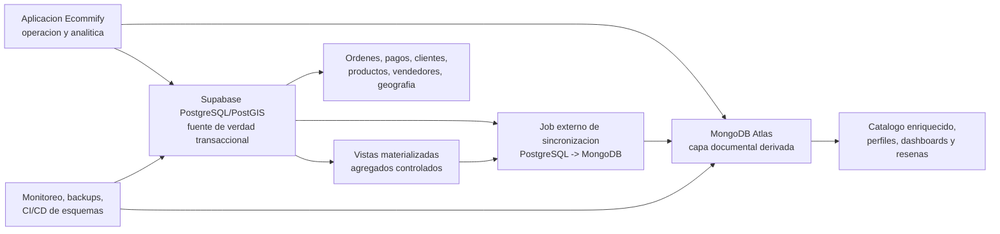
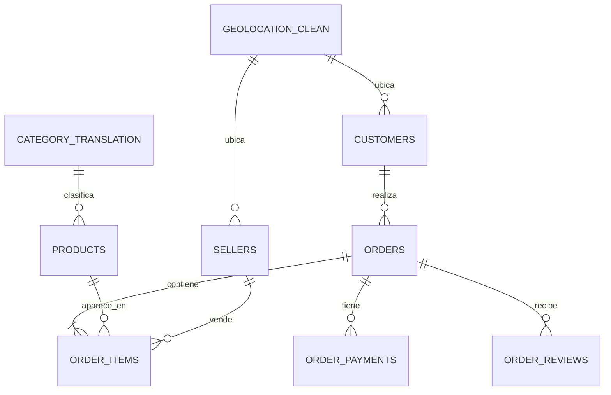
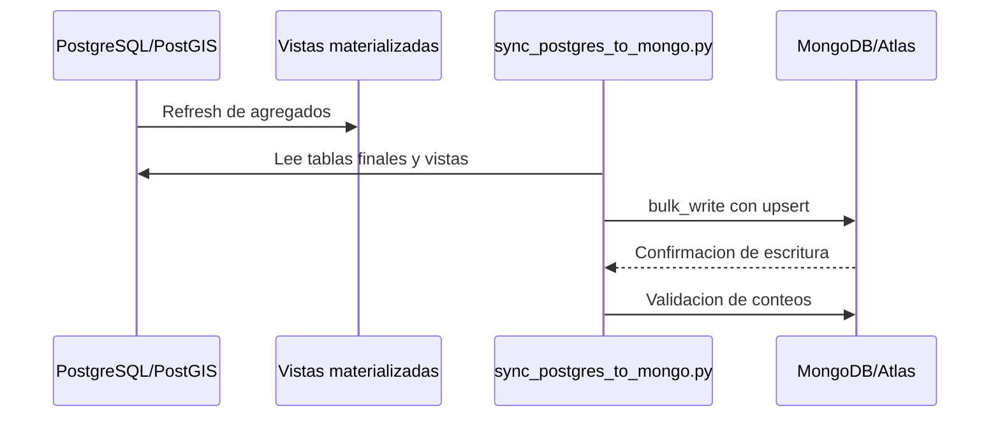

# Ecommify Olist

**Informe tecnico integral - Unidad 6, Etapa 2**  
**Grupo 01 - Equipo E16**  

- Jorge Andres Ayala Valero - jorgeayva@unisabana.edu.co
- Pablo Andres Melo Garcia - pablomega@unisabana.edu.co
- Camilo Andres Padilla Garcia - camilopaga@unisabana.edu.co

---

## Executive Summary

Ecommify es un proyecto academico de diseno y optimizacion de bases de datos construido sobre el dataset publico de Olist. El caso representa una plataforma de comercio electronico con clientes, ordenes, pagos, productos, vendedores, resenas y datos geograficos. La solucion final adopta una arquitectura hibrida: PostgreSQL/PostGIS conserva la fuente de verdad transaccional y MongoDB aloja documentos derivados para lectura, analitica y consultas de baja friccion.

La arquitectura fue implementada y validada en dos niveles. Primero, Docker Compose sirvio como ambiente reproducible de normalizacion, carga desde CSV, pruebas tecnicas y generacion de evidencias. Segundo, la arquitectura cloud objetivo se materializo con Supabase para PostgreSQL/PostGIS y MongoDB Atlas para la capa documental derivada. Esta separacion evita tratar Docker como destino productivo y lo mantiene como entorno de reconstruccion y verificacion.

Los principales logros del proyecto son:

| Dimension | Resultado clave |
|---|---|
| Modelo relacional | 9 tablas finales normalizadas con PK/FK tecnicas, IDs Olist trazables, restricciones e indices. |
| Datos cargados en Supabase | 99.441 clientes, 99.441 ordenes, 112.650 items, 103.886 pagos, 99.224 resenas, 32.951 productos, 3.095 vendedores y 27.912 ubicaciones. |
| Capa documental en Atlas | 256.409 documentos funcionales distribuidos en 5 colecciones derivadas, sin incluir benchmarks locales. |
| Optimizacion PostgreSQL | Busqueda OLTP por orden paso de 25,899 ms a 0,043 ms en benchmark local. |
| Optimizacion MongoDB | `geo_analytics` redujo documentos examinados de 20.888 a 20 usando indice compuesto. |
| Arquitectura cloud | Supabase PostgreSQL/PostGIS validado con 210 MB finales y Atlas validado con conteos e indices. |

La recomendacion estrategica es conservar la arquitectura hibrida. PostgreSQL debe seguir gobernando integridad, pagos, estados de orden, auditoria y relaciones principales. MongoDB debe operar como capa derivada reconstruible para catalogo, perfiles, dashboards, analitica geografica y resenas enriquecidas. Para una evolucion 10x, el siguiente paso no es reemplazar un motor por otro, sino formalizar sincronizacion incremental, observabilidad, cache, busqueda especializada y CI/CD de cambios de esquema.

---

## 1. Introduccion y contexto

### 1.1 Problema de negocio

Ecommify necesita soportar operaciones transaccionales de comercio electronico y, al mismo tiempo, resolver consultas analiticas sobre ventas, clientes, vendedores, categorias, resenas y geografia. Estos dos grupos de necesidades tienen tensiones distintas:

- Las operaciones de ordenes, pagos y clientes requieren consistencia fuerte, integridad referencial y trazabilidad.
- Los dashboards, catalogos enriquecidos y perfiles analiticos requieren estructuras rapidas de lectura y toleran cierto desfase temporal.
- Los datos del proyecto tienen relaciones claras, pero tambien contienen texto libre, atributos flexibles, coordenadas y consultas agregadas.

Por esta razon, una sola tecnologia no resuelve todos los requisitos de forma igualmente eficiente. La solucion final combina un nucleo relacional con una capa documental derivada.

### 1.2 Objetivos y alcance

El objetivo del informe es consolidar criticamente el proyecto final de Ecommify. No se busca repetir entregables anteriores, sino sintetizar decisiones, evidencias, trade-offs y recomendaciones.

Alcance incluido:

- Arquitectura hibrida PostgreSQL/PostGIS + MongoDB.
- Modelo ER transaccional y modelo documental sintetico.
- Implementacion tecnica relevante.
- Evaluacion de rendimiento con evidencia cuantitativa.
- Comparacion PostgreSQL vs MongoDB para el caso Ecommify.
- Analisis del Teorema CAP por modulo.
- Recomendaciones de escalamiento 10x y migracion a produccion.

Fuera de alcance de este documento:

- Repetir todos los DDL, scripts completos o salidas crudas de consola.
- Reemplazar la presentacion ejecutiva o el video final.
- Activar sharding real en Atlas Free Cluster, porque el plan gratuito no lo permite.

### 1.3 Metodologia aplicada

La metodologia combino analisis exploratorio, diseno progresivo, implementacion reproducible y validacion empirica:

1. Analisis del dataset Olist para identificar volumen, relaciones, cardinalidad, nulos y distribuciones.
2. Normalizacion hasta 3FN del nucleo transaccional.
3. Seleccion de tipos avanzados, extensiones e indices especializados en PostgreSQL.
4. Construccion de vistas materializadas para consultas analiticas recurrentes.
5. Diseno de colecciones MongoDB derivadas desde PostgreSQL.
6. Sincronizacion PostgreSQL -> MongoDB mediante job idempotente con `upsert`.
7. Benchmarks antes/despues de indices en PostgreSQL y MongoDB.
8. Migracion cloud validada hacia Supabase y MongoDB Atlas.
9. Evaluacion critica de CAP, consistencia eventual, escalabilidad y limitaciones de free tier.

---

## 2. Arquitectura y diseno

### 2.1 Arquitectura hibrida completa

La arquitectura objetivo final es cloud: Supabase aloja PostgreSQL/PostGIS como nucleo relacional y espacial, mientras MongoDB Atlas aloja la capa documental derivada. La aplicacion consume cada motor segun su responsabilidad: operaciones criticas, pagos e integridad se consultan en Supabase; catalogo enriquecido, perfiles, dashboards y resenas contextualizadas se consultan en Atlas.

Docker y las bases locales no hacen parte de la decision arquitectonica final. Se conservan solo como ambiente de pruebas, reconstruccion desde CSV, validacion de scripts y generacion de evidencias antes de aplicar cambios en cloud.

### 2.2 Matriz de decisiones PostgreSQL vs MongoDB

| Dominio de datos | Tecnologia cloud principal | Justificacion |
|---|---|---|
| Clientes | Supabase PostgreSQL | Requieren identidad, FK con ordenes, trazabilidad y segmentacion derivada. |
| Ordenes | Supabase PostgreSQL | Estado transaccional, fechas criticas e integridad con pagos/items. |
| Pagos | Supabase PostgreSQL | Reglas financieras, secuencia por orden y consistencia fuerte. |
| Items de orden | Supabase PostgreSQL | Relacionan orden, producto y vendedor; requieren FK y valores monetarios consistentes. |
| Productos base | Supabase PostgreSQL | Catalogo maestro, categorias, dimensiones, restricciones y trazabilidad. |
| Atributos flexibles de producto | Supabase PostgreSQL `JSONB` y MongoDB Atlas derivado | `JSONB` permite flexibilidad controlada; Atlas facilita lectura enriquecida. |
| Geolocalizacion | Supabase PostgreSQL/PostGIS | Consultas espaciales con `GEOGRAPHY(Point, 4326)` e indice GiST. |
| Catalogo enriquecido | MongoDB Atlas | Documento de lectura que consolida producto, categoria, metricas y resenas. |
| Perfiles de clientes | MongoDB Atlas | Proyeccion analitica orientada a segmentacion y lectura rapida. |
| Desempeno de vendedores | MongoDB Atlas | Documento agregado para dashboards por vendedor/estado. |
| Analitica geografica | MongoDB Atlas | Documento agregado por estado, ciudad y mes. |
| Resenas enriquecidas | MongoDB Atlas | Documento con contexto de orden, producto y cliente para analisis de experiencia. |

### 2.3 Modelo ER sintetico

El modelo relacional representa el nucleo OLTP. Usa llaves tecnicas internas `*_sk BIGINT IDENTITY` y conserva identificadores Olist como `TEXT UNIQUE` para trazabilidad.

### 2.4 Modelo documental sintetico

| Coleccion | Forma del documento | Fuente relacional | Proposito |
|---|---|---|---|
| `product_catalog` | Producto con categoria, dimensiones, especificaciones, fotos y metricas | `products`, `category_translation`, `order_items`, `order_reviews` | Catalogo enriquecido. |
| `customer_profiles` | Cliente con ubicacion, segmento y resumen de pagos | `customers`, `orders`, `order_payments`, `order_reviews` | Segmentacion y CRM analitico. |
| `seller_performance` | Vendedor con estado, metricas mensuales y desempeno | `sellers`, `order_items`, `orders` | Evaluacion comercial. |
| `geo_analytics` | Estado/ciudad/mes con ordenes y valor pagado | `geolocation_clean`, `orders`, `customers` | Dashboard geografico. |
| `review_documents` | Resena con contexto de orden, producto y cliente | `order_reviews`, `orders`, `products`, `customers` | Analisis de satisfaccion. |

### 2.5 CAP aplicado por modulo

| Modulo | Motor | Prioridad CAP | Decision |
|---|---|---|---|
| Ordenes y pagos | PostgreSQL/Supabase | CP | Ante particiones o fallas, se prioriza consistencia sobre disponibilidad parcial. No se aceptan pagos u ordenes inconsistentes. |
| Clientes y productos maestros | PostgreSQL/Supabase | CP | La integridad referencial y las restricciones pesan mas que una escritura siempre disponible. |
| Catalogo enriquecido | MongoDB/Atlas | AP controlado | Se privilegia disponibilidad y baja latencia, aceptando consistencia eventual frente a PostgreSQL. |
| Dashboards y analitica geografica | MongoDB/Atlas | AP controlado | Los agregados pueden estar desfasados hasta el siguiente refresh o job de sincronizacion. |
| Validacion posterior a sincronizacion | MongoDB/Atlas | CP temporal | Al validar una carga se recomienda leer desde Primary con `read concern: majority`. |

---

## 3. Implementacion tecnica

### 3.1 PostgreSQL/PostGIS

Supabase PostgreSQL/PostGIS implementa el modelo transaccional final con 9 tablas principales: `customers`, `orders`, `order_items`, `order_payments`, `order_reviews`, `products`, `sellers`, `category_translation` y `geolocation_clean`. Los scripts fueron probados previamente en Docker, pero el despliegue que representa la arquitectura objetivo es Supabase.

Decisiones tecnicas relevantes:

| Decision | Implementacion | Justificacion |
|---|---|---|
| Llaves tecnicas internas | `*_sk BIGINT IDENTITY` | Evita depender de IDs externos como PK fisicas y simplifica FK. |
| IDs Olist trazables | `TEXT UNIQUE` | Conserva correspondencia con dataset original y evidencias. |
| Tipos avanzados | `JSONB` en `products.specifications` y `orders.lifecycle`; `TEXT[]` en `products.photo_urls` | Permite flexibilidad sin abandonar integridad relacional. |
| Busqueda textual | `pg_trgm` + indices GIN | Optimiza ciudades y comentarios con coincidencia aproximada. |
| Analitica espacial | PostGIS `GEOGRAPHY(Point, 4326)` + GiST | Soporta busquedas por radio y analisis geografico. |
| Analitica recurrente | Vistas materializadas | Reduce costo de dashboards y alimenta documentos derivados. |
| Particionamiento | Diferido | Se documento borrador, pero no se activo para no romper simplicidad de PK/FK con el volumen actual. |

El particionamiento de `orders` por fecha es una evolucion valida, pero la implementacion final lo difirio porque PostgreSQL exige que claves unicas de tablas particionadas incluyan la clave de particion. Aplicarlo sin redisenar FK podria introducir complejidad innecesaria para el volumen actual.

### 3.2 MongoDB

MongoDB Atlas no replica el modelo relacional. Aloja documentos derivados, pensados para lecturas agregadas y consultas de experiencia. La sincronizacion cloud se interpreta como Supabase PostgreSQL/PostGIS -> job externo -> MongoDB Atlas, con operaciones idempotentes.

Colecciones e indices principales:

| Coleccion | Indices principales | Justificacion |
|---|---|---|
| `product_catalog` | `{ product_id: 1 } unique`, `{ "category.translated_name": 1 }` | Trazabilidad y busqueda por categoria. |
| `customer_profiles` | `{ customer_id: 1 } unique`, `{ segment: 1 }`, `{ "location.state": 1 }` | Consulta por cliente, segmento y region. |
| `seller_performance` | `{ seller_id: 1 } unique`, `{ "location.state": 1 }` | Consulta por vendedor y estado. |
| `geo_analytics` | `{ geo_key: 1 } unique`, `{ state: 1, city: 1 }` | Dashboard geografico eficiente. |
| `review_documents` | `{ review_id: 1, order_id: 1 } unique`, `{ review_score: 1 }` | Corrige unicidad real y habilita consultas por satisfaccion. |

Una decision importante fue corregir `review_documents`: usar solo `review_id` como unico reducia la carga a 994 documentos. El indice compuesto `{ review_id, order_id }` permitio cargar 99.224 documentos, mostrando que el modelo se ajusto a los datos reales.

### 3.3 Sincronizacion entre sistemas

La sincronizacion actual validada para la entrega es batch e idempotente. Para el dataset historico de Olist es suficiente. En la arquitectura cloud, Supabase y Atlas no se conectan directamente entre si: el responsable es un job externo que lee PostgreSQL/PostGIS y escribe documentos en Atlas. Para produccion, debe evolucionar a sincronizacion incremental por `updated_at`, patron outbox o CDC basado en logical replication.

---

## 4. Evaluacion de rendimiento y escalabilidad

### 4.1 Metodologia de pruebas aplicada

La evaluacion se baso en benchmarks controlados antes/despues de indices y optimizaciones:

- En PostgreSQL se compararon planes con y sin uso efectivo de indices para consultas OLTP, texto, geografia y vistas materializadas.
- En MongoDB se compararon recorridos naturales de coleccion contra planes con indices usando `explain("executionStats")`.
- En cloud se validaron conteos, uso de indices y tiempos de consultas representativas en Supabase y Atlas.
- Las pruebas de carga concurrente y escalabilidad con datasets 10x quedan como recomendacion de siguiente fase, porque el repositorio actual ya contiene benchmarks de consulta pero no una suite formal de concurrencia.

### 4.2 Resultados PostgreSQL

| Consulta critica | Antes | Despues | Mejora |
|---|---:|---:|---:|
| OLTP order lookup | 25,899 ms | 0,043 ms | 99,83% menos tiempo |
| `pg_trgm` customer city search | 136,633 ms | 46,813 ms | 65,74% menos tiempo |
| PostGIS radius search | 26,105 ms | 0,351 ms | 98,66% menos tiempo |
| Materialized view sales dashboard | No aplica | 0,231 ms | Lectura preagregada |

```mermaid
xychart-beta
    title "PostgreSQL - tiempo antes/despues (ms)"
    x-axis ["Order lookup", "pg_trgm ciudad", "PostGIS radio"]
    y-axis "ms" 0 --> 140
    bar [25.899, 136.633, 26.105]
    bar [0.043, 46.813, 0.351]
```

Interpretacion: PostgreSQL mostro su mayor fortaleza en consultas transaccionales y espaciales. El caso `order_id` valida que las busquedas puntuales deben vivir en el motor relacional. `pg_trgm` tambien aporta valor, aunque su costo sigue siendo mayor que una busqueda por llave.

### 4.3 Resultados MongoDB

| Consulta | Antes docs examinados | Despues docs examinados | Reduccion |
|---|---:|---:|---:|
| `product_catalog` por categoria | 353 | 20 | 94,33% |
| `customer_profiles` por estado | 39 | 20 | 48,72% |
| `geo_analytics` por estado/ciudad | 20.888 | 20 | 99,90% |
| `review_documents` baja calificacion | 157 | 20 | 87,26% |

```mermaid
xychart-beta
    title "MongoDB - documentos examinados antes/despues"
    x-axis ["Catalogo", "Clientes", "Geo", "Resenas"]
    y-axis "docs" 0 --> 21000
    bar [353, 39, 20888, 157]
    bar [20, 20, 20, 20]
```

Interpretacion: MongoDB fue especialmente efectivo cuando la consulta coincide con la estructura documental e indices definidos. `geo_analytics` es el caso mas fuerte: el indice compuesto `{ state: 1, city: 1 }` redujo la exploracion de 20.888 documentos a 20.

### 4.4 Validacion cloud

Supabase quedo validado como destino PostgreSQL/PostGIS:

| Aspecto | Resultado |
|---|---:|
| Region | us-east-2 |
| PostgreSQL | 17.6 |
| PostGIS | 3.3.7 |
| `pg_trgm` | 1.6 |
| Tamano final | 210 MB |
| Tablas finales migradas | 9 |

MongoDB Atlas quedo validado como destino documental:

| Coleccion | Documentos |
|---|---:|
| `product_catalog` | 32.951 |
| `customer_profiles` | 99.441 |
| `seller_performance` | 3.095 |
| `geo_analytics` | 21.698 |
| `review_documents` | 99.224 |

### 4.5 Comparacion PostgreSQL vs MongoDB para Ecommify

| Aspecto evaluado | Ganador | Evidencia y justificacion |
|---|---|---|
| Consultas transaccionales puntuales | PostgreSQL | `order_id` optimizado llego a 0,043 ms con integridad y joins por FK. |
| Integridad financiera | PostgreSQL | Pagos tienen secuencia, valores, FK y restricciones; MongoDB no debe gobernarlos. |
| Busqueda espacial | PostgreSQL | PostGIS con GiST resolvio radio geografico en 0,351 ms local. |
| Texto aproximado sobre datos relacionales | PostgreSQL | `pg_trgm` permite busqueda aproximada sin duplicar entidades. |
| Catalogo enriquecido de lectura | MongoDB | Documento evita joins frecuentes y consulta por categoria examino solo 20 documentos con indice. |
| Dashboards derivados | Empate controlado | PostgreSQL prepara vistas materializadas; MongoDB sirve documentos agregados listos para lectura. |
| Flexibilidad de documentos | MongoDB | Mejor para estructuras anidadas y evolucion de proyecciones. |
| Consistencia fuerte | PostgreSQL | Prioridad CP para ordenes, pagos y entidades maestras. |
| Consistencia eventual tolerable | MongoDB | Adecuado para catalogo, perfiles y dashboards. |
| Escalamiento horizontal documental | MongoDB | Sharding futuro por `category.translated_name` + `product_id hashed`, condicionado por metricas. |

### 4.6 Cuellos de botella y limitaciones

| Limitacion | Impacto | Mitigacion recomendada |
|---|---|---|
| Free tier de Supabase y Atlas | Recursos compartidos, limites de almacenamiento y variabilidad de tiempos. | Migrar a planes productivos antes de pruebas de carga reales. |
| Sincronizacion batch | MongoDB puede quedar desactualizado entre ejecuciones. | Implementar incremental por `updated_at`, outbox o CDC. |
| Falta de suite formal de concurrencia | No se mide throughput real ni degradacion bajo usuarios concurrentes. | Crear pruebas con k6, Locust o JMeter contra consultas criticas. |
| Sharding no validado en Atlas Free | La arquitectura distribuida queda teorica. | Probar en cluster dedicado cuando el volumen o SLA lo justifique. |
| `review_documents` en Atlas con filtro sin resultados | La prueba valida indice, pero no eficiencia con retorno real. | Repetir con filtro que retorne documentos. |

---

## 5. Analisis arquitectonico critico

### 5.1 Trade-offs CAP por escenario de falla

| Escenario | Comportamiento esperado | Garantia priorizada | Riesgo aceptado |
|---|---|---|---|
| Particion de red entre aplicacion y Supabase | Operaciones criticas deben fallar o degradarse antes que aceptar inconsistencias. | Consistencia + tolerancia a particiones | Menor disponibilidad temporal de pagos/ordenes. |
| Particion o failover en Atlas | Catalogo y dashboards pueden leer de secundarios o quedar brevemente desfasados. | Disponibilidad + tolerancia a particiones | Consistencia eventual en documentos derivados. |
| Lag de replica en MongoDB | Lecturas desde secundarios pueden mostrar version anterior. | Disponibilidad | Ventana de inconsistencia controlada por `maxStalenessSeconds` y monitoreo. |
| Falla del job de sincronizacion | PostgreSQL conserva verdad; MongoDB queda congelado hasta reintento. | Consistencia de origen | Dashboards/documentos no se actualizan temporalmente. |
| Error de carga documental | `upsert` e indices unicos evitan duplicacion. | Consistencia logica derivada | Reproceso batch puede tomar tiempo. |

### 5.2 Consistencia eventual y mitigacion

MongoDB acepta consistencia eventual porque sus datos son derivados. La ventana de inconsistencia corresponde al tiempo entre un cambio en PostgreSQL y la siguiente sincronizacion. En Olist historico esto no afecta el negocio; en produccion si debe controlarse.

Mitigaciones recomendadas:

- Usar `updated_at` como marca de agua para sincronizacion incremental.
- Registrar ejecuciones del job con inicio, fin, filas procesadas y errores.
- Aplicar `writeConcern: { w: "majority", j: true, wtimeout: 5000 }` en escrituras documentales.
- Leer desde `primary` con `read concern: majority` en validaciones posteriores al refresh.
- Usar `secondaryPreferred` solo para dashboards tolerantes a desfase.
- Definir SLA de frescura por coleccion, por ejemplo catalogo menor a 5 minutos y dashboards menor a 30 minutos.

### 5.3 Reflexion sobre la seleccion tecnologica

La seleccion fue correcta por modulo. PostgreSQL no solo almacena datos relacionales: aporta restricciones, PostGIS, `pg_trgm`, vistas materializadas y planes de ejecucion eficientes. MongoDB no reemplaza ese nucleo; brilla cuando el consumo necesita documentos listos para lectura.

Una arquitectura 100% relacional seria viable, pero obligaria a resolver catalogo enriquecido, perfiles y dashboards con joins o vistas complejas en cada lectura. Seria mas simple operativamente, pero menos flexible para proyecciones documentales.

Una arquitectura 100% NoSQL no seria recomendable para Ecommify. Pagos, ordenes, relaciones entre clientes/items/productos y reglas financieras perderian integridad declarativa o requeririan implementarla en aplicacion, aumentando riesgo.

Lo que cambiaria en una version productiva no es la seleccion de motores, sino el mecanismo de sincronizacion. El batch manual debe evolucionar a pipeline incremental con observabilidad y reintentos.

### 5.4 Lecciones aprendidas

| Leccion | Explicacion |
|---|---|
| La arquitectura hibrida debe tener una fuente de verdad clara | Evita conflictos entre PostgreSQL y MongoDB. |
| Los documentos derivados deben ser reconstruibles | Si MongoDB falla o cambia el modelo, se puede regenerar desde PostgreSQL. |
| Las llaves unicas se validan con datos reales | El caso `review_documents` demostro que un supuesto de unicidad puede ser incorrecto. |
| Los indices deben responder al patron de consulta | MongoDB y PostgreSQL mejoraron cuando el indice coincidio con el filtro real. |
| Free tier sirve para validar, no para concluir capacidad productiva | Los tiempos cloud dependen de red, recursos compartidos y limites del proveedor. |

---

## 6. Recomendaciones estrategicas

### 6.1 Plan de escalamiento 10x

| Capa | Accion recomendada | Motivo |
|---|---|---|
| PostgreSQL | Migrar Supabase a plan productivo con backups, PITR y recursos dedicados | El volumen 10x excedera los margenes comodos de free tier. |
| PostgreSQL | Evaluar particionamiento de `orders` por fecha con redisenio de constraints | Mejora mantenimiento y consultas historicas si el volumen crece. |
| PostgreSQL | Separar replicas de lectura para reportes pesados | Evita competir con OLTP. |
| MongoDB | Pasar Atlas a cluster dedicado | Permite mejores limites, metricas y opciones de escalamiento. |
| MongoDB | Activar sharding primero en `product_catalog` si metricas lo justifican | Es la coleccion candidata por exposicion y crecimiento. |
| Sincronizacion | Cambiar batch completo por incremental/CDC | Reduce latencia y costo de reconstruccion. |
| Cache | Agregar Redis para catalogo y dashboards calientes | Reduce lecturas repetitivas y mejora latencia. |
| Search | Evaluar OpenSearch/Atlas Search para resenas y catalogo textual | `pg_trgm` sirve, pero busqueda full-text avanzada puede requerir motor especializado. |
| Observabilidad | Medir latencia, throughput, replication lag, errores de job y query plans | Sin metricas no hay escalamiento seguro. |

### 6.2 Migracion de free tier a produccion

Consideraciones tecnicas:

- Definir ambientes `dev`, `staging` y `prod`.
- Activar backups y recuperacion punto en tiempo para PostgreSQL.
- Alinear versiones de MongoDB local y Atlas antes de `dump/restore`.
- Evitar migrar staging y benchmarks a produccion.
- Gestionar secretos con variables de entorno o secret manager.
- Agregar pruebas de migracion reversibles.

Consideraciones economicas:

- Estimar almacenamiento 10x: Supabase pasaria aproximadamente de 210 MB a 2,1 GB solo para modelo final, sin contar indices, historial ni staging.
- MongoDB Atlas pasaria de 256.409 documentos a mas de 2,5 millones de documentos derivados.
- El costo real dependera de retencion historica, replicas, backups, region y trafico.

### 6.3 Tecnologias complementarias

| Tecnologia | Uso propuesto |
|---|---|
| Redis | Cache de catalogo, sesiones de lectura y resultados de dashboards frecuentes. |
| OpenSearch o Atlas Search | Busqueda textual avanzada sobre productos y resenas. |
| dbt | Transformaciones analiticas versionadas para vistas/materializaciones. |
| Airflow, Prefect o GitHub Actions | Orquestacion de jobs de sincronizacion y validacion. |
| Prometheus/Grafana o Datadog | Observabilidad de bases, jobs, latencia y errores. |
| Great Expectations o tests SQL | Validacion de calidad de datos antes de publicar documentos. |

### 6.4 Estrategia CI/CD para cambios de esquema

1. Mantener migraciones SQL versionadas y revisadas por pull request.
2. Ejecutar pruebas en Docker antes de aplicar cambios cloud.
3. Validar compatibilidad de scripts con Supabase, especialmente schemas de extensiones.
4. Ejecutar pruebas de conteos, constraints e indices despues de cada migracion.
5. Versionar validadores e indices de MongoDB junto con el codigo de sincronizacion.
6. Probar sincronizacion en staging antes de Atlas productivo.
7. Mantener rollback documentado para DDL y cambios documentales.

---

## 7. Conclusiones

El proyecto cumple el objetivo de disenar, implementar y evaluar una arquitectura de bases de datos eficiente para un caso de comercio electronico. PostgreSQL/PostGIS queda validado como fuente de verdad relacional y espacial; MongoDB Atlas queda validado como capa documental derivada para lectura y analitica.

Las evidencias muestran mejoras cuantitativas importantes. En PostgreSQL, la consulta OLTP por orden redujo su tiempo en 99,83% y la consulta espacial con PostGIS en 98,66%. En MongoDB, `geo_analytics` redujo los documentos examinados de 20.888 a 20. Estos resultados respaldan la seleccion tecnologica y muestran que la optimizacion fue guiada por patrones reales de consulta.

La reflexion principal es que una arquitectura hibrida solo funciona si sus responsabilidades estan bien separadas. En Ecommify, PostgreSQL gobierna consistencia, integridad y operaciones criticas; MongoDB acelera lecturas derivadas y analitica flexible. Esta division evita duplicar responsabilidades y permite escalar de forma gradual.

Para produccion, el proyecto debe evolucionar en tres frentes: pruebas formales de carga y concurrencia, sincronizacion incremental con observabilidad, y migracion desde free tier hacia servicios con recursos dedicados. Con esos pasos, la solucion quedaria preparada para un crecimiento 10x sin abandonar las decisiones tecnicas centrales.

---

## 8. Referencias y anexos

### 8.1 Artefactos internos del repositorio

| Artefacto | Uso en este informe |
|---|---|
| `README.md` | Contexto general del proyecto y estructura. |
| `Ecommify_Database_Design/README.md` | Fuente de verdad tecnica, arquitectura, secuencia de artefactos y decisiones. |
| `docs/Documento_Tecnico_Implementacion_U5_Actividad_2.md` | Evidencias de implementacion, rendimiento y cloud. |
| `docs/Pruebas_Rendimiento_Consolidadas_U6.md` | Consolidacion de benchmarks, validaciones cloud, fuentes de evidencia y limitaciones de pruebas de carga. |
| `docs/Evidencia_Migracion_Cloud_Supabase.md` | Validacion Supabase, conteos, extensiones e indices. |
| `docs/Evidencia_Migracion_Cloud_MongoDB_Atlas.md` | Validacion Atlas, colecciones, conteos e indices. |
| `docs/Actividad_U3_Etapa_2.md` | Estrategia de sharding, replica sets y consistencia eventual. |
| `docs/Actividad_U4_Etapa_2.md` | Optimizaciones, indices especializados y particionamiento propuesto. |
| `postgresql/evidencias.md` | Evidencias PostgreSQL locales. |
| `mongodb/evidencias.md` | Evidencias MongoDB locales. |
| `docs/Modelo_Entidad_Relacion.md` | Modelo ER sintetico. |

### 8.2 Referencias tecnicas externas

- PostgreSQL Logical Replication: https://www.postgresql.org/docs/current/logical-replication.html
- PostgreSQL Logical Decoding: https://www.postgresql.org/docs/current/logicaldecoding.html
- MongoDB Sharding: https://www.mongodb.com/docs/manual/sharding/
- MongoDB Shard Keys: https://www.mongodb.com/docs/manual/core/sharding-shard-key/
- MongoDB Read Preference: https://www.mongodb.com/docs/manual/core/read-preference/
- MongoDB Read Concern: https://www.mongodb.com/docs/manual/reference/read-concern/
- MongoDB Write Concern: https://www.mongodb.com/docs/manual/reference/write-concern/
- MongoDB Causal Consistency: https://www.mongodb.com/docs/manual/core/causal-consistency-read-write-concerns/
- Supabase Database Webhooks: https://supabase.com/docs/guides/database/webhooks
- Supabase Realtime Postgres Changes: https://supabase.com/docs/guides/realtime/postgres-changes
