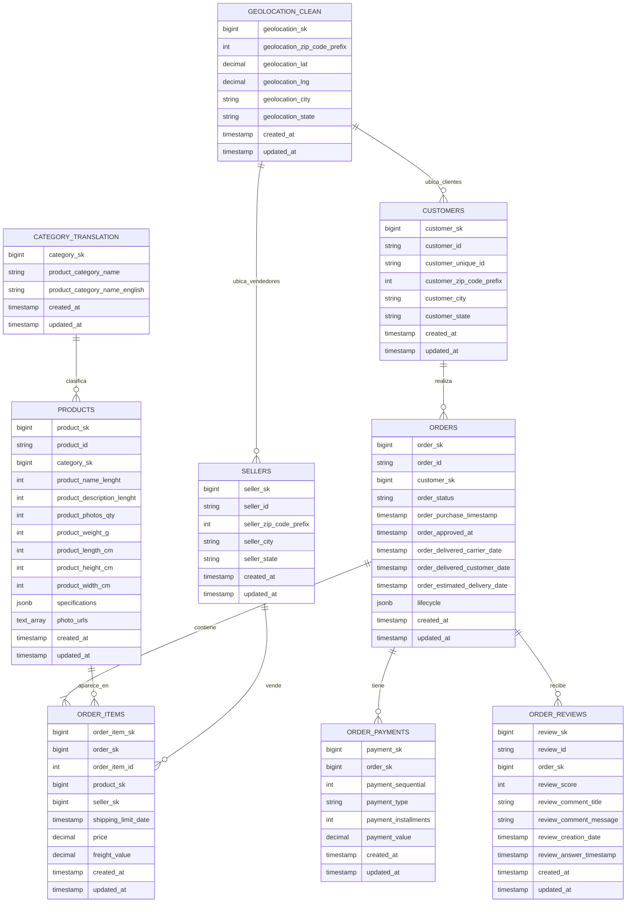

# Modelo Entidad-Relacion - Ecommify

Este documento define el modelo entidad-relacion del componente transaccional de Ecommify, tomando como base las decisiones consolidadas en la documentacion tecnica del proyecto.

La decision principal es mantener PostgreSQL como fuente de verdad transaccional. MongoDB no reemplaza este modelo; se usa como una capa derivada de lectura y analitica para documentos como `product_catalog`, `customer_profiles`, `seller_performance`, `geo_analytics` y `review_documents`.

---

## 1. Alcance del modelo

El modelo entidad-relacion representa las entidades normalizadas que soportan operaciones OLTP. A nivel fisico/logico se adopta una estrategia de llaves tecnicas internas: las PK y FK usan columnas `*_sk BIGINT GENERATED ALWAYS AS IDENTITY`, mientras que los IDs originales de Olist se conservan como `TEXT UNIQUE` para trazabilidad.

No se incluyen colecciones MongoDB como entidades transaccionales porque son documentos derivados desde PostgreSQL.

---

## 2. Diagrama entidad-relacion



---

## 3. Entidades principales

| Entidad | Tabla | PK tecnica | Identificador Olist / natural | Proposito |
|---|---|---|---|---|
| Cliente | `customers` | `customer_sk` | `customer_id TEXT UNIQUE` | Almacena clientes que realizan ordenes. |
| Orden | `orders` | `order_sk` | `order_id TEXT UNIQUE` | Representa el pedido realizado por un cliente. |
| Item de orden | `order_items` | `order_item_sk` | `UNIQUE (order_sk, order_item_id)` | Detalla productos vendidos dentro de una orden. |
| Pago | `order_payments` | `payment_sk` | `UNIQUE (order_sk, payment_sequential)` | Registra pagos asociados a una orden. |
| Producto | `products` | `product_sk` | `product_id TEXT UNIQUE` | Contiene el producto base del catalogo. |
| Categoria | `category_translation` | `category_sk` | `product_category_name TEXT UNIQUE` | Normaliza y traduce categorias de producto. |
| Vendedor | `sellers` | `seller_sk` | `seller_id TEXT UNIQUE` | Contiene vendedores asociados a items de orden. |
| Resena | `order_reviews` | `review_sk` | `UNIQUE (review_id, order_sk)` | Registra calificacion y comentarios de la orden. |
| Geolocalizacion | `geolocation_clean` | `geolocation_sk` | Prefijo postal indexado | Consolida ubicaciones por prefijo postal, ciudad y estado. |

---

## 4. Relaciones y cardinalidades

| Relacion | Cardinalidad | Llave foranea interna | Interpretacion |
|---|---|---|---|
| `customers` -> `orders` | 1:N | `orders.customer_sk` -> `customers.customer_sk` | Un cliente puede realizar varias ordenes. |
| `orders` -> `order_items` | 1:N | `order_items.order_sk` -> `orders.order_sk` | Una orden contiene uno o varios items. |
| `products` -> `order_items` | 1:N | `order_items.product_sk` -> `products.product_sk` | Un producto puede aparecer en muchos items de orden. |
| `sellers` -> `order_items` | 1:N | `order_items.seller_sk` -> `sellers.seller_sk` | Un vendedor puede vender muchos items. |
| `orders` -> `order_payments` | 1:N | `order_payments.order_sk` -> `orders.order_sk` | Una orden puede tener uno o varios pagos. |
| `orders` -> `order_reviews` | 1:N | `order_reviews.order_sk` -> `orders.order_sk` | Una orden puede tener una o varias resenas. |
| `category_translation` -> `products` | 1:N | `products.category_sk` -> `category_translation.category_sk` | Una categoria puede clasificar muchos productos. |
| `geolocation_clean` -> `customers` | 1:N logica | Prefijo postal | Varios clientes pueden compartir una ubicacion consolidada. |
| `geolocation_clean` -> `sellers` | 1:N logica | Prefijo postal | Varios vendedores pueden compartir una ubicacion consolidada. |

---

## 5. Reglas de negocio incorporadas

| Regla | Tabla / campo | Implementacion esperada |
|---|---|---|
| El precio de un item no puede ser negativo. | `order_items.price` | `CHECK (price >= 0)` |
| El flete no puede ser negativo. | `order_items.freight_value` | `CHECK (freight_value >= 0)` |
| El pago no puede ser negativo. | `order_payments.payment_value` | `CHECK (payment_value >= 0)` |
| Un pago se identifica por orden y secuencia. | `order_payments` | `UNIQUE (order_sk, payment_sequential)` |
| Toda orden debe tener fecha de compra. | `orders.order_purchase_timestamp` | `NOT NULL` |
| Toda orden debe tener estado. | `orders.order_status` | `NOT NULL` |
| La calificacion debe estar en rango valido. | `order_reviews.review_score` | `CHECK (review_score BETWEEN 1 AND 5)` |
| El producto conserva categoria controlada cuando aplique. | `products.category_sk` | FK hacia `category_translation.category_sk`. |

---

## 6. Decisiones tecnicas reflejadas en el modelo

| Decision | Aplicacion en el modelo |
|---|---|
| PostgreSQL es fuente de verdad. | Las entidades transaccionales viven como tablas normalizadas. |
| PK/FK internas con surrogate keys. | Se usan columnas `*_sk BIGINT IDENTITY` para relaciones relacionales. |
| IDs Olist como trazabilidad. | `customer_id`, `order_id`, `product_id`, `seller_id` y `review_id` quedan como `TEXT UNIQUE` o parte de reglas naturales. |
| UUID no adoptado inicialmente. | No se convierte artificialmente el identificador Olist a UUID. |
| MongoDB es capa derivada. | Las colecciones documentales no reemplazan PK, FK ni constraints. |
| Uso controlado de `JSONB`. | `products.specifications` y `orders.lifecycle`. |
| Uso controlado de arrays. | `products.photo_urls TEXT[]`. |
| Pagos normalizados. | `order_payments` permanece como tabla relacional con `payment_sk` y secuencia unica por orden. |
| Dimensiones normalizadas. | Peso, alto, ancho y largo permanecen como columnas de `products`. |
| Auditoria operacional. | Tablas principales incluyen `created_at` y `updated_at`. |

---

## 7. Capa derivada no transaccional

Las siguientes estructuras pueden construirse desde el modelo relacional, pero no forman parte del ER transaccional:

| Coleccion / vista | Origen relacional | Proposito |
|---|---|---|
| `product_catalog` | `products`, `category_translation`, `order_items`, `order_reviews` | Catalogo enriquecido para lectura. |
| `customer_profiles` | `customers`, `orders`, `order_payments`, `order_reviews` | Perfil analitico de clientes. |
| `seller_performance` | `sellers`, `order_items`, `orders`, `order_reviews` | Desempeno comercial de vendedores. |
| `geo_analytics` | `geolocation_clean`, `customers`, `sellers`, `orders` | Analisis geografico agregado. |
| `review_documents` | `order_reviews`, `orders`, `products`, `customers` | Resenas enriquecidas. |
| `mv_sales_by_category_monthly` | `orders`, `order_items`, `products`, `category_translation` | Ventas mensuales por categoria. |
| `mv_customer_segments` | `customers`, `orders`, `order_payments`, `order_reviews` | Segmentacion de clientes. |
| `mv_seller_performance_monthly` | `sellers`, `order_items`, `orders`, `order_reviews` | Desempeno mensual de vendedores. |
| `mv_geo_sales_summary` | `orders`, `customers`, `geolocation_clean` | Ventas agregadas por ubicacion. |

---

## 8. Archivo Mermaid reutilizable

El diagrama tambien queda disponible como archivo independiente:

```text
docs/modelo_entidad_relacion.mmd
```

Este archivo funciona como fuente Mermaid del diagrama ER para versionamiento y reutilizacion tecnica.
